# Data Structures & Algorithms Fundamentals

Essential algorithm patterns and complexity analysis for problem-solving.

---

## 1. Time & Space Complexity Analysis 📊

Understanding how to calculate and analyze algorithm complexity is crucial for writing efficient code and acing technical interviews.

### What is Big O Notation?

Big O notation describes the **upper bound** of algorithm performance as input size grows. It focuses on the **worst-case scenario** and ignores constants and lower-order terms.

**Key Principle:** How does runtime/memory grow as input size (n) increases?

---

### Common Complexity Classes

| Complexity | Name | Example | Growth Rate |
|------------|------|---------|-------------|
| O(1) | Constant | Array access, hash lookup | Best |
| O(log n) | Logarithmic | Binary search | Excellent |
| O(n) | Linear | Single loop through array | Good |
| O(n log n) | Linearithmic | Merge sort, quicksort | Fair |
| O(n²) | Quadratic | Nested loops | Poor |
| O(n³) | Cubic | Triple nested loops | Bad |
| O(2ⁿ) | Exponential | Recursive fibonacci | Very bad |
| O(n!) | Factorial | Permutations | Worst |

**Visual Growth Comparison:**
```
Input size (n) = 10:
O(1)      = 1
O(log n)  = 3
O(n)      = 10
O(n log n)= 30
O(n²)     = 100
O(2ⁿ)     = 1,024
O(n!)     = 3,628,800

Input size (n) = 100:
O(1)      = 1
O(log n)  = 7
O(n)      = 100
O(n log n)= 700
O(n²)     = 10,000
O(2ⁿ)     = 1.27 × 10³⁰ (astronomical!)
```

**Complexity Growth Visualization:**


---

### How to Calculate Time Complexity

#### 1. Sequential Statements (Addition Rule)

Add complexities of sequential operations:

```javascript
function example(arr) {
  // O(1) - constant operation
  let sum = 0;

  // O(n) - single loop
  for (let i = 0; i < arr.length; i++) {
    sum += arr[i];
  }

  // O(n) - another single loop
  for (let i = 0; i < arr.length; i++) {
    console.log(arr[i]);
  }

  return sum;
}

// Total: O(1) + O(n) + O(n) = O(2n + 1) = O(n)
// Drop constants and lower terms → O(n)
```

#### 2. Nested Loops (Multiplication Rule)

Multiply complexities of nested operations:

```javascript
function printPairs(arr) {
  // Outer loop: O(n)
  for (let i = 0; i < arr.length; i++) {
    // Inner loop: O(n)
    for (let j = 0; j < arr.length; j++) {
      console.log(arr[i], arr[j]);
    }
  }
}

// Total: O(n) × O(n) = O(n²)
```

**Different Loop Ranges:**
```javascript
function example1(arr) {
  for (let i = 0; i < arr.length; i++) {
    for (let j = i + 1; j < arr.length; j++) {
      console.log(arr[i], arr[j]);
    }
  }
}
// Still O(n²) because we do roughly n²/2 operations
// Drop constants → O(n²)
```

#### 3. Logarithmic Complexity

Occurs when input is **halved** (or divided) each iteration:

```javascript
function binarySearch(arr, target) {
  let left = 0;
  let right = arr.length - 1;

  while (left <= right) {
    const mid = Math.floor((left + right) / 2);

    if (arr[mid] === target) return mid;

    if (arr[mid] < target) {
      left = mid + 1;  // Search right half
    } else {
      right = mid - 1; // Search left half
    }
  }

  return -1;
}

// Each iteration halves the search space
// n → n/2 → n/4 → n/8 → ... → 1
// Number of iterations = log₂(n)
// Time Complexity: O(log n)
```

**Binary Search Visualization:**

```mermaid
graph TD
    A["Array: [2, 5, 8, 12, 16, 23, 38, 45, 56, 67, 78]<br/>Target: 23<br/>Iteration 1: Search all 11 items"] --> B["mid = 5, arr[5] = 23<br/>✓ Found!"]

    A2["Array: [2, 5, 8, 12, 16, 23, 38, 45, 56, 67, 78]<br/>Target: 67<br/>Iteration 1: Search all 11 items"] --> C["mid = 5, arr[5] = 23<br/>23 < 67, search right →"]
    C --> D["Iteration 2: Search 6 items<br/>[38, 45, 56, 67, 78]<br/>mid = 8, arr[8] = 56<br/>56 < 67, search right →"]
    D --> E["Iteration 3: Search 3 items<br/>[67, 78]<br/>mid = 9, arr[9] = 67<br/>✓ Found!"]

    style B fill:#90EE90
    style E fill:#90EE90
```



**Why O(log n)?**
- Iteration 1: n items
- Iteration 2: n/2 items
- Iteration 3: n/4 items
- ...
- Iteration k: n/2^k = 1

Solve: 2^k = n → k = log₂(n)

#### 4. Recursive Complexity

Analyze using **recurrence relations**:

**Example 1: Linear Recursion**
```javascript
function factorial(n) {
  if (n <= 1) return 1;          // Base case: O(1)
  return n * factorial(n - 1);   // Recursive call
}

// T(n) = T(n-1) + O(1)
// T(n) = T(n-2) + O(1) + O(1) = T(n-2) + 2·O(1)
// ...
// T(n) = T(1) + n·O(1) = O(n)
// Time: O(n), Space: O(n) call stack
```

**Call Stack Visualization for factorial(4):**

```mermaid
graph TB
    subgraph "Call Stack Growth"
    A[factorial4<br/>returns 4 × factorial3]
    B[factorial3<br/>returns 3 × factorial2]
    C[factorial2<br/>returns 2 × factorial1]
    D[factorial1<br/>returns 1 - BASE CASE]
    end

    subgraph "Return Values Flow"
    D2[factorial1<br/>returns 1] --> C2[factorial2<br/>returns 2 × 1 = 2]
    C2 --> B2[factorial3<br/>returns 3 × 2 = 6]
    B2 --> A2[factorial4<br/>returns 4 × 6 = 24]
    end

    A --> B --> C --> D
    D --> D2

    style D fill:#90EE90
    style A2 fill:#FFD700
```



**Example 2: Binary Recursion (Exponential)**
```javascript
function fibonacci(n) {
  if (n <= 1) return n;
  return fibonacci(n - 1) + fibonacci(n - 2);
}

// T(n) = T(n-1) + T(n-2) + O(1)
// Creates a binary tree of calls
// Height: n, Nodes: ~2ⁿ
// Time: O(2ⁿ), Space: O(n) call stack depth
```

**Fibonacci Recursion Tree for fib(5):**


**Notice:** fib(3), fib(2), fib(1), fib(0) are computed multiple times! This redundancy causes exponential time complexity. **Solution**: Use memoization to cache results.

**Example 3: Divide and Conquer**
```javascript
function mergeSort(arr) {
  if (arr.length <= 1) return arr;

  const mid = Math.floor(arr.length / 2);
  const left = mergeSort(arr.slice(0, mid));   // T(n/2)
  const right = mergeSort(arr.slice(mid));     // T(n/2)

  return merge(left, right);                   // O(n)
}

// T(n) = 2·T(n/2) + O(n)
// Using Master Theorem: T(n) = O(n log n)
// Space: O(n) for temporary arrays + O(log n) call stack
```

#### 5. Multiple Inputs

When you have multiple inputs, keep them separate:

```javascript
function process(arr1, arr2) {
  // O(n) where n = arr1.length
  for (let i = 0; i < arr1.length; i++) {
    console.log(arr1[i]);
  }

  // O(m) where m = arr2.length
  for (let j = 0; j < arr2.length; j++) {
    console.log(arr2[j]);
  }
}

// Time: O(n + m) - NOT O(n) because inputs are independent
```

```javascript
function printAllPairs(arr1, arr2) {
  for (let i = 0; i < arr1.length; i++) {
    for (let j = 0; j < arr2.length; j++) {
      console.log(arr1[i], arr2[j]);
    }
  }
}

// Time: O(n × m) - NOT O(n²)
```

---

### Space Complexity Analysis

Space complexity measures **additional memory** used by an algorithm (excluding input).

#### What to Count:

1. **Variables** - Count fixed-size variables as O(1)
2. **Data Structures** - Arrays, objects, sets, maps
3. **Call Stack** - Recursive calls
4. **Temporary Arrays** - Created during processing

**Don't count:** Input array size (it's given)

#### Examples:

**Example 1: O(1) Space**
```javascript
function sumArray(arr) {
  let sum = 0;  // O(1) - single variable

  for (let i = 0; i < arr.length; i++) {
    sum += arr[i];
  }

  return sum;
}

// Space: O(1) - only uses fixed amount of extra memory
```

**Example 2: O(n) Space - Array**
```javascript
function doubleArray(arr) {
  const result = [];  // O(n) - new array of size n

  for (let i = 0; i < arr.length; i++) {
    result.push(arr[i] * 2);
  }

  return result;
}

// Space: O(n) - result array grows with input size
```

**Example 3: O(n) Space - Recursion**
```javascript
function recursiveSum(arr, index = 0) {
  if (index >= arr.length) return 0;
  return arr[index] + recursiveSum(arr, index + 1);
}

// Space: O(n) - call stack depth = n
// Each recursive call adds a frame to the stack
```

**Example 4: O(n²) Space**
```javascript
function create2DArray(n) {
  const matrix = [];

  for (let i = 0; i < n; i++) {
    matrix[i] = [];
    for (let j = 0; j < n; j++) {
      matrix[i][j] = i * j;
    }
  }

  return matrix;
}

// Space: O(n²) - n×n matrix
```

**Example 5: Hash Map Space**
```javascript
function countFrequency(arr) {
  const freq = new Map();  // O(k) where k = unique elements

  for (let num of arr) {
    freq.set(num, (freq.get(num) || 0) + 1);
  }

  return freq;
}

// Space: O(k) where k ≤ n
// Best case: O(1) if all elements same
// Worst case: O(n) if all elements unique
// Usually expressed as O(n) for worst case
```

---

### Common Patterns & Their Complexities

#### Pattern 1: Two Pointers
```javascript
function twoSumSorted(arr, target) {
  let left = 0;
  let right = arr.length - 1;

  while (left < right) {
    const sum = arr[left] + arr[right];
    if (sum === target) return [left, right];
    sum < target ? left++ : right--;
  }

  return null;
}

// Time: O(n) - single pass with two pointers
// Space: O(1) - only two variables
```

#### Pattern 2: Sliding Window
```javascript
function maxSumSubarray(arr, k) {
  let maxSum = 0;
  let windowSum = 0;

  // Initial window
  for (let i = 0; i < k; i++) {
    windowSum += arr[i];
  }
  maxSum = windowSum;

  // Slide window
  for (let i = k; i < arr.length; i++) {
    windowSum = windowSum - arr[i - k] + arr[i];
    maxSum = Math.max(maxSum, windowSum);
  }

  return maxSum;
}

// Time: O(n) - two sequential loops
// Space: O(1) - fixed variables
```

#### Pattern 3: Hash Map for Lookup
```javascript
function twoSum(arr, target) {
  const seen = new Map();

  for (let i = 0; i < arr.length; i++) {
    const complement = target - arr[i];

    if (seen.has(complement)) {
      return [seen.get(complement), i];
    }

    seen.set(arr[i], i);
  }

  return null;
}

// Time: O(n) - single loop, O(1) hash operations
// Space: O(n) - hash map stores up to n elements
```

#### Pattern 4: Sorting-Based
```javascript
function findDuplicates(arr) {
  arr.sort((a, b) => a - b);  // O(n log n)

  const duplicates = [];
  for (let i = 1; i < arr.length; i++) {  // O(n)
    if (arr[i] === arr[i - 1]) {
      duplicates.push(arr[i]);
    }
  }

  return duplicates;
}

// Time: O(n log n) - dominated by sorting
// Space: O(1) if in-place sort, O(n) for result array
```

#### Pattern 5: DFS/BFS on Tree
```javascript
function maxDepth(root) {
  if (!root) return 0;

  const leftDepth = maxDepth(root.left);
  const rightDepth = maxDepth(root.right);

  return 1 + Math.max(leftDepth, rightDepth);
}

// Time: O(n) - visit each node once
// Space: O(h) - recursion stack depth = height
//   Best case (balanced): O(log n)
//   Worst case (skewed): O(n)
```

---

### Step-by-Step Complexity Analysis

**Step 1: Identify all operations**
**Step 2: Count iterations/recursions**
**Step 3: Combine using addition/multiplication rules**
**Step 4: Drop constants and lower-order terms**
**Step 5: Express in Big O notation**

**Example:**
```javascript
function complexExample(arr) {
  // Step 1: Identify operations

  let count = 0;                        // O(1)

  // Loop 1: Linear scan
  for (let i = 0; i < arr.length; i++) {  // O(n)
    count++;                              // O(1)
  }

  // Loop 2: Nested loops
  for (let i = 0; i < arr.length; i++) {      // O(n)
    for (let j = i + 1; j < arr.length; j++) { // O(n)
      if (arr[i] + arr[j] === 0) {            // O(1)
        count++;
      }
    }
  }

  // Loop 3: Binary search pattern
  let start = 0, end = arr.length - 1;
  while (start < end) {                  // O(log n)
    if (arr[start] === arr[end]) break;
    start++;
    end--;
  }

  return count;
}

// Step 2: Count iterations
// - First loop: n iterations
// - Nested loops: n × n/2 ≈ n²/2 iterations
// - While loop: log n iterations

// Step 3: Combine
// Total = O(1) + O(n) + O(n²) + O(log n)

// Step 4: Drop constants and lower terms
// O(n²) dominates, so drop O(n) and O(log n)

// Step 5: Final answer
// Time: O(n²)
// Space: O(1) - only using fixed variables
```

---

### Interview Tips for Complexity Analysis

**What Interviewers Expect:**

1. **Always provide both time AND space complexity**
2. **Explain your reasoning** - don't just state the answer
3. **Consider best, average, and worst cases** when relevant
4. **Identify trade-offs** - faster time often means more space

**Common Mistakes:**

❌ **Forgetting to drop constants**: O(2n) → Should be O(n)
❌ **Not simplifying**: O(n + log n) → Should be O(n)
❌ **Confusing n with m**: Use different variables for different inputs
❌ **Ignoring recursion stack space**: Recursive calls use O(depth) space
❌ **Counting input size**: Space complexity = additional memory, not including input

**Quick Reference Questions:**

| Question | Time | Space |
|----------|------|-------|
| Single loop through array? | O(n) | O(1) |
| Nested loops (both iterate n)? | O(n²) | O(1) |
| Binary search? | O(log n) | O(1) |
| Sorting? | O(n log n) | O(1) or O(n) |
| Hash map for lookups? | O(n) | O(n) |
| DFS/BFS on graph? | O(V + E) | O(V) |
| Recursive fibonacci? | O(2ⁿ) | O(n) |
| Dynamic programming? | O(n) or O(n²) | O(n) or O(n²) |

**Optimization Strategy:**

1. **O(2ⁿ) or O(n!) → Too slow** - Try memoization, DP, greedy, or different approach
2. **O(n²) → Acceptable for n ≤ 1000** - Try two pointers, hash map, or sorting
3. **O(n log n) → Good** - Usually from sorting or divide & conquer
4. **O(n) → Excellent** - Often the target for many problems
5. **O(log n) → Optimal** - Usually binary search or tree operations

**Typical Constraints:**

- n ≤ 10: O(n!) is acceptable
- n ≤ 20: O(2ⁿ) is acceptable
- n ≤ 500: O(n³) is acceptable
- n ≤ 5000: O(n²) is acceptable
- n ≤ 10⁶: O(n log n) is required
- n ≤ 10⁸: O(n) is required
- n > 10⁸: O(log n) or O(1) is required

---

## 2. Algorithm Patterns 🎯

Essential patterns for solving array and string problems efficiently.

### Sliding Window Pattern

The sliding window pattern optimizes problems that involve subarrays or substrings by maintaining a window that slides through the data.

**When to use:** Problems asking for subarrays/substrings with specific properties

```javascript
/**
 * FIXED WINDOW - Maximum sum of subarray of size k
 */
function maxSumSubarray(arr, k) {
  if (arr.length < k) return null;

  let maxSum = 0;
  let windowSum = 0;

  // Calculate first window
  for (let i = 0; i < k; i++) {
    windowSum += arr[i];
  }
  maxSum = windowSum;

  // Slide the window
  for (let i = k; i < arr.length; i++) {
    windowSum = windowSum - arr[i - k] + arr[i];
    maxSum = Math.max(maxSum, windowSum);
  }

  return maxSum;
}

console.log(maxSumSubarray([2, 1, 5, 1, 3, 2], 3)); // 9 (5+1+3)
```

**Sliding Window Visualization:**

```mermaid
graph LR
    subgraph "Array: [2, 1, 5, 1, 3, 2], k=3"
    A["Step 1<br/>[2, 1, 5] 1, 3, 2<br/>sum = 8"]
    B["Step 2<br/>2, [1, 5, 1] 3, 2<br/>sum = 7<br/>remove 2, add 1"]
    C["Step 3<br/>2, 1, [5, 1, 3] 2<br/>sum = 9 ✓<br/>remove 1, add 3"]
    D["Step 4<br/>2, 1, 5, [1, 3, 2]<br/>sum = 6<br/>remove 5, add 2"]
    end

    A --> B --> C --> D

    style C fill:#90EE90
```



```javascript
/**
 * DYNAMIC WINDOW - Longest substring with at most k distinct characters
 */
function longestSubstringKDistinct(s, k) {
  const map = new Map();
  let left = 0;
  let maxLen = 0;

  for (let right = 0; right < s.length; right++) {
    // Expand window - add character
    map.set(s[right], (map.get(s[right]) || 0) + 1);

    // Shrink window if needed
    while (map.size > k) {
      map.set(s[left], map.get(s[left]) - 1);
      if (map.get(s[left]) === 0) {
        map.delete(s[left]);
      }
      left++;
    }

    maxLen = Math.max(maxLen, right - left + 1);
  }

  return maxLen;
}

console.log(longestSubstringKDistinct("eceba", 2)); // 3 ("ece")

/**
 * Template for sliding window problems
 */
function slidingWindowTemplate(arr) {
  let left = 0;
  let result = 0; // Or whatever initial value

  for (let right = 0; right < arr.length; right++) {
    // Step 1: Expand window - add arr[right]

    // Step 2: While window is invalid, shrink it
    while (/* window condition violated */) {
      // Remove arr[left] from window
      left++;
    }

    // Step 3: Update result with current valid window
    result = Math.max(result, right - left + 1);
  }

  return result;
}
```

### Two Pointers Pattern

Two pointers technique uses two references moving through data structure to solve problems in O(n) time.

**When to use:** Sorted arrays, finding pairs, removing duplicates

```javascript
/**
 * OPPOSITE DIRECTION - Two Sum II (sorted array)
 */
function twoSumSorted(numbers, target) {
  let left = 0;
  let right = numbers.length - 1;

  while (left < right) {
    const sum = numbers[left] + numbers[right];

    if (sum === target) {
      return [left, right];
    } else if (sum < target) {
      left++; // Need larger sum
    } else {
      right--; // Need smaller sum
    }
  }

  return [-1, -1];
}

console.log(twoSumSorted([2, 7, 11, 15], 9)); // [0, 1]
```

**Two Pointers Visualization (Opposite Direction):**

```mermaid
graph TD
    subgraph "Array: [2, 7, 11, 15], target=9"
    A["Step 1<br/>L=0, R=3<br/>[2] 7, 11, [15]<br/>sum = 17 > 9<br/>Move R left ←"]
    B["Step 2<br/>L=0, R=2<br/>[2] 7, [11] 15<br/>sum = 13 > 9<br/>Move R left ←"]
    C["Step 3<br/>L=0, R=1<br/>[2] [7] 11, 15<br/>sum = 9 ✓<br/>Found!"]
    end

    A --> B --> C

    style C fill:#90EE90
```



```javascript
/**
 * SAME DIRECTION - Remove duplicates from sorted array (in-place)
 */
function removeDuplicates(nums) {
  if (nums.length === 0) return 0;

  let slow = 0; // Position of last unique element

  for (let fast = 1; fast < nums.length; fast++) {
    if (nums[fast] !== nums[slow]) {
      slow++;
      nums[slow] = nums[fast];
    }
  }

  return slow + 1; // New length
}

const arr = [1, 1, 2, 2, 3, 4, 4];
console.log(removeDuplicates(arr)); // 4
console.log(arr.slice(0, 4)); // [1, 2, 3, 4]

/**
 * FAST & SLOW POINTERS - Detect cycle in linked list (Floyd's algorithm)
 */
function hasCycle(head) {
  let slow = head;
  let fast = head;

  while (fast && fast.next) {
    slow = slow.next;      // Move 1 step
    fast = fast.next.next;  // Move 2 steps

    if (slow === fast) {
      return true; // Cycle detected
    }
  }

  return false;
}
```

**Fast & Slow Pointers Visualization (Cycle Detection):**


**How it works:** Fast pointer moves 2× speed. If cycle exists, fast will eventually catch up to slow (like runners on a circular track).

### Pattern Recognition Guide

```text
SLIDING WINDOW signals:
- "substring", "subarray", "contiguous"
- "maximum/minimum sum/length"
- "at most/at least K"

TWO POINTERS signals:
- Sorted array
- Finding pairs/triplets
- Remove duplicates in-place
- Linked list cycle
- Palindrome checking
```

### Complexity Analysis

| Pattern | Time | Space | Best For |
|---------|------|-------|----------|
| Fixed Window | O(n) | O(1) | Fixed-size subarrays |
| Dynamic Window | O(n) | O(k) | Variable-size subarrays |
| Two Pointers (Opposite) | O(n) | O(1) | Sorted array pairs |
| Two Pointers (Same) | O(n) | O(1) | In-place modifications |
| Fast & Slow | O(n) | O(1) | Cycle detection |

---

## Quick Summary

**Time Complexity Cheat Sheet:**
- O(1): Direct access (array index, hash lookup)
- O(log n): Binary search, balanced tree operations
- O(n): Single loop, linear scan
- O(n log n): Efficient sorting (merge/quick sort)
- O(n²): Nested loops
- O(2ⁿ): Recursive solutions without memoization

**Space Complexity Cheat Sheet:**
- O(1): Fixed variables
- O(n): Single array/hash map, linear recursion depth
- O(n²): 2D matrix
- Always count: extra data structures, recursion stack depth
- Never count: input size

**Pattern Selection:**
- **Sliding Window**: Contiguous subarrays/substrings
- **Two Pointers**: Sorted arrays, pairs, in-place operations
- **Hash Map**: Fast lookups, counting, seen elements
- **Binary Search**: Sorted data, O(log n) required
- **DFS/BFS**: Tree/graph traversal, connected components
