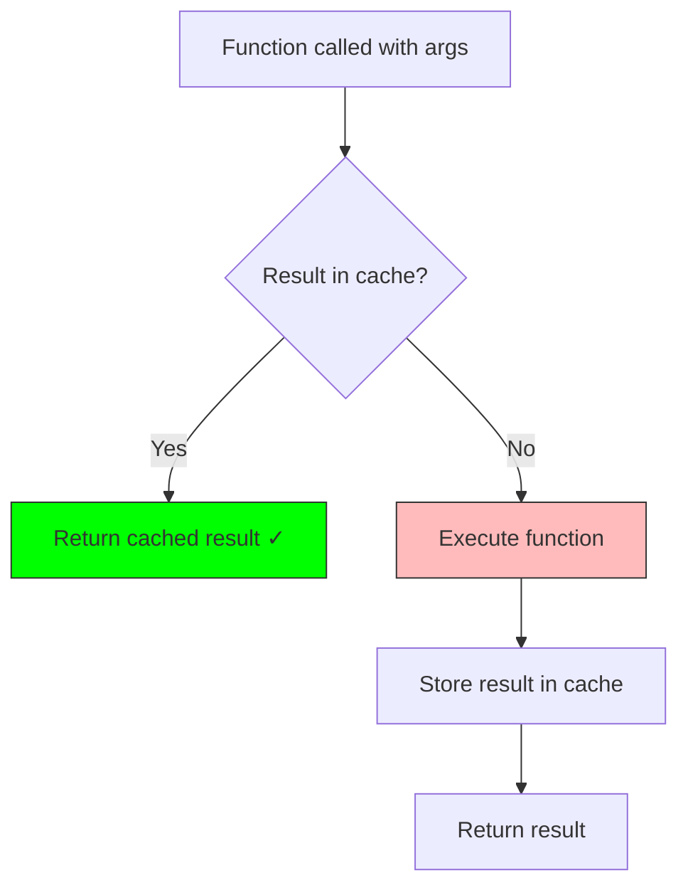
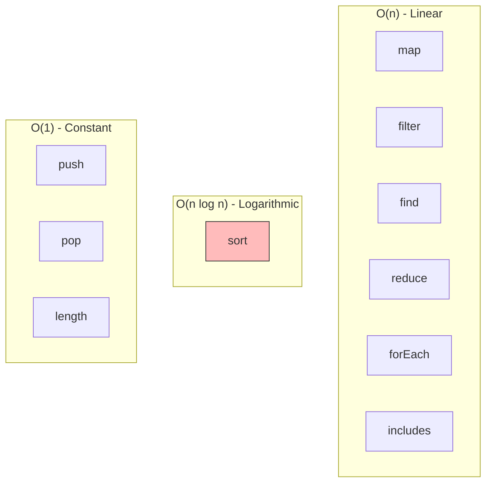
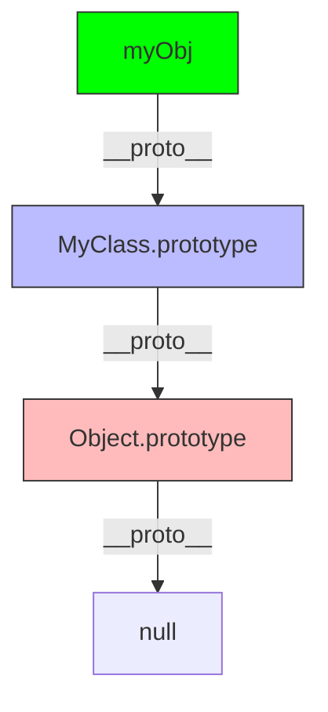
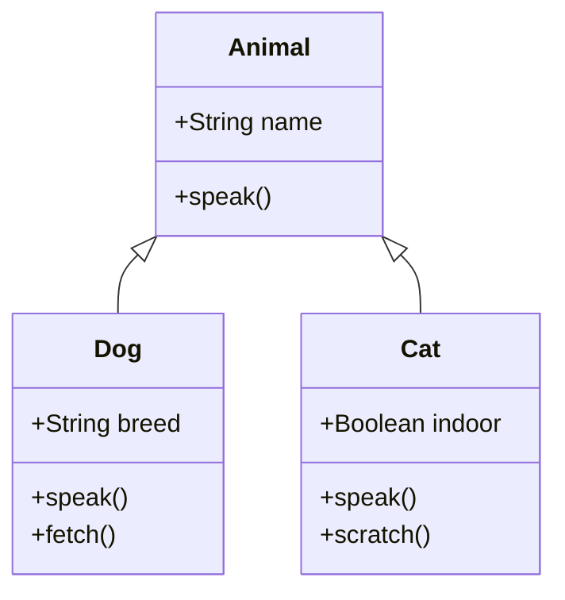
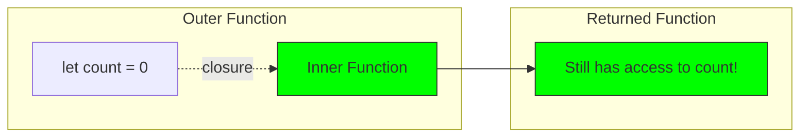
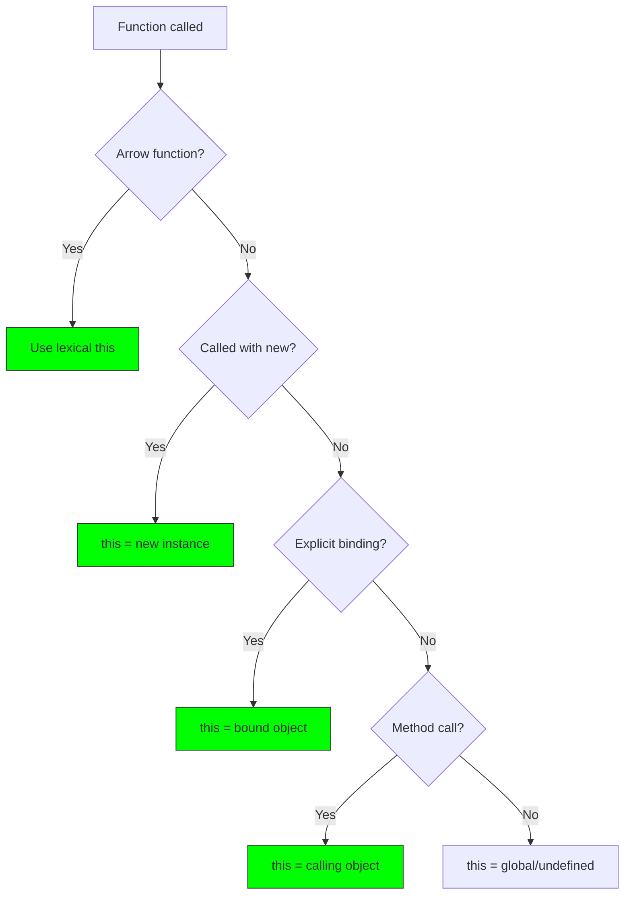
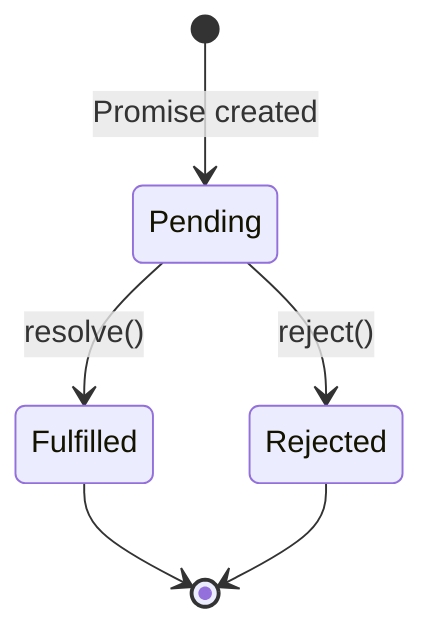
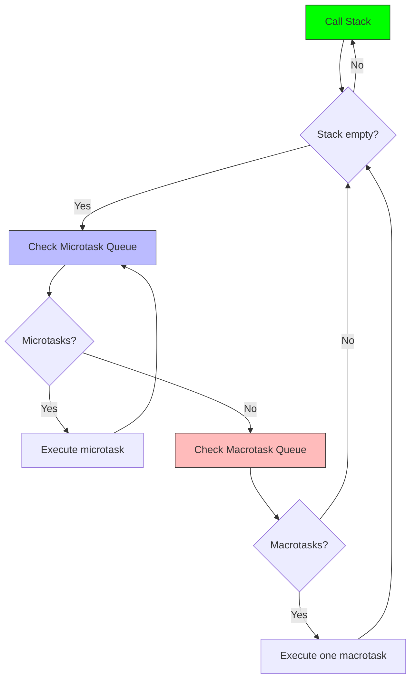
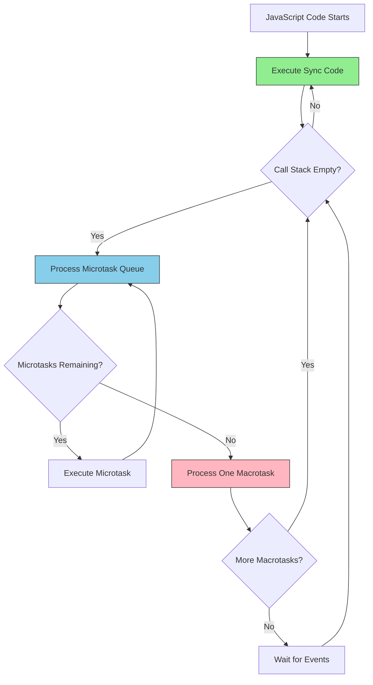
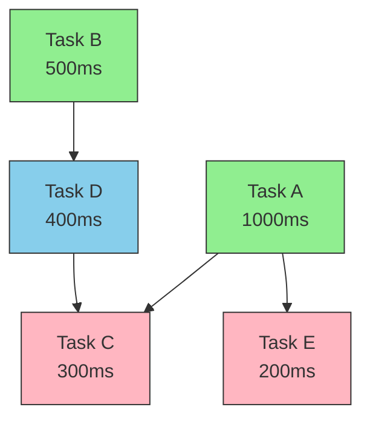

# JavaScript Core Concepts

Essential JavaScript concepts for technical interviews.

---

## 1. Memoization

Memoization is an optimization technique that caches function results to avoid redundant calculations.

### Basic Memoization Pattern

```javascript
/**
 * Simple memoization wrapper
 */
function memoize(fn) {
  const cache = new Map();

  return function(...args) {
    const key = JSON.stringify(args);

    if (cache.has(key)) {
      console.log('Cache hit!');
      return cache.get(key);
    }

    console.log('Computing...');
    const result = fn.apply(this, args);
    cache.set(key, result);
    return result;
  };
}

// Example: Fibonacci with memoization
const fibonacci = memoize((n) => {
  if (n <= 1) return n;
  return fibonacci(n - 1) + fibonacci(n - 2);
});

console.log(fibonacci(10)); // Computing... 55
console.log(fibonacci(10)); // Cache hit! 55
```

### Memoization Visualization



### Advanced: LRU Memoization

```javascript
/**
 * LRU Memoization with capacity limit
 */
class LRUMemoize {
  constructor(fn, capacity = 100) {
    this.fn = fn;
    this.cache = new Map();
    this.capacity = capacity;
  }

  call(...args) {
    const key = JSON.stringify(args);

    if (this.cache.has(key)) {
      // Move to end (most recently used)
      const value = this.cache.get(key);
      this.cache.delete(key);
      this.cache.set(key, value);
      return value;
    }

    const result = this.fn(...args);

    if (this.cache.size >= this.capacity) {
      // Remove least recently used (first item)
      const firstKey = this.cache.keys().next().value;
      this.cache.delete(firstKey);
    }

    this.cache.set(key, result);
    return result;
  }
}
```

---

## 2. Array Methods Cheat Sheet

### Essential Array Methods

```javascript
const arr = [1, 2, 3, 4, 5];

// 📍 map - Transform each element
const doubled = arr.map(x => x * 2);
// [2, 4, 6, 8, 10]

// 📍 filter - Keep elements that match condition
const evens = arr.filter(x => x % 2 === 0);
// [2, 4]

// 📍 reduce - Accumulate to single value
const sum = arr.reduce((acc, x) => acc + x, 0);
// 15

// 📍 find - First element that matches
const found = arr.find(x => x > 3);
// 4

// 📍 findIndex - Index of first match
const index = arr.findIndex(x => x > 3);
// 3

// 📍 some - At least one matches
const hasEven = arr.some(x => x % 2 === 0);
// true

// 📍 every - All elements match
const allPositive = arr.every(x => x > 0);
// true

// 📍 forEach - Execute for each (no return)
arr.forEach(x => console.log(x));

// 📍 includes - Check if value exists
arr.includes(3); // true

// 📍 indexOf - Find first index
arr.indexOf(3); // 2

// 📍 slice - Copy portion (non-mutating)
const copy = arr.slice(1, 4);
// [2, 3, 4]

// 📍 splice - Add/remove elements (mutating)
const removed = arr.splice(1, 2, 99);
// arr is now [1, 99, 4, 5], removed is [2, 3]
```

### Sort Method

```javascript
/**
 * Array.sort() - Sorts in-place
 */

// Numbers - Ascending
const nums = [3, 1, 4, 1, 5];
nums.sort((a, b) => a - b);
// [1, 1, 3, 4, 5]

// Numbers - Descending
nums.sort((a, b) => b - a);
// [5, 4, 3, 1, 1]

// Strings - Alphabetical
const words = ['banana', 'apple', 'cherry'];
words.sort();
// ['apple', 'banana', 'cherry']

// Objects - By property
const people = [
  { name: 'Alice', age: 30 },
  { name: 'Bob', age: 25 },
  { name: 'Charlie', age: 35 }
];
people.sort((a, b) => a.age - b.age);
// Sorted by age ascending

// ⚠️ Common mistake: Sorting numbers without comparator
const wrong = [10, 5, 40, 25, 1000, 1].sort();
// ['1', '10', '1000', '25', '40', '5'] ❌ WRONG!
// JavaScript converts to strings: "10" < "5" alphabetically

const correct = [10, 5, 40, 25, 1000, 1].sort((a, b) => a - b);
// [1, 5, 10, 25, 40, 1000] ✓ CORRECT!
```

### Finding Min/Max

```javascript
const numbers = [5, 2, 8, 1, 9, 3];

// Method 1: Math.min/max with spread
const min = Math.min(...numbers); // 1
const max = Math.max(...numbers); // 9

// Method 2: reduce
const min2 = numbers.reduce((min, num) => Math.min(min, num), Infinity);
const max2 = numbers.reduce((max, num) => Math.max(max, num), -Infinity);

// Method 3: sort (modifies array)
const sorted = [...numbers].sort((a, b) => a - b);
const min3 = sorted[0]; // 1
const max3 = sorted[sorted.length - 1]; // 9

// For large arrays (performance):
let min4 = numbers[0];
let max4 = numbers[0];
for (const num of numbers) {
  if (num < min4) min4 = num;
  if (num > max4) max4 = num;
}
```

### Array Methods Complexity



---

## 3. Prototype Chain

JavaScript uses prototypal inheritance. Every object has a prototype chain.

### Prototype Chain Visualization



### Prototype Chain Example

```javascript
/**
 * Understanding Prototype Chain
 */

function Person(name) {
  this.name = name;
}

Person.prototype.greet = function() {
  return `Hello, I'm ${this.name}`;
};

const alice = new Person('Alice');

// Prototype chain lookup
console.log(alice.name); // Own property
console.log(alice.greet()); // From Person.prototype
console.log(alice.toString()); // From Object.prototype

// Check prototype chain
console.log(alice.__proto__ === Person.prototype); // true
console.log(Person.prototype.__proto__ === Object.prototype); // true
console.log(Object.prototype.__proto__ === null); // true
```

### Class Syntax (Modern)

```javascript
/**
 * ES6 Class syntax (syntactic sugar over prototypes)
 */

class Animal {
  constructor(name) {
    this.name = name;
  }

  speak() {
    return `${this.name} makes a sound`;
  }
}

class Dog extends Animal {
  constructor(name, breed) {
    super(name); // Call parent constructor
    this.breed = breed;
  }

  speak() {
    return `${this.name} barks!`;
  }

  fetch() {
    return `${this.name} fetches the ball`;
  }
}

const dog = new Dog('Buddy', 'Golden Retriever');
console.log(dog.speak()); // "Buddy barks!"
console.log(dog.fetch()); // "Buddy fetches the ball"
```

### Inheritance Diagram



---

## 4. Polymorphism

Polymorphism allows objects of different types to be treated uniformly.

### Method Overriding

```javascript
/**
 * Method overriding - Different implementations in subclasses
 */

class Shape {
  area() {
    throw new Error('area() must be implemented');
  }

  describe() {
    return `A shape with area ${this.area()}`;
  }
}

class Circle extends Shape {
  constructor(radius) {
    super();
    this.radius = radius;
  }

  area() {
    return Math.PI * this.radius ** 2;
  }
}

class Rectangle extends Shape {
  constructor(width, height) {
    super();
    this.width = width;
    this.height = height;
  }

  area() {
    return this.width * this.height;
  }
}

// Polymorphism in action
const shapes = [
  new Circle(5),
  new Rectangle(4, 6),
  new Circle(3)
];

shapes.forEach(shape => {
  console.log(shape.describe());
  // Each calls its own area() implementation
});
```

### Duck Typing

```javascript
/**
 * Duck Typing - "If it walks like a duck and quacks like a duck..."
 * JavaScript doesn't care about types, only if methods exist
 */

function makeItSpeak(animal) {
  // Doesn't care what type animal is
  return animal.speak();
}

const duck = {
  speak: () => 'Quack!'
};

const dog = {
  speak: () => 'Woof!'
};

const robot = {
  speak: () => 'Beep boop!'
};

console.log(makeItSpeak(duck)); // "Quack!"
console.log(makeItSpeak(dog)); // "Woof!"
console.log(makeItSpeak(robot)); // "Beep boop!"
// All work because they have speak() method
```

---

## 5. Closures

A closure gives a function access to its outer scope even after the outer function has returned.

### Closure Visualization



### Closure Examples

```javascript
/**
 * Classic counter using closure
 */
function createCounter() {
  let count = 0; // Private variable

  return {
    increment() {
      count++;
      return count;
    },
    decrement() {
      count--;
      return count;
    },
    getCount() {
      return count;
    }
  };
}

const counter = createCounter();
console.log(counter.increment()); // 1
console.log(counter.increment()); // 2
console.log(counter.getCount()); // 2
// count is private, can't access directly

/**
 * Module pattern with closure
 */
const calculator = (function() {
  let result = 0; // Private

  return {
    add(x) {
      result += x;
      return this;
    },
    subtract(x) {
      result -= x;
      return this;
    },
    multiply(x) {
      result *= x;
      return this;
    },
    getResult() {
      return result;
    }
  };
})();

calculator.add(5).multiply(2).subtract(3);
console.log(calculator.getResult()); // 7
```

### Currying - Function Transformation

Currying is a technique where a function with multiple arguments is transformed into a sequence of functions, each taking a single argument.

**Basic Currying Pattern:**

```javascript
/**
 * Simple currying example
 */
function sum(a) {
  return function(b) {
    return function(c) {
      return a + b + c;
    };
  };
}

const result = sum(1)(2)(3);
console.log(result); // 6

// Or step by step
const step1 = sum(1);        // Returns function(b)
const step2 = step1(2);      // Returns function(c)
const step3 = step2(3);      // Returns 6
console.log(step3); // 6
```

**Why Currying Works:**
- Each inner function has access to outer parameters via closures
- `a` is captured by the first closure
- `b` is captured by the second closure
- Final function has access to all parameters

**Arrow Function Syntax:**

```javascript
// More concise with arrow functions
const sum = a => b => c => a + b + c;

console.log(sum(1)(2)(3)); // 6

// Even cleaner for partial application
const add5 = sum(5);
const add5and10 = add5(10);
console.log(add5and10(20)); // 35
```

**Flexible Currying (Multiple or Single Invocation):**

```javascript
/**
 * Curry function that works with multiple or single arguments
 */
function flexibleSum(...args) {
  const total = args.reduce((sum, num) => sum + num, 0);

  function add(...moreArgs) {
    if (moreArgs.length === 0) {
      return total;
    }
    return flexibleSum(total, ...moreArgs);
  }

  // Make it callable with no args to get result
  add.valueOf = () => total;
  add.toString = () => total.toString();

  return add;
}

console.log(flexibleSum(1)(2)(3).valueOf()); // 6
console.log(flexibleSum(1, 2)(3, 4)(5).valueOf()); // 15
console.log(+flexibleSum(1)(2)(3)); // 6 (using valueOf)
```

**Generic Curry Function:**

```javascript
/**
 * Generic curry implementation
 * Transforms any function into a curried version
 */
function curry(fn) {
  return function curried(...args) {
    // If enough arguments provided, call the original function
    if (args.length >= fn.length) {
      return fn.apply(this, args);
    }

    // Otherwise, return a function that collects more arguments
    return function(...moreArgs) {
      return curried.apply(this, [...args, ...moreArgs]);
    };
  };
}

// Example usage
function multiply(a, b, c) {
  return a * b * c;
}

const curriedMultiply = curry(multiply);

console.log(curriedMultiply(2)(3)(4)); // 24
console.log(curriedMultiply(2, 3)(4)); // 24
console.log(curriedMultiply(2)(3, 4)); // 24
console.log(curriedMultiply(2, 3, 4)); // 24
```

**Real-World Use Cases:**

```javascript
/**
 * 1. Event Handlers with Parameters
 */
const handleClick = (elementType) => (action) => (event) => {
  console.log(`${elementType} ${action}:`, event.target.value);
};

const buttonClick = handleClick('Button');
const buttonSubmit = buttonClick('submit');
// button.addEventListener('click', buttonSubmit);

/**
 * 2. Reusable Validators
 */
const validate = (regex) => (message) => (value) => {
  return regex.test(value) ? null : message;
};

const validateEmail = validate(
  /^[^\s@]+@[^\s@]+\.[^\s@]+$/
)('Invalid email format');

const validatePhone = validate(
  /^\d{10}$/
)('Phone must be 10 digits');

console.log(validateEmail('test@example.com')); // null (valid)
console.log(validateEmail('invalid')); // 'Invalid email format'

/**
 * 3. Logging with Context
 */
const log = (level) => (module) => (message) => {
  const timestamp = new Date().toISOString();
  console.log(`[${timestamp}] [${level}] [${module}] ${message}`);
};

const errorLog = log('ERROR');
const authError = errorLog('Auth');
const dbError = errorLog('Database');

authError('User not found'); // [timestamp] [ERROR] [Auth] User not found
dbError('Connection failed'); // [timestamp] [ERROR] [Database] Connection failed

/**
 * 4. Partial Application for API Calls
 */
const apiCall = (baseUrl) => (endpoint) => (method) => (data) => {
  return fetch(`${baseUrl}${endpoint}`, {
    method,
    headers: { 'Content-Type': 'application/json' },
    body: JSON.stringify(data)
  });
};

const myApi = apiCall('https://api.example.com');
const usersEndpoint = myApi('/users');
const getUsers = usersEndpoint('GET');
const postUser = usersEndpoint('POST');

// getUsers(null).then(res => res.json());
// postUser({ name: 'John' }).then(res => res.json());
```

**Interview Challenge: Infinite Currying**

```javascript
/**
 * Implement sum that works with infinite chaining
 * sum(1)(2)(3)...(n)() => returns total
 */
function infiniteSum(initial = 0) {
  function add(num) {
    if (num === undefined) {
      return initial;
    }
    return infiniteSum(initial + num);
  }

  return add;
}

console.log(infiniteSum(1)(2)(3)(4)(5)()); // 15
console.log(infiniteSum(10)(20)(30)()); // 60

/**
 * Alternative with valueOf
 */
function sum(a) {
  let currentSum = a;

  function f(b) {
    if (b === undefined) {
      return currentSum;
    }
    currentSum += b;
    return f;
  }

  f.valueOf = () => currentSum;
  f.toString = () => currentSum.toString();

  return f;
}

console.log(+sum(1)(2)(3)); // 6 (valueOf called)
console.log(sum(5)(10)(15).valueOf()); // 30
```

**Curry vs Partial Application:**

```javascript
// CURRYING: Transform n-arg function into n unary functions
const curried = a => b => c => a + b + c;
curried(1)(2)(3); // 6

// PARTIAL APPLICATION: Fix some arguments, create new function
function partial(fn, ...fixedArgs) {
  return function(...remainingArgs) {
    return fn(...fixedArgs, ...remainingArgs);
  };
}

function greet(greeting, name, punctuation) {
  return `${greeting}, ${name}${punctuation}`;
}

const sayHello = partial(greet, 'Hello');
console.log(sayHello('John', '!')); // Hello, John!

const sayHelloJohn = partial(greet, 'Hello', 'John');
console.log(sayHelloJohn('!')); // Hello, John!
```

**Performance Consideration:**

```javascript
/**
 * Memoized Curry for expensive operations
 */
function memoizedCurry(fn) {
  const cache = new Map();

  return function curried(...args) {
    const key = JSON.stringify(args);

    if (cache.has(key)) {
      console.log('Cache hit!');
      return cache.get(key);
    }

    if (args.length >= fn.length) {
      const result = fn.apply(this, args);
      cache.set(key, result);
      return result;
    }

    return function(...moreArgs) {
      return curried.apply(this, [...args, ...moreArgs]);
    };
  };
}

function expensiveOperation(a, b, c) {
  console.log('Computing...');
  return a * b * c;
}

const memoized = memoizedCurry(expensiveOperation);

console.log(memoized(2)(3)(4)); // Computing... 24
console.log(memoized(2)(3)(4)); // Cache hit! 24
```

::: tip Key Takeaways
1. **Currying transforms** `f(a, b, c)` into `f(a)(b)(c)`
2. **Partial application** fixes some arguments and returns a new function
3. **Use cases**: Event handlers, validators, logging, API wrappers
4. **Closures enable** each function to remember previous arguments
5. **Performance**: Consider memoization for expensive curried functions
:::

::: warning Common Mistakes
- Confusing currying with partial application
- Not handling variable argument counts properly
- Creating memory leaks with unnecessary closures
- Over-currying simple functions (adds complexity)
:::

---

## 6. The `this` Keyword

The value of `this` depends on how a function is called.

### `this` Binding Rules

```javascript
/**
 * Rule 1: Default binding - global object (or undefined in strict mode)
 */
function showThis() {
  console.log(this);
}
showThis(); // Window (browser) or global (Node)

/**
 * Rule 2: Implicit binding - object calling the method
 */
const obj = {
  name: 'Alice',
  greet() {
    console.log(this.name);
  }
};
obj.greet(); // "Alice"

/**
 * Rule 3: Explicit binding - call, apply, bind
 */
function greet() {
  console.log(`Hello, ${this.name}`);
}

const person = { name: 'Bob' };
greet.call(person); // "Hello, Bob"
greet.apply(person); // "Hello, Bob"

const boundGreet = greet.bind(person);
boundGreet(); // "Hello, Bob"

/**
 * Rule 4: new binding - new instance
 */
function Person(name) {
  this.name = name;
}
const alice = new Person('Alice');
// this refers to new instance

/**
 * Rule 5: Arrow functions - lexical this
 */
const obj2 = {
  name: 'Charlie',
  greet: function() {
    setTimeout(() => {
      console.log(this.name); // "Charlie"
      // Arrow function inherits this from outer scope
    }, 1000);
  }
};
```

### `this` Binding Diagram



---

## 7. Promises & Async/Await

Handling asynchronous operations.

### Promise States



### Promise Examples

```javascript
/**
 * Creating and using Promises
 */

// Create a promise
const fetchData = new Promise((resolve, reject) => {
  setTimeout(() => {
    const success = true;
    if (success) {
      resolve({ data: 'Hello!' });
    } else {
      reject(new Error('Failed to fetch'));
    }
  }, 1000);
});

// Consume promise
fetchData
  .then(result => console.log(result.data))
  .catch(error => console.error(error))
  .finally(() => console.log('Done'));

/**
 * Async/Await (cleaner syntax)
 */
async function getData() {
  try {
    const result = await fetchData;
    console.log(result.data);
  } catch (error) {
    console.error(error);
  } finally {
    console.log('Done');
  }
}

/**
 * Promise combinators
 */

// Promise.all - Wait for all (fails if any fails)
const promises = [fetch('/api/1'), fetch('/api/2'), fetch('/api/3')];
const results = await Promise.all(promises);

// Promise.race - First to complete
const fastest = await Promise.race(promises);

// Promise.allSettled - Wait for all (gets all results/errors)
const allResults = await Promise.allSettled(promises);

// Promise.any - First to fulfill (ignores rejections)
const firstSuccess = await Promise.any(promises);
```

---

## 8. Event Loop

How JavaScript handles asynchronous code.

### Event Loop Visualization



### Event Loop Example

```javascript
/**
 * Understanding execution order
 */

console.log('1: Sync');

setTimeout(() => {
  console.log('2: Macrotask (setTimeout)');
}, 0);

Promise.resolve().then(() => {
  console.log('3: Microtask (Promise)');
});

console.log('4: Sync');

// Output order:
// 1: Sync
// 4: Sync
// 3: Microtask (Promise)     ← Microtasks run before macrotasks
// 2: Macrotask (setTimeout)
```

---

## 9. Event Loop Interview Questions 🔥

Master the execution order with these tricky console.log sequence questions!

### Question 1: Basic Event Loop ⭐

**Predict the output:**

```javascript
console.log('Start');

setTimeout(() => {
  console.log('Timeout 1');
}, 0);

Promise.resolve().then(() => {
  console.log('Promise 1');
});

console.log('End');
```

<details>
<summary>Click to see answer</summary>

**Output:**
```
Start
End
Promise 1
Timeout 1
```

**Explanation:**
1. `Start` - Synchronous code runs first
2. `End` - Synchronous code continues
3. `Promise 1` - Microtasks (Promises) run before macrotasks
4. `Timeout 1` - Macrotasks (setTimeout) run last
</details>

---

### Question 2: Multiple Promises & Timeouts ⭐⭐

**Predict the output:**

```javascript
console.log('1');

setTimeout(() => {
  console.log('2');
  Promise.resolve().then(() => {
    console.log('3');
  });
}, 0);

Promise.resolve().then(() => {
  console.log('4');
  setTimeout(() => {
    console.log('5');
  }, 0);
});

console.log('6');
```

<details>
<summary>Click to see answer</summary>

**Output:**
```
1
6
4
2
3
5
```

**Explanation:**
1. `1` - Sync code
2. `6` - Sync code
3. `4` - First promise resolves (microtask)
4. `2` - First timeout executes (macrotask)
5. `3` - Promise inside timeout (microtask runs after current macrotask)
6. `5` - Second timeout from promise callback
</details>

---

### Question 3: Nested Promises ⭐⭐

**Predict the output:**

```javascript
console.log('A');

Promise.resolve()
  .then(() => {
    console.log('B');
    return Promise.resolve();
  })
  .then(() => {
    console.log('C');
  });

Promise.resolve()
  .then(() => {
    console.log('D');
  })
  .then(() => {
    console.log('E');
  });

console.log('F');
```

<details>
<summary>Click to see answer</summary>

**Output:**
```
A
F
B
D
C
E
```

**Explanation:**
1. `A` - Sync
2. `F` - Sync
3. `B` - First promise chain starts
4. `D` - Second promise chain starts (both chains are in microtask queue)
5. `C` - First chain continues (returning Promise.resolve() adds to microtask queue)
6. `E` - Second chain continues
</details>

---

### Question 4: Async/Await Magic ⭐⭐⭐

**Predict the output:**

```javascript
async function async1() {
  console.log('A');
  await async2();
  console.log('B');
}

async function async2() {
  console.log('C');
}

console.log('D');

setTimeout(() => {
  console.log('E');
}, 0);

async1();

new Promise((resolve) => {
  console.log('F');
  resolve();
}).then(() => {
  console.log('G');
});

console.log('H');
```

<details>
<summary>Click to see answer</summary>

**Output:**
```
D
A
C
F
H
B
G
E
```

**Explanation:**
1. `D` - Sync
2. `A` - async1 starts (sync)
3. `C` - async2 executes (sync)
4. `F` - Promise constructor is sync
5. `H` - Remaining sync code
6. `B` - Code after await (microtask)
7. `G` - Promise.then (microtask)
8. `E` - setTimeout (macrotask)

**Key:** `await` converts the rest of the function into a microtask!
</details>

---

### Question 5: The Tricky One 🔥⭐⭐⭐

**Predict the output:**

```javascript
console.log('1');

setTimeout(() => {
  console.log('2');
  new Promise((resolve) => {
    console.log('3');
    resolve();
  }).then(() => {
    console.log('4');
  });
}, 0);

new Promise((resolve) => {
  console.log('5');
  resolve();
}).then(() => {
  console.log('6');
  setTimeout(() => {
    console.log('7');
  }, 0);
}).then(() => {
  console.log('8');
});

setTimeout(() => {
  console.log('9');
}, 0);

console.log('10');
```

<details>
<summary>Click to see answer</summary>

**Output:**
```
1
5
10
6
8
2
3
4
9
7
```

**Explanation:**
1. `1` - Sync
2. `5` - Promise constructor (sync)
3. `10` - Sync
4. `6` - First .then() (microtask)
5. `8` - Second .then() (microtask)
6. `2` - First setTimeout (macrotask)
7. `3` - Promise constructor inside timeout (sync)
8. `4` - Promise.then inside timeout (microtask after current macrotask)
9. `9` - Second setTimeout (macrotask)
10. `7` - setTimeout from promise chain (macrotask)
</details>

---

### Question 6: Process.nextTick & queueMicrotask ⭐⭐⭐

**Node.js specific - Predict the output:**

```javascript
console.log('1');

setTimeout(() => {
  console.log('2');
}, 0);

Promise.resolve().then(() => {
  console.log('3');
});

process.nextTick(() => {
  console.log('4');
});

queueMicrotask(() => {
  console.log('5');
});

console.log('6');
```

<details>
<summary>Click to see answer</summary>

**Output:**
```
1
6
4
3
5
2
```

**Explanation:**
1. `1` - Sync
2. `6` - Sync
3. `4` - process.nextTick (highest priority microtask in Node.js)
4. `3` - Promise microtask
5. `5` - queueMicrotask
6. `2` - setTimeout macrotask

**Key:** In Node.js, `process.nextTick` runs before other microtasks!
</details>

---

### Question 7: The Ultimate Challenge 🔥🔥⭐⭐⭐

**Predict the output:**

```javascript
console.log('start');

const promise1 = new Promise((resolve) => {
  console.log('promise1');
  resolve();
});

promise1.then(() => {
  console.log('promise1-then');
  const promise2 = new Promise((resolve) => {
    console.log('promise2');
    resolve();
  });

  promise2.then(() => {
    console.log('promise2-then');
  });
});

setTimeout(() => {
  console.log('setTimeout1');
  promise1.then(() => {
    console.log('setTimeout1-promise');
  });
}, 0);

promise1.then(() => {
  console.log('promise1-then2');
});

console.log('end');
```

<details>
<summary>Click to see answer</summary>

**Output:**
```
start
promise1
end
promise1-then
promise1-then2
promise2
promise2-then
setTimeout1
setTimeout1-promise
```

**Explanation:**
1. `start` - Sync
2. `promise1` - Promise constructor (sync)
3. `end` - Sync
4. `promise1-then` - First .then() microtask
5. `promise1-then2` - Second .then() microtask (queued before promise2 executes)
6. `promise2` - Promise constructor inside first .then() (sync in microtask)
7. `promise2-then` - promise2's .then() microtask
8. `setTimeout1` - Macrotask
9. `setTimeout1-promise` - Promise inside setTimeout (microtask after macrotask)
</details>

---

### Question 8: Async Iteration 🔥⭐⭐⭐

**Predict the output:**

```javascript
console.log('1');

async function test() {
  console.log('2');

  await Promise.resolve();
  console.log('3');

  await Promise.resolve();
  console.log('4');
}

test();

Promise.resolve()
  .then(() => console.log('5'))
  .then(() => console.log('6'));

console.log('7');
```

<details>
<summary>Click to see answer</summary>

**Output:**
```
1
2
7
3
5
4
6
```

**Explanation:**
1. `1` - Sync
2. `2` - test() starts (sync part)
3. `7` - Remaining sync
4. `3` - First await completes (microtask)
5. `5` - Promise chain first .then()
6. `4` - Second await completes (microtask)
7. `6` - Promise chain second .then()

**Key:** Each `await` adds a new microtask to the queue!
</details>

---

### Event Loop Priority Diagram



### Priority Order (High to Low)

1. **Synchronous Code** - Runs immediately
2. **process.nextTick()** - Node.js only (highest priority)
3. **Microtasks**:
   - Promise callbacks (`.then`, `.catch`, `.finally`)
   - `queueMicrotask()`
   - `MutationObserver`
4. **Macrotasks**:
   - `setTimeout`
   - `setInterval`
   - `setImmediate` (Node.js)
   - I/O operations
   - UI rendering

---

### Task Type Classification Table

| Operation | Type | Execution Time | Example |
|-----------|------|----------------|---------|
| `console.log()` | **Synchronous** | Immediate | `console.log('hello')` |
| Variable declarations | **Synchronous** | Immediate | `const x = 5` |
| Function calls (non-async) | **Synchronous** | Immediate | `myFunction()` |
| Arithmetic operations | **Synchronous** | Immediate | `1 + 2` |
| `Promise` constructor | **Synchronous** | Immediate | `new Promise((resolve) => {...})` |
| `async` function (before await) | **Synchronous** | Immediate | First part of async function |
| Loop iterations | **Synchronous** | Immediate | `for`, `while`, `forEach` |
| Object/Array operations | **Synchronous** | Immediate | `arr.push()`, `obj.key = val` |
| | | | |
| `Promise.then()` | **Microtask** | After sync code | `promise.then(() => {})` |
| `Promise.catch()` | **Microtask** | After sync code | `promise.catch(() => {})` |
| `Promise.finally()` | **Microtask** | After sync code | `promise.finally(() => {})` |
| `async/await` (after await) | **Microtask** | After sync code | Code after `await` |
| `queueMicrotask()` | **Microtask** | After sync code | `queueMicrotask(() => {})` |
| `process.nextTick()` | **Microtask** (Priority) | After sync, before others | Node.js only |
| `MutationObserver` | **Microtask** | After sync code | Browser API |
| | | | |
| `setTimeout()` | **Macrotask** | After microtasks | `setTimeout(() => {}, 0)` |
| `setInterval()` | **Macrotask** | After microtasks | `setInterval(() => {}, 1000)` |
| `setImmediate()` | **Macrotask** | After microtasks | Node.js only |
| `requestAnimationFrame()` | **Macrotask** | Before next paint | Browser API |
| `I/O operations` | **Macrotask** | After microtasks | File read/write, network |
| `UI rendering` | **Macrotask** | After microtasks | Browser reflow/repaint |
| `MessageChannel` | **Macrotask** | After microtasks | `new MessageChannel()` |

### Quick Identification Guide

```javascript
// ✅ SYNCHRONOUS (Runs immediately)
console.log('sync');
const x = 10;
function foo() { return 5; }
new Promise(() => { console.log('constructor'); }); // Constructor is sync!
const arr = [1, 2, 3];

// ⚡ MICROTASKS (Run after sync code, before macrotasks)
Promise.resolve().then(() => console.log('microtask'));
async function test() {
  await something();
  console.log('microtask'); // This part!
}
queueMicrotask(() => console.log('microtask'));
process.nextTick(() => console.log('highest priority')); // Node.js

// 🕐 MACROTASKS (Run after all microtasks)
setTimeout(() => console.log('macrotask'), 0);
setInterval(() => console.log('macrotask'), 1000);
setImmediate(() => console.log('macrotask')); // Node.js
```

### Memory Trick 🧠

**Sync → Micro → Macro**

- **Sync**: "Runs NOW" - Direct code execution
- **Micro**: "Promise stuff" - Promises, async/await, queueMicrotask
- **Macro**: "Timer stuff" - setTimeout, setInterval, I/O

::: tip Remember
The **Promise constructor** is SYNCHRONOUS, but `.then()`, `.catch()`, and `.finally()` are MICROTASKS!

```javascript
new Promise((resolve) => {
  console.log('1: SYNC'); // Runs immediately
  resolve();
}).then(() => {
  console.log('2: MICRO'); // Runs after sync code
});
console.log('3: SYNC'); // Runs immediately

// Output: 1 → 3 → 2
```
:::

---

### Pro Tips for Interviews

::: tip Interview Strategy
1. **Identify sync code first** - Always runs top-to-bottom
2. **Mark all microtasks** - Run before any macrotask
3. **Order the macrotasks** - FIFO order
4. **Remember**: Each macrotask can add new microtasks
5. **Async/await = Promise + syntactic sugar**
6. **Draw a timeline** if needed
:::

::: warning Common Mistakes
- Thinking `setTimeout(fn, 0)` runs immediately ❌
- Forgetting microtasks have higher priority ❌
- Not considering nested promises ❌
- Confusing async function execution order ❌
:::

---

## 10. Custom Promises & Task Executor 🚀

### Creating Your Own Promise

Understanding how to build a Promise from scratch deepens your knowledge of async JavaScript.

```javascript
/**
 * Simplified Promise implementation
 */
class MyPromise {
  constructor(executor) {
    this.state = 'pending'; // pending, fulfilled, rejected
    this.value = undefined;
    this.error = undefined;
    this.thenCallbacks = [];
    this.catchCallbacks = [];

    const resolve = (value) => {
      if (this.state !== 'pending') return;

      this.state = 'fulfilled';
      this.value = value;
      this.thenCallbacks.forEach(callback => callback(value));
    };

    const reject = (error) => {
      if (this.state !== 'pending') return;

      this.state = 'rejected';
      this.error = error;
      this.catchCallbacks.forEach(callback => callback(error));
    };

    try {
      executor(resolve, reject);
    } catch (error) {
      reject(error);
    }
  }

  then(onFulfilled) {
    if (this.state === 'fulfilled') {
      onFulfilled(this.value);
    } else if (this.state === 'pending') {
      this.thenCallbacks.push(onFulfilled);
    }
    return this; // For chaining
  }

  catch(onRejected) {
    if (this.state === 'rejected') {
      onRejected(this.error);
    } else if (this.state === 'pending') {
      this.catchCallbacks.push(onRejected);
    }
    return this;
  }
}

// Usage
const myPromise = new MyPromise((resolve, reject) => {
  setTimeout(() => {
    resolve('Success!');
  }, 1000);
});

myPromise
  .then(value => console.log(value)) // Success!
  .catch(error => console.error(error));
```

### Task Executor with Dependencies

Build a system that executes tasks respecting their dependencies.

**Problem**: Execute tasks a, b, c, d, e where:
- c depends on: d, a
- d depends on: b
- e depends on: a

```javascript
/**
 * Task Executor with Dependency Management
 */
class TaskExecutor {
  constructor() {
    this.tasks = new Map();
    this.results = new Map();
  }

  /**
   * Register a task with its dependencies
   * @param {string} name - Task name
   * @param {Function} fn - Task function (can be async)
   * @param {Array<string>} dependencies - Array of task names this depends on
   */
  addTask(name, fn, dependencies = []) {
    this.tasks.set(name, {
      fn,
      dependencies,
      status: 'pending' // pending, running, completed, failed
    });
  }

  /**
   * Execute a single task
   */
  async executeTask(name) {
    const task = this.tasks.get(name);

    if (!task) {
      throw new Error(`Task ${name} not found`);
    }

    // If already completed, return cached result
    if (this.results.has(name)) {
      return this.results.get(name);
    }

    // If already running, wait for it
    if (task.status === 'running') {
      return task.promise;
    }

    // Mark as running
    task.status = 'running';

    // Wait for all dependencies
    const dependencyResults = await Promise.all(
      task.dependencies.map(dep => this.executeTask(dep))
    );

    // Execute the task
    task.promise = (async () => {
      try {
        console.log(`⏳ Executing task: ${name}`);
        const result = await task.fn(...dependencyResults);

        task.status = 'completed';
        this.results.set(name, result);
        console.log(`✅ Task ${name} completed:`, result);

        return result;
      } catch (error) {
        task.status = 'failed';
        console.error(`❌ Task ${name} failed:`, error);
        throw error;
      }
    })();

    return task.promise;
  }

  /**
   * Execute all tasks
   */
  async executeAll() {
    const allTasks = Array.from(this.tasks.keys());
    return Promise.all(allTasks.map(name => this.executeTask(name)));
  }

  /**
   * Get execution order (topological sort)
   */
  getExecutionOrder() {
    const visited = new Set();
    const order = [];

    const visit = (name) => {
      if (visited.has(name)) return;
      visited.add(name);

      const task = this.tasks.get(name);
      if (task) {
        task.dependencies.forEach(dep => visit(dep));
        order.push(name);
      }
    };

    Array.from(this.tasks.keys()).forEach(name => visit(name));
    return order;
  }
}

// Usage Example
const executor = new TaskExecutor();

// Simulate async tasks with delays
const delay = (ms, value) => new Promise(resolve =>
  setTimeout(() => resolve(value), ms)
);

// Define tasks with their execution time and dependencies
executor.addTask('a', () => delay(1000, 'Result A'), []);
executor.addTask('b', () => delay(500, 'Result B'), []);
executor.addTask('c', (resultD, resultA) => {
  return delay(300, `Result C (using ${resultD} and ${resultA})`);
}, ['d', 'a']);
executor.addTask('d', (resultB) => {
  return delay(400, `Result D (using ${resultB})`);
}, ['b']);
executor.addTask('e', (resultA) => {
  return delay(200, `Result E (using ${resultA})`);
}, ['a']);

// Get execution order
console.log('Execution order:', executor.getExecutionOrder());
// Output: ['a', 'b', 'd', 'c', 'e'] or ['b', 'a', 'd', 'c', 'e']

// Execute all tasks
executor.executeAll().then(results => {
  console.log('All tasks completed!', results);
});

/*
Console output:
⏳ Executing task: b
⏳ Executing task: a
✅ Task b completed: Result B
⏳ Executing task: d
✅ Task d completed: Result D (using Result B)
✅ Task a completed: Result A
⏳ Executing task: c
⏳ Executing task: e
✅ Task e completed: Result E (using Result A)
✅ Task c completed: Result C (using Result D (using Result B) and Result A)
All tasks completed!
*/
```

### Dependency Graph Visualization



### Advanced: Parallel Execution with Concurrency Limit

```javascript
/**
 * Task Executor with concurrency control
 */
class ConcurrentTaskExecutor {
  constructor(maxConcurrency = 2) {
    this.maxConcurrency = maxConcurrency;
    this.tasks = new Map();
    this.results = new Map();
    this.running = 0;
    this.queue = [];
  }

  addTask(name, fn, dependencies = []) {
    this.tasks.set(name, { fn, dependencies, status: 'pending' });
  }

  async executeTask(name) {
    const task = this.tasks.get(name);

    if (this.results.has(name)) {
      return this.results.get(name);
    }

    // Wait for dependencies
    await Promise.all(
      task.dependencies.map(dep => this.executeTask(dep))
    );

    // Wait for available slot
    await this.waitForSlot();

    this.running++;
    console.log(`▶️  Running task: ${name} (${this.running}/${this.maxConcurrency})`);

    try {
      const result = await task.fn();
      this.results.set(name, result);
      console.log(`✅ Task ${name} completed`);
      return result;
    } finally {
      this.running--;
      this.processQueue();
    }
  }

  waitForSlot() {
    if (this.running < this.maxConcurrency) {
      return Promise.resolve();
    }

    return new Promise(resolve => {
      this.queue.push(resolve);
    });
  }

  processQueue() {
    if (this.queue.length > 0 && this.running < this.maxConcurrency) {
      const resolve = this.queue.shift();
      resolve();
    }
  }

  async executeAll() {
    const allTasks = Array.from(this.tasks.keys());
    return Promise.all(allTasks.map(name => this.executeTask(name)));
  }
}

// Usage with concurrency limit
const concurrentExecutor = new ConcurrentTaskExecutor(2); // Max 2 parallel

concurrentExecutor.addTask('task1', () => delay(1000, 'T1'), []);
concurrentExecutor.addTask('task2', () => delay(1000, 'T2'), []);
concurrentExecutor.addTask('task3', () => delay(1000, 'T3'), []);
concurrentExecutor.addTask('task4', () => delay(1000, 'T4'), []);

concurrentExecutor.executeAll();
// Only 2 tasks run in parallel at any time
```

### Real-World Use Cases

```javascript
/**
 * Example: Build System
 */
const buildExecutor = new TaskExecutor();

buildExecutor.addTask('install-deps', async () => {
  console.log('Installing dependencies...');
  await delay(2000);
  return 'Dependencies installed';
}, []);

buildExecutor.addTask('lint', async () => {
  console.log('Running linter...');
  await delay(1000);
  return 'Linting passed';
}, ['install-deps']);

buildExecutor.addTask('type-check', async () => {
  console.log('Type checking...');
  await delay(1500);
  return 'Type check passed';
}, ['install-deps']);

buildExecutor.addTask('test', async () => {
  console.log('Running tests...');
  await delay(3000);
  return 'All tests passed';
}, ['lint', 'type-check']);

buildExecutor.addTask('build', async () => {
  console.log('Building project...');
  await delay(2000);
  return 'Build successful';
}, ['test']);

buildExecutor.executeTask('build').then(() => {
  console.log('🎉 Build pipeline completed!');
});
```

### Key Insights

::: tip Understanding Task Execution
1. **Dependency Resolution**: Use topological sort to determine execution order
2. **Caching**: Store results to avoid re-executing completed tasks
3. **Parallelization**: Independent tasks can run concurrently
4. **Error Handling**: Failed tasks should not block independent tasks
5. **Promise Chaining**: Each task returns a promise for its result
:::

::: warning Common Pitfalls
- **Circular dependencies**: Task A depends on B, B depends on A → deadlock
- **Missing error handling**: One task failure shouldn't crash entire system
- **Race conditions**: Ensure proper state management for concurrent execution
- **Memory leaks**: Clear results cache when appropriate
:::

### Interview Questions

**Q: How would you detect circular dependencies?**

```javascript
function detectCycle(tasks) {
  const visiting = new Set();
  const visited = new Set();

  function visit(name) {
    if (visiting.has(name)) {
      throw new Error(`Circular dependency detected: ${name}`);
    }
    if (visited.has(name)) return;

    visiting.add(name);

    const task = tasks.get(name);
    task.dependencies.forEach(dep => visit(dep));

    visiting.delete(name);
    visited.add(name);
  }

  Array.from(tasks.keys()).forEach(name => visit(name));
}
```

**Q: How would you add task cancellation?**

```javascript
class CancellableTaskExecutor extends TaskExecutor {
  constructor() {
    super();
    this.cancelled = new Set();
  }

  cancelTask(name) {
    this.cancelled.add(name);
    const task = this.tasks.get(name);
    if (task && task.status === 'running' && task.abortController) {
      task.abortController.abort();
    }
  }

  async executeTask(name) {
    if (this.cancelled.has(name)) {
      throw new Error(`Task ${name} was cancelled`);
    }

    const task = this.tasks.get(name);
    task.abortController = new AbortController();

    // Rest of implementation...
  }
}
```

---

## 11. Debounce & Throttle ⚡

Debounce and throttle are essential performance optimization techniques for controlling function execution frequency.

### Debounce

Debounce delays function execution until after a specified time has passed since the last invocation.

**Use cases:** Search boxes, resize handlers, form validation

```javascript
/**
 * Debounce - Execute after delay since last call
 */
function debounce(fn, delay) {
  let timeoutId;

  return function(...args) {
    clearTimeout(timeoutId);
    timeoutId = setTimeout(() => {
      fn.apply(this, args);
    }, delay);
  };
}

/**
 * Advanced debounce with immediate execution option
 */
function debounceAdvanced(fn, delay, immediate = false) {
  let timeoutId;

  return function(...args) {
    const callNow = immediate && !timeoutId;

    clearTimeout(timeoutId);

    timeoutId = setTimeout(() => {
      timeoutId = null;
      if (!immediate) {
        fn.apply(this, args);
      }
    }, delay);

    if (callNow) {
      fn.apply(this, args);
    }
  };
}

// Real-world example: Search autocomplete
const searchAPI = debounce((query) => {
  console.log(`Searching for: ${query}`);
  fetch(`/api/search?q=${query}`)
    .then(res => res.json())
    .then(data => console.log(data));
}, 300);

// User types: "hello"
// Only calls API once after user stops typing for 300ms
```

### Throttle

Throttle ensures function executes at most once per specified interval.

**Use cases:** Scroll handlers, button clicks, API rate limiting

```javascript
/**
 * Throttle - Execute at most once per interval
 */
function throttle(fn, interval) {
  let lastTime = 0;

  return function(...args) {
    const now = Date.now();

    if (now - lastTime >= interval) {
      lastTime = now;
      fn.apply(this, args);
    }
  };
}

/**
 * Advanced throttle with leading and trailing options
 */
function throttleAdvanced(fn, interval, options = {}) {
  let timeoutId;
  let lastTime = 0;
  const { leading = true, trailing = true } = options;

  return function(...args) {
    const now = Date.now();

    if (!leading && lastTime === 0) {
      lastTime = now;
    }

    const remaining = interval - (now - lastTime);

    if (remaining <= 0) {
      if (timeoutId) {
        clearTimeout(timeoutId);
        timeoutId = null;
      }
      lastTime = now;
      fn.apply(this, args);
    } else if (!timeoutId && trailing) {
      timeoutId = setTimeout(() => {
        lastTime = leading ? Date.now() : 0;
        timeoutId = null;
        fn.apply(this, args);
      }, remaining);
    }
  };
}

// Real-world example: Scroll tracking
const trackScroll = throttle(() => {
  console.log('Scroll position:', window.scrollY);
  // Send analytics event
}, 1000);

window.addEventListener('scroll', trackScroll);
```

### Debounce vs Throttle Comparison

```javascript
// Simulation: User types "hello" (5 keystrokes in 500ms)
// Debounce (300ms): -----> execute once after typing stops
// Throttle (300ms): execute -> wait 300ms -> execute if more input

/**
 * Visual representation
 */
// Events:     | | | | |
// Debounce:              ✓ (waits for silence)
// Throttle:   ✓     ✓      (executes periodically)
```

### Key Differences

| Aspect | Debounce | Throttle |
|--------|----------|----------|
| **When** | After silence period | At regular intervals |
| **Use case** | Search, validation | Scroll, resize |
| **Calls** | Once after last event | Multiple times at intervals |
| **Example** | Type "hello" → 1 call | Scroll 10s → 10 calls (1s throttle) |

### Interview Tips

**Common question:** "Implement debounce"

```javascript
// Key points to mention:
// 1. Use closure to store timeout ID
// 2. Clear previous timeout on each call
// 3. Use apply() to preserve this context
// 4. Return function that accepts ...args

function debounce(fn, delay) {
  let timeoutId; // Closure variable

  return function(...args) { // Variadic function
    clearTimeout(timeoutId); // Clear previous
    timeoutId = setTimeout(() => {
      fn.apply(this, args); // Preserve context
    }, delay);
  };
}
```

---

## 12. Algorithm Patterns 🎯

Essential patterns for solving array and string problems efficiently.

### Sliding Window Pattern

The sliding window pattern optimizes problems that involve subarrays or substrings by maintaining a window that slides through the data.

**When to use:** Problems asking for subarrays/substrings with specific properties

```javascript
/**
 * FIXED WINDOW - Maximum sum of subarray of size k
 */
function maxSumSubarray(arr, k) {
  if (arr.length < k) return null;

  let maxSum = 0;
  let windowSum = 0;

  // Calculate first window
  for (let i = 0; i < k; i++) {
    windowSum += arr[i];
  }
  maxSum = windowSum;

  // Slide the window
  for (let i = k; i < arr.length; i++) {
    windowSum = windowSum - arr[i - k] + arr[i];
    maxSum = Math.max(maxSum, windowSum);
  }

  return maxSum;
}

console.log(maxSumSubarray([2, 1, 5, 1, 3, 2], 3)); // 9 (5+1+3)

/**
 * DYNAMIC WINDOW - Longest substring with at most k distinct characters
 */
function longestSubstringKDistinct(s, k) {
  const map = new Map();
  let left = 0;
  let maxLen = 0;

  for (let right = 0; right < s.length; right++) {
    // Expand window - add character
    map.set(s[right], (map.get(s[right]) || 0) + 1);

    // Shrink window if needed
    while (map.size > k) {
      map.set(s[left], map.get(s[left]) - 1);
      if (map.get(s[left]) === 0) {
        map.delete(s[left]);
      }
      left++;
    }

    maxLen = Math.max(maxLen, right - left + 1);
  }

  return maxLen;
}

console.log(longestSubstringKDistinct("eceba", 2)); // 3 ("ece")

/**
 * Template for sliding window problems
 */
function slidingWindowTemplate(arr) {
  let left = 0;
  let result = 0; // Or whatever initial value

  for (let right = 0; right < arr.length; right++) {
    // Step 1: Expand window - add arr[right]

    // Step 2: While window is invalid, shrink it
    while (/* window condition violated */) {
      // Remove arr[left] from window
      left++;
    }

    // Step 3: Update result with current valid window
    result = Math.max(result, right - left + 1);
  }

  return result;
}
```

### Two Pointers Pattern

Two pointers technique uses two references moving through data structure to solve problems in O(n) time.

**When to use:** Sorted arrays, finding pairs, removing duplicates

```javascript
/**
 * OPPOSITE DIRECTION - Two Sum II (sorted array)
 */
function twoSumSorted(numbers, target) {
  let left = 0;
  let right = numbers.length - 1;

  while (left < right) {
    const sum = numbers[left] + numbers[right];

    if (sum === target) {
      return [left, right];
    } else if (sum < target) {
      left++; // Need larger sum
    } else {
      right--; // Need smaller sum
    }
  }

  return [-1, -1];
}

console.log(twoSumSorted([2, 7, 11, 15], 9)); // [0, 1]

/**
 * SAME DIRECTION - Remove duplicates from sorted array (in-place)
 */
function removeDuplicates(nums) {
  if (nums.length === 0) return 0;

  let slow = 0; // Position of last unique element

  for (let fast = 1; fast < nums.length; fast++) {
    if (nums[fast] !== nums[slow]) {
      slow++;
      nums[slow] = nums[fast];
    }
  }

  return slow + 1; // New length
}

const arr = [1, 1, 2, 2, 3, 4, 4];
console.log(removeDuplicates(arr)); // 4
console.log(arr.slice(0, 4)); // [1, 2, 3, 4]

/**
 * FAST & SLOW POINTERS - Detect cycle in linked list (Floyd's algorithm)
 */
function hasCycle(head) {
  let slow = head;
  let fast = head;

  while (fast && fast.next) {
    slow = slow.next;      // Move 1 step
    fast = fast.next.next;  // Move 2 steps

    if (slow === fast) {
      return true; // Cycle detected
    }
  }

  return false;
}
```

### Pattern Recognition Guide

```text
SLIDING WINDOW signals:
- "substring", "subarray", "contiguous"
- "maximum/minimum sum/length"
- "at most/at least K"

TWO POINTERS signals:
- Sorted array
- Finding pairs/triplets
- Remove duplicates in-place
- Linked list cycle
- Palindrome checking
```

### Complexity Analysis

| Pattern | Time | Space | Best For |
|---------|------|-------|----------|
| Fixed Window | O(n) | O(1) | Fixed-size subarrays |
| Dynamic Window | O(n) | O(k) | Variable-size subarrays |
| Two Pointers (Opposite) | O(n) | O(1) | Sorted array pairs |
| Two Pointers (Same) | O(n) | O(1) | In-place modifications |
| Fast & Slow | O(n) | O(1) | Cycle detection |

---

## 13. Array Method Polyfills

Understanding how array methods work internally is essential for frontend interviews. Here are custom implementations of the most commonly asked array methods.

### Array.prototype.map()

```javascript
Array.prototype.myMap = function(callback, thisArg) {
  // Handle null/undefined
  if (this == null) {
    throw new TypeError('Array.prototype.myMap called on null or undefined');
  }

  // Ensure callback is a function
  if (typeof callback !== 'function') {
    throw new TypeError(callback + ' is not a function');
  }

  // Convert to object and get length
  const O = Object(this);
  const len = O.length >>> 0; // Ensure unsigned 32-bit integer

  // Create result array
  const result = new Array(len);

  // Iterate through array
  for (let i = 0; i < len; i++) {
    // Only process existing elements (handle sparse arrays)
    if (i in O) {
      result[i] = callback.call(thisArg, O[i], i, O);
    }
  }

  return result;
};

// Usage
const numbers = [1, 2, 3, 4];
const doubled = numbers.myMap(x => x * 2);
console.log(doubled); // [2, 4, 6, 8]

// With thisArg
const multiplier = {
  factor: 3,
  multiply: function(num) {
    return num * this.factor;
  }
};

const tripled = numbers.myMap(function(x) {
  return this.multiply(x);
}, multiplier);
console.log(tripled); // [3, 6, 9, 12]
```

**Key Points:**
- Handle `null`/`undefined` input
- Validate callback is a function
- Use `>>>` 0 for length coercion to unsigned 32-bit integer
- Check `i in O` to handle sparse arrays correctly
- Use `callback.call(thisArg, ...)` to bind context

---

### Array.prototype.filter()

```javascript
Array.prototype.myFilter = function(callback, thisArg) {
  // Handle null/undefined
  if (this == null) {
    throw new TypeError('Array.prototype.myFilter called on null or undefined');
  }

  // Ensure callback is a function
  if (typeof callback !== 'function') {
    throw new TypeError(callback + ' is not a function');
  }

  // Convert to object and get length
  const O = Object(this);
  const len = O.length >>> 0;

  // Create result array
  const result = [];

  // Iterate through array
  for (let i = 0; i < len; i++) {
    // Only process existing elements
    if (i in O) {
      const value = O[i];
      // Add to result if callback returns truthy
      if (callback.call(thisArg, value, i, O)) {
        result.push(value);
      }
    }
  }

  return result;
};

// Usage
const numbers = [1, 2, 3, 4, 5, 6];
const evens = numbers.myFilter(x => x % 2 === 0);
console.log(evens); // [2, 4, 6]

// With objects
const users = [
  { name: 'Alice', age: 25 },
  { name: 'Bob', age: 30 },
  { name: 'Charlie', age: 28 }
];

const adults = users.myFilter(function(user) {
  return user.age >= this.minAge;
}, { minAge: 28 });
console.log(adults); // [{ name: 'Bob', age: 30 }, { name: 'Charlie', age: 28 }]
```

**Key Points:**
- Similar structure to map
- Use `push()` instead of direct index assignment (result array grows dynamically)
- Only add elements where callback returns truthy value

---

### Array.prototype.reduce()

```javascript
Array.prototype.myReduce = function(callback, initialValue) {
  // Handle null/undefined
  if (this == null) {
    throw new TypeError('Array.prototype.myReduce called on null or undefined');
  }

  // Ensure callback is a function
  if (typeof callback !== 'function') {
    throw new TypeError(callback + ' is not a function');
  }

  // Convert to object and get length
  const O = Object(this);
  const len = O.length >>> 0;

  // Handle empty array with no initial value
  if (len === 0 && arguments.length < 2) {
    throw new TypeError('Reduce of empty array with no initial value');
  }

  // Initialize accumulator and starting index
  let accumulator;
  let startIndex = 0;

  if (arguments.length >= 2) {
    // Initial value provided
    accumulator = initialValue;
  } else {
    // Find first existing element as initial value
    let found = false;
    for (let i = 0; i < len; i++) {
      if (i in O) {
        accumulator = O[i];
        startIndex = i + 1;
        found = true;
        break;
      }
    }

    if (!found) {
      throw new TypeError('Reduce of empty array with no initial value');
    }
  }

  // Iterate and reduce
  for (let i = startIndex; i < len; i++) {
    if (i in O) {
      accumulator = callback(accumulator, O[i], i, O);
    }
  }

  return accumulator;
};

// Usage Examples

// Sum
const numbers = [1, 2, 3, 4, 5];
const sum = numbers.myReduce((acc, curr) => acc + curr, 0);
console.log(sum); // 15

// Without initial value (first element becomes initial)
const sum2 = numbers.myReduce((acc, curr) => acc + curr);
console.log(sum2); // 15

// Object transformation
const people = [
  { name: 'Alice', age: 25 },
  { name: 'Bob', age: 30 },
  { name: 'Charlie', age: 25 }
];

const groupedByAge = people.myReduce((acc, person) => {
  const age = person.age;
  if (!acc[age]) {
    acc[age] = [];
  }
  acc[age].push(person);
  return acc;
}, {});

console.log(groupedByAge);
// {
//   25: [{ name: 'Alice', age: 25 }, { name: 'Charlie', age: 25 }],
//   30: [{ name: 'Bob', age: 30 }]
// }

// Flatten array
const nested = [[1, 2], [3, 4], [5, 6]];
const flattened = nested.myReduce((acc, curr) => acc.concat(curr), []);
console.log(flattened); // [1, 2, 3, 4, 5, 6]

// Count occurrences
const fruits = ['apple', 'banana', 'apple', 'orange', 'banana', 'apple'];
const count = fruits.myReduce((acc, fruit) => {
  acc[fruit] = (acc[fruit] || 0) + 1;
  return acc;
}, {});
console.log(count); // { apple: 3, banana: 2, orange: 1 }
```

**Key Points:**
- Most complex of the three polyfills
- Check if `initialValue` provided using `arguments.length`
- Handle empty array with no initial value (throw error)
- If no initial value, find first existing element
- Handle sparse arrays by checking `i in O`

---

### Array.prototype.forEach()

```javascript
Array.prototype.myForEach = function(callback, thisArg) {
  // Handle null/undefined
  if (this == null) {
    throw new TypeError('Array.prototype.myForEach called on null or undefined');
  }

  // Ensure callback is a function
  if (typeof callback !== 'function') {
    throw new TypeError(callback + ' is not a function');
  }

  // Convert to object and get length
  const O = Object(this);
  const len = O.length >>> 0;

  // Iterate through array
  for (let i = 0; i < len; i++) {
    // Only process existing elements
    if (i in O) {
      callback.call(thisArg, O[i], i, O);
    }
  }

  // forEach returns undefined
  return undefined;
};

// Usage
const numbers = [1, 2, 3];
numbers.myForEach((num, index) => {
  console.log(`Index ${index}: ${num}`);
});
// Index 0: 1
// Index 1: 2
// Index 2: 3
```

---

### Comparison Table

| Method | Returns | Mutates Original | Common Use Case |
|--------|---------|------------------|-----------------|
| `map()` | New array (same length) | No | Transform each element |
| `filter()` | New array (≤ length) | No | Select subset of elements |
| `reduce()` | Single value (any type) | No | Accumulate/aggregate data |
| `forEach()` | `undefined` | No (but can mutate via reference) | Side effects only |

---

### Edge Cases to Handle in Interviews

**1. Sparse Arrays:**
```javascript
const sparse = [1, , 3]; // Note the hole at index 1
sparse.myMap(x => x * 2); // [2, <empty>, 6]
```

**2. Array-like Objects:**
```javascript
const arrayLike = { 0: 'a', 1: 'b', length: 2 };
Array.prototype.myMap.call(arrayLike, x => x.toUpperCase());
// ['A', 'B']
```

**3. Length Coercion:**
```javascript
const weird = { 0: 'x', length: '2' }; // length is a string
Array.prototype.myMap.call(weird, x => x);
// Should handle length >>> 0 conversion
```

**4. Reduce Edge Cases:**
```javascript
// Empty array with no initial value
[].myReduce((acc, val) => acc + val); // TypeError

// Empty array with initial value
[].myReduce((acc, val) => acc + val, 0); // 0

// Sparse array
[1, , , 4].myReduce((acc, val) => acc + val, 0); // 5 (skips holes)
```

---

### Interview Tips

**Common Questions:**
1. "Implement map/filter/reduce" ⭐ Very common
2. "What's the difference between map and forEach?"
3. "How would you flatten an array using reduce?"
4. "Implement a function to chain map, filter, reduce"

**What Interviewers Look For:**
- ✅ Proper error handling (null checks, function validation)
- ✅ Correct handling of `thisArg` parameter
- ✅ Understanding of sparse arrays (checking `i in O`)
- ✅ Length coercion with `>>> 0`
- ✅ Understanding when to use `call()` vs `apply()`
- ✅ Reduce initialization logic

**Bonus: Method Chaining**
```javascript
// Implementing chainable array methods
class ChainableArray {
  constructor(array) {
    this.array = array;
  }

  map(callback) {
    this.array = this.array.map(callback);
    return this; // Return this for chaining
  }

  filter(callback) {
    this.array = this.array.filter(callback);
    return this;
  }

  reduce(callback, initial) {
    return this.array.reduce(callback, initial);
  }

  value() {
    return this.array;
  }
}

// Usage
const result = new ChainableArray([1, 2, 3, 4, 5])
  .map(x => x * 2)
  .filter(x => x > 5)
  .reduce((acc, x) => acc + x, 0);

console.log(result); // 18 (6 + 8 + 10)
```

---

## 14. Promise Polyfills

Understanding how Promise static methods work internally is crucial for handling async operations. Here are implementations of the most commonly asked Promise methods.

### Promise.all()

Waits for all promises to resolve, or rejects if any promise rejects. Returns results in the same order as input.

```javascript
Promise.myAll = function(promises) {
  return new Promise((resolve, reject) => {
    // Handle non-iterable input
    if (!Array.isArray(promises)) {
      return reject(new TypeError('Argument must be an array'));
    }

    // Handle empty array
    if (promises.length === 0) {
      return resolve([]);
    }

    const results = [];
    let completed = 0;

    promises.forEach((promise, index) => {
      // Wrap non-promise values with Promise.resolve
      Promise.resolve(promise)
        .then(value => {
          results[index] = value;
          completed++;

          // Resolve when all promises complete
          if (completed === promises.length) {
            resolve(results);
          }
        })
        .catch(error => {
          // Reject immediately on first error
          reject(error);
        });
    });
  });
};

// Usage Examples

// All resolve
Promise.myAll([
  Promise.resolve(1),
  Promise.resolve(2),
  Promise.resolve(3)
]).then(results => {
  console.log(results); // [1, 2, 3]
});

// With delays (maintains order)
Promise.myAll([
  new Promise(resolve => setTimeout(() => resolve('first'), 300)),
  new Promise(resolve => setTimeout(() => resolve('second'), 100)),
  new Promise(resolve => setTimeout(() => resolve('third'), 200))
]).then(results => {
  console.log(results); // ['first', 'second', 'third']
});

// One rejects (fails fast)
Promise.myAll([
  Promise.resolve(1),
  Promise.reject('Error!'),
  Promise.resolve(3)
]).catch(error => {
  console.log(error); // 'Error!'
});

// With non-promise values
Promise.myAll([1, 2, Promise.resolve(3)]).then(results => {
  console.log(results); // [1, 2, 3]
});
```

**Key Points:**
- Returns a new Promise that resolves with an array of results
- Maintains the order of input promises
- Fails fast: rejects immediately on first rejection
- Handles non-promise values by wrapping with `Promise.resolve()`
- Empty array resolves immediately to `[]`

---

### Promise.race()

Returns the result of the first promise to settle (resolve or reject).

```javascript
Promise.myRace = function(promises) {
  return new Promise((resolve, reject) => {
    // Handle non-iterable input
    if (!Array.isArray(promises)) {
      return reject(new TypeError('Argument must be an array'));
    }

    // Handle empty array (never settles)
    if (promises.length === 0) {
      return; // Never resolves or rejects
    }

    promises.forEach(promise => {
      // Wrap non-promise values with Promise.resolve
      Promise.resolve(promise)
        .then(resolve)  // Resolve with first resolution
        .catch(reject); // Reject with first rejection
    });
  });
};

// Usage Examples

// First to resolve wins
Promise.myRace([
  new Promise(resolve => setTimeout(() => resolve('slow'), 500)),
  new Promise(resolve => setTimeout(() => resolve('fast'), 100)),
  new Promise(resolve => setTimeout(() => resolve('slower'), 300))
]).then(result => {
  console.log(result); // 'fast'
});

// First to reject wins
Promise.myRace([
  new Promise((_, reject) => setTimeout(() => reject('error'), 100)),
  new Promise(resolve => setTimeout(() => resolve('success'), 200))
]).catch(error => {
  console.log(error); // 'error'
});

// Timeout pattern
function timeout(ms) {
  return new Promise((_, reject) =>
    setTimeout(() => reject(new Error('Timeout')), ms)
  );
}

function fetchWithTimeout(url, ms) {
  return Promise.myRace([
    fetch(url),
    timeout(ms)
  ]);
}
```

**Key Points:**
- Returns the first promise to settle (resolve or reject)
- Once settled, ignores other promises
- Empty array creates a promise that never settles
- Useful for implementing timeouts

---

### Promise.any()

Resolves when any promise resolves. Rejects only if all promises reject (with AggregateError).

```javascript
Promise.myAny = function(promises) {
  return new Promise((resolve, reject) => {
    // Handle non-iterable input
    if (!Array.isArray(promises)) {
      return reject(new TypeError('Argument must be an array'));
    }

    // Handle empty array
    if (promises.length === 0) {
      return reject(new AggregateError([], 'All promises were rejected'));
    }

    const errors = [];
    let rejected = 0;

    promises.forEach((promise, index) => {
      // Wrap non-promise values with Promise.resolve
      Promise.resolve(promise)
        .then(value => {
          // Resolve immediately on first success
          resolve(value);
        })
        .catch(error => {
          errors[index] = error;
          rejected++;

          // Reject only when all promises reject
          if (rejected === promises.length) {
            reject(new AggregateError(errors, 'All promises were rejected'));
          }
        });
    });
  });
};

// Usage Examples

// First success wins
Promise.myAny([
  Promise.reject('Error 1'),
  Promise.resolve('Success!'),
  Promise.reject('Error 2')
]).then(result => {
  console.log(result); // 'Success!'
});

// All reject
Promise.myAny([
  Promise.reject('Error 1'),
  Promise.reject('Error 2'),
  Promise.reject('Error 3')
]).catch(error => {
  console.log(error.name); // 'AggregateError'
  console.log(error.errors); // ['Error 1', 'Error 2', 'Error 3']
});

// Fallback pattern (try multiple sources)
Promise.myAny([
  fetch('https://api.primary.com/data'),
  fetch('https://api.backup1.com/data'),
  fetch('https://api.backup2.com/data')
]).then(response => {
  console.log('Got response from first available server');
});
```

**Key Points:**
- Opposite of `Promise.all()`: succeeds on first success
- Rejects only when all promises reject
- Returns `AggregateError` containing all rejection reasons
- Useful for fallback scenarios

---

### Promise.allSettled()

Waits for all promises to settle (resolve or reject). Never rejects - always resolves with status array.

```javascript
Promise.myAllSettled = function(promises) {
  return new Promise((resolve, reject) => {
    // Handle non-iterable input
    if (!Array.isArray(promises)) {
      return reject(new TypeError('Argument must be an array'));
    }

    // Handle empty array
    if (promises.length === 0) {
      return resolve([]);
    }

    const results = [];
    let settled = 0;

    promises.forEach((promise, index) => {
      // Wrap non-promise values with Promise.resolve
      Promise.resolve(promise)
        .then(value => {
          results[index] = {
            status: 'fulfilled',
            value: value
          };
        })
        .catch(reason => {
          results[index] = {
            status: 'rejected',
            reason: reason
          };
        })
        .finally(() => {
          settled++;

          // Resolve when all promises settle
          if (settled === promises.length) {
            resolve(results);
          }
        });
    });
  });
};

// Usage Examples

// Mixed success and failure
Promise.myAllSettled([
  Promise.resolve(1),
  Promise.reject('Error!'),
  Promise.resolve(3),
  Promise.reject('Another error!')
]).then(results => {
  console.log(results);
  // [
  //   { status: 'fulfilled', value: 1 },
  //   { status: 'rejected', reason: 'Error!' },
  //   { status: 'fulfilled', value: 3 },
  //   { status: 'rejected', reason: 'Another error!' }
  // ]
});

// Process results
Promise.myAllSettled([
  fetch('/api/user'),
  fetch('/api/posts'),
  fetch('/api/comments')
]).then(results => {
  const successful = results.filter(r => r.status === 'fulfilled');
  const failed = results.filter(r => r.status === 'rejected');

  console.log(`${successful.length} succeeded, ${failed.length} failed`);

  // Handle partial failures
  successful.forEach(result => {
    console.log('Got data:', result.value);
  });

  failed.forEach(result => {
    console.error('Failed:', result.reason);
  });
});
```

**Key Points:**
- Never rejects - always resolves with an array
- Each result has `status` property ('fulfilled' or 'rejected')
- Fulfilled promises have `value` property
- Rejected promises have `reason` property
- Useful when you need all results regardless of success/failure

---

### Comparison Table

| Method | Resolves When | Rejects When | Use Case |
|--------|---------------|--------------|----------|
| `Promise.all()` | All promises resolve | Any promise rejects (fail-fast) | Need all results |
| `Promise.race()` | First promise settles | First promise settles | Timeout, fastest response |
| `Promise.any()` | First promise resolves | All promises reject | Fallback sources |
| `Promise.allSettled()` | All promises settle | Never (always resolves) | Need all outcomes |

---

### Visual Comparison

```javascript
// Example promises
const fast = new Promise(resolve => setTimeout(() => resolve('fast'), 100));
const slow = new Promise(resolve => setTimeout(() => resolve('slow'), 500));
const fail = new Promise((_, reject) => setTimeout(() => reject('error'), 200));

// Promise.all - All must succeed
Promise.all([fast, slow])
  .then(results => console.log(results)) // ['fast', 'slow'] after 500ms

Promise.all([fast, fail])
  .catch(error => console.log(error)) // 'error' after 200ms (fail-fast)

// Promise.race - First to finish
Promise.race([fast, slow])
  .then(result => console.log(result)) // 'fast' after 100ms

// Promise.any - First success
Promise.any([fail, slow])
  .then(result => console.log(result)) // 'slow' after 500ms

// Promise.allSettled - Wait for all
Promise.allSettled([fast, fail])
  .then(results => console.log(results))
  // [
  //   { status: 'fulfilled', value: 'fast' },
  //   { status: 'rejected', reason: 'error' }
  // ] after 200ms
```

---

### Real-World Examples

**1. Parallel API Calls (Promise.all)**
```javascript
async function fetchUserData(userId) {
  try {
    const [user, posts, comments] = await Promise.all([
      fetch(`/api/users/${userId}`),
      fetch(`/api/users/${userId}/posts`),
      fetch(`/api/users/${userId}/comments`)
    ]);

    return {
      user: await user.json(),
      posts: await posts.json(),
      comments: await comments.json()
    };
  } catch (error) {
    console.error('Failed to fetch user data:', error);
  }
}
```

**2. Request with Timeout (Promise.race)**
```javascript
function fetchWithTimeout(url, timeout = 5000) {
  return Promise.race([
    fetch(url),
    new Promise((_, reject) =>
      setTimeout(() => reject(new Error('Request timeout')), timeout)
    )
  ]);
}
```

**3. Fallback Data Sources (Promise.any)**
```javascript
async function getDataWithFallback() {
  try {
    return await Promise.any([
      fetch('https://primary-api.com/data'),
      fetch('https://backup-api.com/data'),
      fetch('https://cache-api.com/data')
    ]);
  } catch (error) {
    console.error('All data sources failed:', error);
    return getLocalCache();
  }
}
```

**4. Batch Processing (Promise.allSettled)**
```javascript
async function processBatch(items) {
  const results = await Promise.allSettled(
    items.map(item => processItem(item))
  );

  const successful = results.filter(r => r.status === 'fulfilled');
  const failed = results.filter(r => r.status === 'rejected');

  return {
    successCount: successful.length,
    failCount: failed.length,
    data: successful.map(r => r.value),
    errors: failed.map(r => r.reason)
  };
}
```

---

### Interview Tips

**Common Questions:**
1. "Implement Promise.all/race/any/allSettled" ⭐ Very common
2. "What's the difference between Promise.all and Promise.allSettled?"
3. "How would you implement a timeout for fetch?"
4. "Explain when to use Promise.any vs Promise.race"

**What Interviewers Look For:**
- ✅ Understanding of Promise states (pending, fulfilled, rejected)
- ✅ Proper error handling for edge cases
- ✅ Understanding of async iteration
- ✅ Knowledge of when each method settles
- ✅ Handling non-Promise values with `Promise.resolve()`
- ✅ Understanding of AggregateError for `Promise.any()`

**Key Differences to Remember:**

| Question | Answer |
|----------|--------|
| When does `Promise.all()` reject? | On first rejection (fail-fast) |
| When does `Promise.any()` reject? | When all promises reject |
| What does `Promise.race()` return? | Result of first settled promise |
| Does `Promise.allSettled()` ever reject? | No, always resolves |
| How to handle timeouts? | Use `Promise.race()` with timeout promise |
| Which methods maintain order? | `Promise.all()` and `Promise.allSettled()` |

---

## Quick Reference Table

| Concept | Time Complexity | Use Case |
|---------|----------------|----------|
| Memoization | O(1) cached | Expensive repeated calculations |
| map() | O(n) | Transform array |
| filter() | O(n) | Select subset |
| reduce() | O(n) | Accumulate to single value |
| sort() | O(n log n) | Order elements |
| find() | O(n) | First match |
| Closure | - | Private variables, callbacks |
| Promise | - | Async operations |

---

## Interview Tips

::: tip Common Questions
1. **"Implement memoization"** - Use Map for cache
2. **"Difference between map and forEach?"** - map returns new array
3. **"Explain prototype chain"** - Objects inherit from prototypes
4. **"What is a closure?"** - Function + lexical environment
5. **"How does this work?"** - Depends on invocation context
6. **"Promise vs async/await?"** - Async/await is syntactic sugar
7. **"Explain event loop"** - Call stack → microtasks → macrotasks
8. **"Implement currying"** - Return function that returns function
9. **"Currying vs partial application?"** - Currying is unary chain, partial fixes args
10. **"Implement a custom Promise"** - Track state, callbacks, and executor
11. **"Build a task executor"** - Handle dependencies with topological sort
:::

---

::: info Practice These
- Implement your own map, filter, reduce
- Build a memoized function factory
- Create inheritance hierarchies
- Practice closure-based patterns
- Write async code with proper error handling
- Build a custom Promise implementation
- Create a task executor with dependency management
:::
