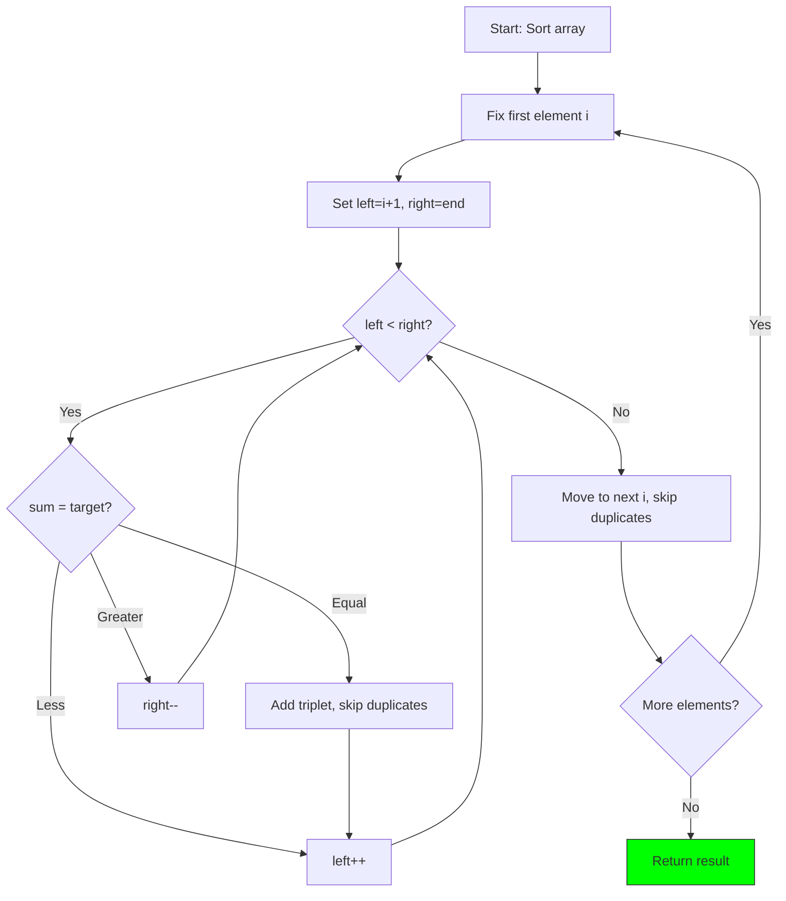
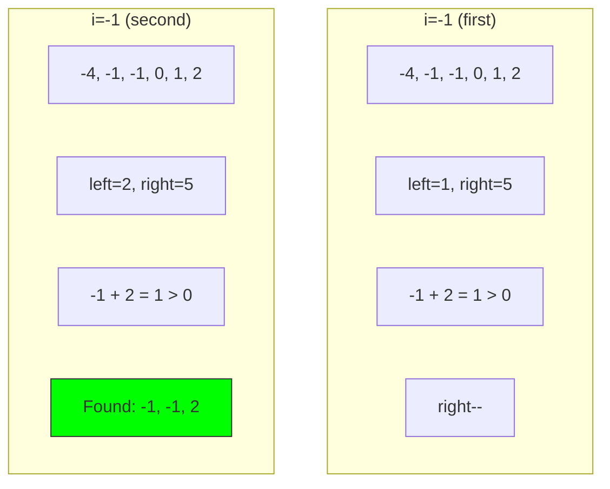

# 11. 3Sum

::: info Problem Info
**Difficulty**: Medium | **Frequency**: High | **LeetCode**: [#15](https://leetcode.com/problems/3sum/)
:::

## Video Tutorials

- 🎥 [NeetCode](https://www.youtube.com/watch?v=jzZsG8bJJZ0)
- 🎥 [Take U Forward](https://www.youtube.com/watch?v=DhFhcV7vXc0)
- 🎥 [Striver](https://www.youtube.com/watch?v=onLvA5KFEA0)

## Problem Statement

Given an integer array `nums`, return all triplets `[nums[i], nums[j], nums[k]]` where:
- `i != j != k`
- `nums[i] + nums[j] + nums[k] == 0`

The solution set must not contain duplicate triplets.

**Example:**
```
Input: nums = [-1,0,1,2,-1,-4]
Output: [[-1,-1,2],[-1,0,1]]
```

## JavaScript Solution

### Two Pointer (Optimal) ⭐

**Time**: O(n²) | **Space**: O(1)

```javascript
function threeSum(nums) {
  nums.sort((a, b) => a - b);
  const result = [];

  for (let i = 0; i < nums.length - 2; i++) {
    // Skip if positive (can't sum to 0)
    if (nums[i] > 0) break;

    // Skip duplicates
    if (i > 0 && nums[i] === nums[i - 1]) continue;

    // Two pointer on remaining array
    let left = i + 1;
    let right = nums.length - 1;
    const target = -nums[i];

    while (left < right) {
      const sum = nums[left] + nums[right];

      if (sum === target) {
        result.push([nums[i], nums[left], nums[right]]);

        // Skip duplicates
        while (left < right && nums[left] === nums[left + 1]) left++;
        while (left < right && nums[right] === nums[right - 1]) right--;

        left++;
        right--;
      } else if (sum < target) {
        left++;
      } else {
        right--;
      }
    }
  }

  return result;
}

// Test
console.log(threeSum([-1, 0, 1, 2, -1, -4]));
// [[-1, -1, 2], [-1, 0, 1]]
```

## Algorithm Visualization

### Two Pointer Approach



### Example Walkthrough

Input: `[-1, 0, 1, 2, -1, -4]` → Sorted: `[-4, -1, -1, 0, 1, 2]`



## Key Insights

- Sort first for two pointer approach
- Skip duplicates carefully
- O(n²) reduces from O(n³) brute force

---

::: info Next Problem
👉 Continue to [Median of Two Sorted Arrays](/problems/median-arrays)
:::
