# 9. Course Schedule

::: info Problem Info
**Difficulty**: Medium | **Frequency**: High | **LeetCode**: [#207](https://leetcode.com/problems/course-schedule/)
:::

## Video Tutorials

- 🎥 [NeetCode](https://www.youtube.com/watch?v=cIBebojxyYQO)
- 🎥 [Take U Forward](https://www.youtube.com/watch?v=Acz5rHgLMgw)
- 🎥 [Striver](https://www.youtube.com/watch?v=0yETf9A1eMg)

## Problem Statement

There are a total of `numCourses` courses labeled from `0` to `numCourses - 1`.

You are given an array `prerequisites` where `prerequisites[i] = [ai, bi]` indicates that you must take course `bi` first if you want to take course `ai`.

Return `true` if you can finish all courses. Otherwise, return `false`.

**Example:**
```
Input: numCourses = 2, prerequisites = [[1,0]]
Output: true
Explanation: Take course 0, then course 1

Input: numCourses = 2, prerequisites = [[1,0],[0,1]]
Output: false
Explanation: Circular dependency - impossible!
```

## Graph Visualization

### Course Dependency Graph (Valid)

Prerequisites: `[[1,0], [2,0], [3,1], [3,2]]`


**Topological Order**: 0 → 1 → 2 → 3 ✓

### Course Dependency Graph (Cycle - Invalid)

Prerequisites: `[[1,0], [0,1]]`


**Cycle Detected**: 0 → 1 → 0 ❌ Impossible!

### DFS Cycle Detection Algorithm

```mermaid
stateDiagram-v2
    [*] --> Unvisited: Initial state
    Unvisited --> Visiting: Start DFS
    Visiting --> Visiting: Visit prerequisite
    Visiting --> Cycle: Found node in Visiting state
    Visiting --> Visited: All prerequisites checked
    Visited --> [*]: Safe to take course

    state "⚪ Unvisited" as Unvisited
    state "🟡 Visiting" as Visiting
    state "🔴 Cycle Found!" as Cycle
    state "🟢 Visited" as Visited
```



### BFS (Kahn's Algorithm) Flow


## JavaScript Solutions

### Approach 1: DFS Cycle Detection ⭐

**Time**: O(V+E) | **Space**: O(V)

```javascript
function canFinish(numCourses, prerequisites) {
  // Build adjacency list
  const graph = Array(numCourses).fill(null).map(() => []);
  for (const [course, prereq] of prerequisites) {
    graph[course].push(prereq);
  }

  // States: 0=unvisited, 1=visiting, 2=visited
  const state = Array(numCourses).fill(0);

  function hasCycle(course) {
    if (state[course] === 1) return true;  // Cycle detected
    if (state[course] === 2) return false; // Already processed

    state[course] = 1; // Mark as visiting

    for (const prereq of graph[course]) {
      if (hasCycle(prereq)) return true;
    }

    state[course] = 2; // Mark as visited
    return false;
  }

  for (let i = 0; i < numCourses; i++) {
    if (state[i] === 0 && hasCycle(i)) {
      return false;
    }
  }

  return true;
}
```

### Approach 2: BFS (Kahn's Algorithm)

**Time**: O(V+E) | **Space**: O(V)

```javascript
function canFinish_BFS(numCourses, prerequisites) {
  const graph = Array(numCourses).fill(null).map(() => []);
  const indegree = Array(numCourses).fill(0);

  for (const [course, prereq] of prerequisites) {
    graph[prereq].push(course);
    indegree[course]++;
  }

  // Start with courses with no prerequisites
  const queue = [];
  for (let i = 0; i < numCourses; i++) {
    if (indegree[i] === 0) {
      queue.push(i);
    }
  }

  let completedCourses = 0;

  while (queue.length > 0) {
    const course = queue.shift();
    completedCourses++;

    for (const dependent of graph[course]) {
      indegree[dependent]--;
      if (indegree[dependent] === 0) {
        queue.push(dependent);
      }
    }
  }

  return completedCourses === numCourses;
}

// Test
console.log(canFinish(2, [[1, 0]])); // true
console.log(canFinish(2, [[1, 0], [0, 1]])); // false (cycle)
```

## Key Insights

::: tip Understanding Cycle Detection
- This is a **cycle detection** problem in a directed graph
- If cycle exists, impossible to complete all courses
- **Topological sort** exists if and only if no cycle
:::

## Real-World Applications

- **Dependency resolution** in package managers
- **Build systems** (make, webpack)
- **Database migration** ordering
- **Feature flags** with dependencies

---

::: info Next Problem
👉 Continue to [Kth Largest Element](/problems/kth-largest)
:::
