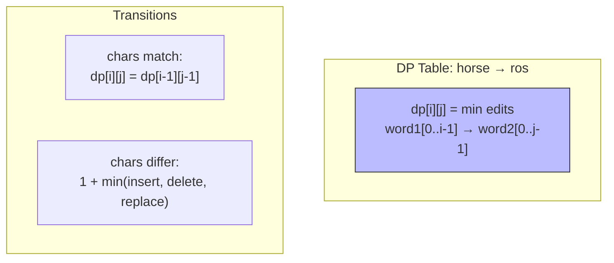
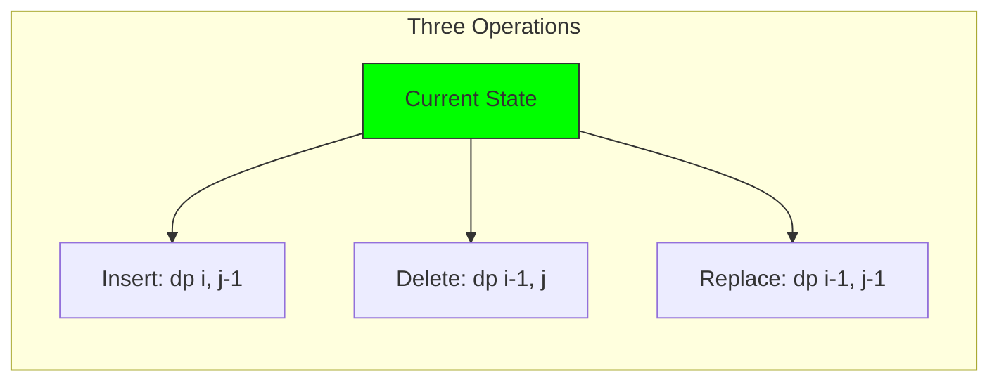
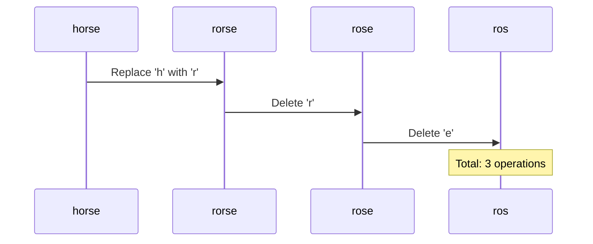

# 13. Edit Distance

::: info Problem Info
**Difficulty**: Medium | **Frequency**: High | **LeetCode**: [#72](https://leetcode.com/problems/edit-distance/)
:::

## Video Tutorials

- 🎥 [NeetCode](https://www.youtube.com/watch?v=XYi2-LPrwm4)
- 🎥 [Take U Forward](https://www.youtube.com/watch?v=fJaKJ-G2PEw)
- 🎥 [Striver](https://www.youtube.com/watch?v=EMl_gZgpWcc)

## Problem Statement

Given two strings `word1` and `word2`, return the **minimum number of operations** required to convert `word1` to `word2`.

You have the following three operations permitted:
- **Insert** a character
- **Delete** a character
- **Replace** a character

**Example:**
```
Input: word1 = "horse", word2 = "ros"
Output: 3
Explanation:
horse → rorse (replace 'h' with 'r')
rorse → rose (remove 'r')
rose → ros (remove 'e')
```

## Algorithm Visualization

### DP Table Structure



### Edit Operations



### Example: "horse" → "ros"



## JavaScript Solution

### Dynamic Programming ⭐

**Time**: O(m×n) | **Space**: O(m×n)

```javascript
function minDistance(word1, word2) {
  const m = word1.length;
  const n = word2.length;

  // dp[i][j] = min edits to convert word1[0...i-1] to word2[0...j-1]
  const dp = Array(m + 1).fill(null).map(() => Array(n + 1).fill(0));

  // Base cases
  for (let i = 0; i <= m; i++) {
    dp[i][0] = i; // Delete all characters
  }
  for (let j = 0; j <= n; j++) {
    dp[0][j] = j; // Insert all characters
  }

  // Fill DP table
  for (let i = 1; i <= m; i++) {
    for (let j = 1; j <= n; j++) {
      if (word1[i - 1] === word2[j - 1]) {
        dp[i][j] = dp[i - 1][j - 1]; // No operation needed
      } else {
        dp[i][j] = 1 + Math.min(
          dp[i - 1][j],     // Delete from word1
          dp[i][j - 1],     // Insert into word1
          dp[i - 1][j - 1]  // Replace
        );
      }
    }
  }

  return dp[m][n];
}

// Test
console.log(minDistance("horse", "ros")); // 3
console.log(minDistance("intention", "execution")); // 5
```

## Key Insights

::: tip DP Transitions
- **If chars match**: `dp[i][j] = dp[i-1][j-1]`
- **Else**:
  - Delete: `dp[i-1][j] + 1`
  - Insert: `dp[i][j-1] + 1`
  - Replace: `dp[i-1][j-1] + 1`
:::

## Real-World Applications

- **Spell checking** in search
- **DNA sequence alignment**
- **Fuzzy string matching**
- **Autocorrect suggestions**

---

::: info Next Problem
👉 Continue to [Lowest Common Ancestor](/problems/lca)
:::
