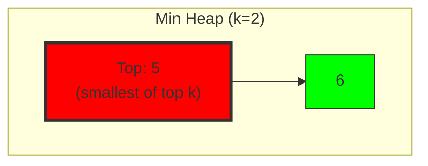
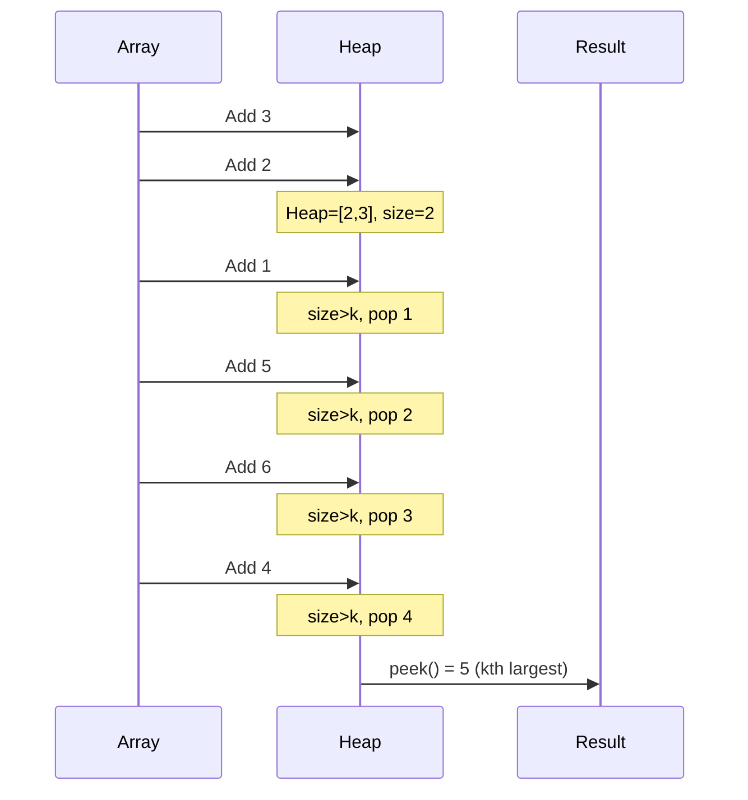

# 10. Kth Largest Element in an Array

::: info Problem Info
**Difficulty**: Medium | **Frequency**: High | **LeetCode**: [#215](https://leetcode.com/problems/kth-largest-element-in-an-array/)
:::

## Video Tutorials

- 🎥 [NeetCode](https://www.youtube.com/watch?v=z1xvDGhx-Yc)
- 🎥 [Take U Forward](https://www.youtube.com/watch?v=EZkT9J8DkdU)
- 🎥 [Striver](https://www.youtube.com/watch?v=ubUYPVvY2z8)

## Problem Statement

Given an integer array `nums` and an integer `k`, return the `kth` largest element in the array.

Note that it is the kth largest element in sorted order, not the kth distinct element.

**Example:**
```
Input: nums = [3,2,1,5,6,4], k = 2
Output: 5
```

## Algorithm Visualization

### Min Heap Structure



**Note**: Top of min heap is the kth largest element!

### Processing Flow



## JavaScript Solutions

### Approach 1: Min Heap ⭐

**Time**: O(n log k) | **Space**: O(k)

```javascript
class MinHeap {
  constructor() {
    this.heap = [];
  }

  push(val) {
    this.heap.push(val);
    this.bubbleUp(this.heap.length - 1);
  }

  pop() {
    if (this.heap.length === 1) return this.heap.pop();
    const min = this.heap[0];
    this.heap[0] = this.heap.pop();
    this.bubbleDown(0);
    return min;
  }

  peek() {
    return this.heap[0];
  }

  size() {
    return this.heap.length;
  }

  bubbleUp(index) {
    while (index > 0) {
      const parentIndex = Math.floor((index - 1) / 2);
      if (this.heap[index] < this.heap[parentIndex]) {
        [this.heap[index], this.heap[parentIndex]] =
          [this.heap[parentIndex], this.heap[index]];
        index = parentIndex;
      } else break;
    }
  }

  bubbleDown(index) {
    while (true) {
      let smallest = index;
      const left = 2 * index + 1;
      const right = 2 * index + 2;

      if (left < this.heap.length && this.heap[left] < this.heap[smallest]) {
        smallest = left;
      }
      if (right < this.heap.length && this.heap[right] < this.heap[smallest]) {
        smallest = right;
      }

      if (smallest !== index) {
        [this.heap[index], this.heap[smallest]] =
          [this.heap[smallest], this.heap[index]];
        index = smallest;
      } else break;
    }
  }
}

function findKthLargest(nums, k) {
  const minHeap = new MinHeap();

  for (const num of nums) {
    minHeap.push(num);
    if (minHeap.size() > k) {
      minHeap.pop();
    }
  }

  return minHeap.peek();
}
```

### Approach 2: Sort (Simple)

**Time**: O(n log n) | **Space**: O(1)

```javascript
function findKthLargest_Sort(nums, k) {
  return nums.sort((a, b) => b - a)[k - 1];
}
```

## Comparison

| Approach | Time | Space | Best For |
|----------|------|-------|----------|
| Min Heap | O(n log k) | O(k) | When k small |
| Sort | O(n log n) | O(1) | Simplest |
| QuickSelect | O(n) avg | O(1) | Optimal average |

---

::: info Next Problem
👉 Continue to [3Sum](/problems/3sum)
:::
