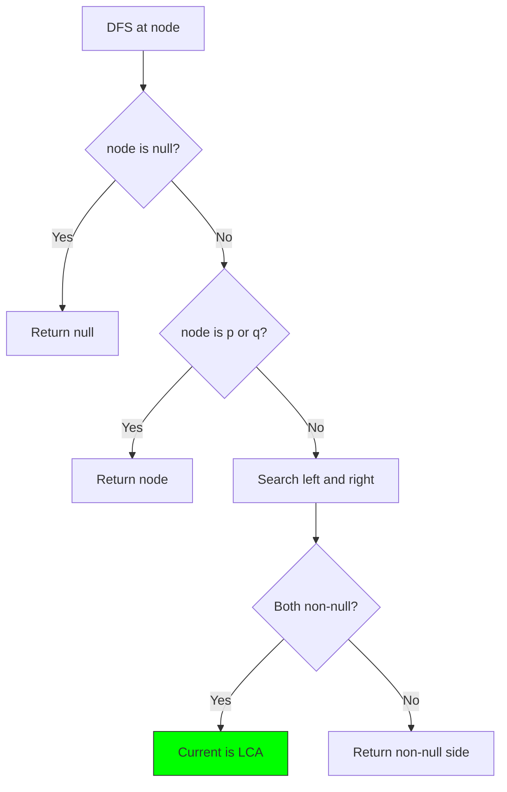

# 14. Lowest Common Ancestor

::: info Problem Info
**Difficulty**: Medium | **Frequency**: High | **LeetCode**: [#236](https://leetcode.com/problems/lowest-common-ancestor-of-a-binary-tree/)
:::

## Video Tutorials

- 🎥 [NeetCode](https://www.youtube.com/watch?v=13m9ZCB8gjw)
- 🎥 [Take U Forward](https://www.youtube.com/watch?v=_-QHfMDde90)
- 🎥 [Striver](https://www.youtube.com/watch?v=tREGBMk8SVw)

## Problem Statement

Given a binary tree, find the **lowest common ancestor (LCA)** of two given nodes.

The LCA is defined as the lowest node that has both `p` and `q` as descendants.

**Example:**
```
        3
       / \
      5   1
     / \
    6   2

LCA(5, 1) = 3
LCA(5, 2) = 5
```

## Algorithm Visualization

### LCA Cases

```mermaid
graph TD
    subgraph "Case 1: Split nodes"
        R1[Root 3]
        R1 --> L1[5 ✓]
        R1 --> R1R[1 ✓]
    end

    subgraph "Case 2: One ancestor of other"
        R2[5 ✓]
        R2 --> R2L[6]
        R2 --> R2R[2 ✓]
    end

    style R1 fill:#0f0,stroke:#333,stroke-width:3px
    style R2 fill:#0f0,stroke:#333,stroke-width:3px
```



### DFS Flow



## JavaScript Solution

### Recursive DFS ⭐

**Time**: O(n) | **Space**: O(h) where h is height

```javascript
function lowestCommonAncestor(root, p, q) {
  if (!root) return null;

  // If either p or q is the root, root is the LCA
  if (root === p || root === q) return root;

  // Search in left and right subtrees
  const left = lowestCommonAncestor(root.left, p, q);
  const right = lowestCommonAncestor(root.right, p, q);

  // If both left and right return non-null, root is LCA
  if (left && right) return root;

  // If only one side has a result, return that side
  return left ? left : right;
}

// Test
class TreeNode {
  constructor(val, left = null, right = null) {
    this.val = val;
    this.left = left;
    this.right = right;
  }
}

const root = new TreeNode(3);
root.left = new TreeNode(5);
root.right = new TreeNode(1);
root.left.left = new TreeNode(6);
root.left.right = new TreeNode(2);

console.log(lowestCommonAncestor(root, root.left, root.right).val); // 3
console.log(lowestCommonAncestor(root, root.left, root.left.right).val); // 5
```

## Key Insights

::: tip Understanding LCA
- If both p and q in **left subtree**, LCA is in left
- If both in **right subtree**, LCA is in right
- If **split** between left and right, current node is LCA
- One node can be ancestor of another
:::

## Interview Tips

- Draw the tree and trace through
- Explain the three cases clearly
- Discuss time/space complexity

---

::: info Next Problem
👉 Continue to [Word Ladder](/problems/word-ladder)
:::
