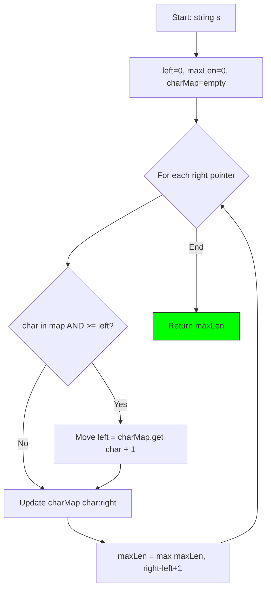
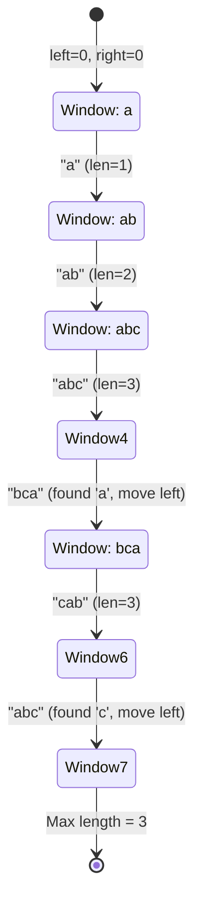
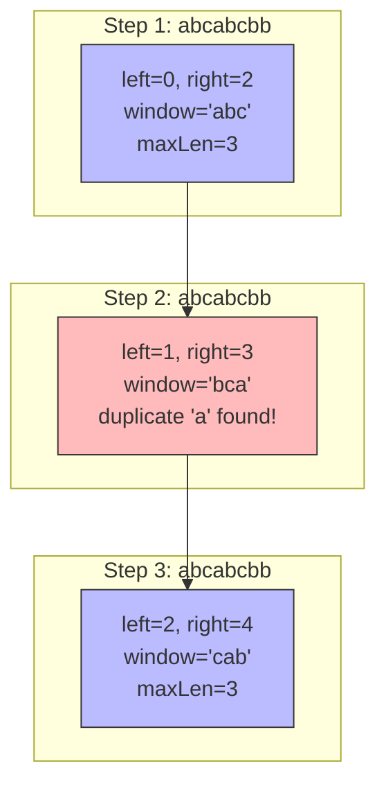

# 3. Longest Substring Without Repeating Characters

::: info Problem Info
**Difficulty**: Medium | **Frequency**: Very High | **LeetCode**: [#3](https://leetcode.com/problems/longest-substring-without-repeating-characters/)
:::

## Video Tutorials

- 🎥 [NeetCode](https://www.youtube.com/watch?v=wiGpQwVHdE0)
- 🎥 [Take U Forward](https://www.youtube.com/watch?v=tcTJknBzqnA)
- 🎥 [Striver](https://www.youtube.com/watch?v=AU0Ph7BN92w)

## Problem Statement

Given a string `s`, find the length of the **longest substring** without repeating characters.

**Example 1:**
```
Input: s = "abcabcbb"
Output: 3
Explanation: The answer is "abc", with length 3.
```

**Example 2:**
```
Input: s = "pwwkew"
Output: 3
Explanation: The answer is "wke", with length 3.
```

## Algorithm Visualization

### Sliding Window Approach



### Example: "abcabcbb"



### Sliding Window Visualization



## JavaScript Solution

### Sliding Window + Hash Map (Optimal) ⭐

**Time Complexity**: O(n) | **Space Complexity**: O(min(m,n))

```javascript
/**
 * Sliding Window + Hash Map
 * O(n) time, O(min(m,n)) space where m = charset size
 */
function lengthOfLongestSubstring(s) {
  const charMap = new Map();
  let maxLength = 0;
  let left = 0;

  for (let right = 0; right < s.length; right++) {
    const char = s[right];

    // If character exists and is in current window, move left pointer
    if (charMap.has(char) && charMap.get(char) >= left) {
      left = charMap.get(char) + 1;
    }

    // Update character's latest position
    charMap.set(char, right);

    // Update max length
    maxLength = Math.max(maxLength, right - left + 1);
  }

  return maxLength;
}

// Test cases
console.log(lengthOfLongestSubstring("abcabcbb")); // 3 ("abc")
console.log(lengthOfLongestSubstring("bbbbb")); // 1 ("b")
console.log(lengthOfLongestSubstring("pwwkew")); // 3 ("wke")
console.log(lengthOfLongestSubstring("dvdf")); // 3 ("vdf")
```

## Key Insights

::: tip Why This Works
- **Sliding window** shrinks when duplicate found
- **Store character positions** for quick lookup
- **Only update left** when char is in CURRENT window
- **Single pass** through the string
:::

## Interview Tips

- Start by explaining the sliding window concept
- Draw the window movement on an example
- Explain why we need `charMap.get(char) >= left` check

---

::: info Next Problem
👉 Continue to [Top K Frequent Elements](/problems/top-k-frequent)
:::
