# 2. LRU Cache ⭐

::: warning CRITICAL FOR SEARCH
**Difficulty**: Hard | **Frequency**: Very High | **PRIORITY**: MUST DO

This problem is **essential** for search/caching systems!
:::

## Video Tutorials

- 🎥 [NeetCode](https://www.youtube.com/watch?v=7ABFX8Q_AKk)
- 🎥 [Take U Forward](https://www.youtube.com/watch?v=xDEuM-mR3p8)
- 🎥 [Code with Harry](https://www.youtube.com/watch?v=PKmAXbzpDhE)

## Problem Statement

Design a data structure that follows the constraints of a **Least Recently Used (LRU) cache**. Implement `get()` and `put()` operations in **O(1) time**.

**Operations:**
- `LRUCache(int capacity)` - Initialize with positive capacity
- `int get(int key)` - Return value if exists, else -1
- `void put(int key, int value)` - Update if exists, insert if not. Evict LRU item if at capacity.

**Example:**
```javascript
const lru = new LRUCache(2);
lru.put(1, 1);
lru.put(2, 2);
lru.get(1);      // returns 1
lru.put(3, 3);   // evicts key 2
lru.get(2);      // returns -1 (not found)
```

## Architecture Overview

### LRU Cache Structure


### Operation Flow


### Data Structure Visualization

```mermaid
graph LR
    subgraph "Hash Map"
        M[Map: key → Node]
    end

    subgraph "Doubly Linked List"
        HEAD[HEAD dummy] <--> N1[Node 3] <--> N2[Node 1] <--> TAIL[TAIL dummy]
    end

    M -.->|points to| N1
    M -.->|points to| N2

    style HEAD fill:#f9f,stroke:#333
    style TAIL fill:#f9f,stroke:#333
    style N1 fill:#bbf,stroke:#333
    style N2 fill:#bbf,stroke:#333

    classDef mru fill:#0f0,stroke:#333
    classDef lru fill:#f00,stroke:#333
```



**Legend:**
- **HEAD → Most Recently Used (MRU)**
- **TAIL → Least Recently Used (LRU)**
- Green = Recently accessed
- Red = Candidate for eviction

## JavaScript Solutions

### Approach 1: Hash Map + Doubly Linked List (Optimal) ⭐

**Time Complexity**: O(1) for both get and put | **Space Complexity**: O(capacity)

```javascript
/**
 * Node for Doubly Linked List
 */
class Node {
  constructor(key, value) {
    this.key = key;
    this.value = value;
    this.prev = null;
    this.next = null;
  }
}

/**
 * LRU Cache - O(1) for both get/put
 * This is THE solution for caching in search systems!
 */
class LRUCache {
  constructor(capacity) {
    this.capacity = capacity;
    this.cache = new Map();

    // Dummy nodes for easier pointer manipulation
    this.head = new Node(0, 0);
    this.tail = new Node(0, 0);
    this.head.next = this.tail;
    this.tail.prev = this.head;
  }

  /**
   * Add node right after head (most recently used)
   */
  addToHead(node) {
    node.prev = this.head;
    node.next = this.head.next;
    this.head.next.prev = node;
    this.head.next = node;
  }

  /**
   * Remove node from its current position
   */
  removeNode(node) {
    node.prev.next = node.next;
    node.next.prev = node.prev;
  }

  /**
   * Get value and mark as recently used
   * Time: O(1), Space: O(1)
   */
  get(key) {
    if (!this.cache.has(key)) {
      return -1;
    }

    const node = this.cache.get(key);
    this.removeNode(node);
    this.addToHead(node);

    return node.value;
  }

  /**
   * Put key-value pair, evict LRU if full
   * Time: O(1), Space: O(1)
   */
  put(key, value) {
    if (this.cache.has(key)) {
      // Update existing key
      const node = this.cache.get(key);
      node.value = value;
      this.removeNode(node);
      this.addToHead(node);
    } else {
      // Add new key
      if (this.cache.size >= this.capacity) {
        // Remove least recently used (right before tail)
        const lru = this.tail.prev;
        this.removeNode(lru);
        this.cache.delete(lru.key);
      }

      const newNode = new Node(key, value);
      this.cache.set(key, newNode);
      this.addToHead(newNode);
    }
  }
}

// Test
const lru = new LRUCache(2);
lru.put(1, 1);
lru.put(2, 2);
console.log(lru.get(1)); // 1
lru.put(3, 3); // Evicts key 2
console.log(lru.get(2)); // -1 (not found)
```

### Approach 2: Map with Insertion Order (Simpler)

**Time Complexity**: O(1) | **Space Complexity**: O(capacity)

```javascript
/**
 * Simpler approach using Map's insertion order
 * Also O(1) and cleaner for interviews if you're short on time
 */
class LRUCacheSimple {
  constructor(capacity) {
    this.capacity = capacity;
    this.cache = new Map();
  }

  get(key) {
    if (!this.cache.has(key)) return -1;

    const value = this.cache.get(key);
    // Move to end (most recently used)
    this.cache.delete(key);
    this.cache.set(key, value);
    return value;
  }

  put(key, value) {
    if (this.cache.has(key)) {
      this.cache.delete(key);
    } else if (this.cache.size >= this.capacity) {
      // Remove first entry (least recently used)
      const firstKey = this.cache.keys().next().value;
      this.cache.delete(firstKey);
    }
    this.cache.set(key, value);
  }
}
```

## Complexity Analysis

| Approach | Get | Put | Space | Note |
|----------|-----|-----|-------|------|
| Map + DLL | O(1) | O(1) | O(capacity) | **Production-ready** |
| Map Only | O(1) | O(1) | O(capacity) | Simpler, leverages JS Map |

## Key Insights

::: tip Why This Works
1. **Map for O(1) lookups** - Constant time access to any key
2. **Doubly Linked List for O(1) removal** - Can remove any node in constant time
3. **Dummy head/tail** - Simplifies edge cases (no null checks)
4. **Most recent = head** - Recently accessed items near head
5. **Least recent = tail** - Items to evict near tail
:::

## Data Structure Visualization

```
Cache State: {1→Node1, 2→Node2}

Doubly Linked List:
HEAD ⇄ [1] ⇄ [2] ⇄ TAIL
       (MRU)  (LRU)

After get(1):
HEAD ⇄ [1] ⇄ [2] ⇄ TAIL
       (MRU)  (LRU)

After put(3, 3) [capacity=2]:
HEAD ⇄ [3] ⇄ [1] ⇄ TAIL
       (MRU)  (LRU)
Node 2 evicted!
```

## Interview Tips

::: tip Speaking Points
- **Explain data structure choice upfront** - "I'll use a hash map for O(1) lookups and a doubly linked list for O(1) removal"
- **Draw the structure** - Visual representation helps clarify
- **Walk through a complex scenario** - Show access and eviction
- **Mention real-world applications**:
  - Search result caching
  - Browser history
  - Database query caching
  - CDN caching
:::

## Real-World Applications

**In Microsoft Teams Search:**
- Cache recent search queries
- Cache search results for frequently accessed terms
- Evict least recently accessed results when cache is full
- Improves response time significantly

## Common Mistakes

::: danger Watch Out
- ❌ Forgetting to update order on `get()`
- ❌ Not storing key in node (needed for eviction)
- ❌ Incorrect pointer updates in DLL
- ❌ Not handling capacity edge cases
- ❌ Using array (O(n) removal) instead of linked list
:::

## Follow-up Questions

**Q: How would you make this thread-safe?**
A: Add locks/mutexes around get/put operations

**Q: What if we need LFU (Least Frequently Used) instead?**
A: Track frequency count, use min heap or additional data structures

**Q: How to handle expiration time?**
A: Add timestamp to nodes, check on access

**Q: What about distributed caching?**
A: Use Redis, Memcached, or distributed hash tables

## Related Problems

- [460. LFU Cache](https://leetcode.com/problems/lfu-cache/) - Hard
- [1429. First Unique Number](https://leetcode.com/problems/first-unique-number/) - Medium

---

::: info Next Problem
👉 Continue to [Number of Islands](/problems/number-of-islands)
:::
