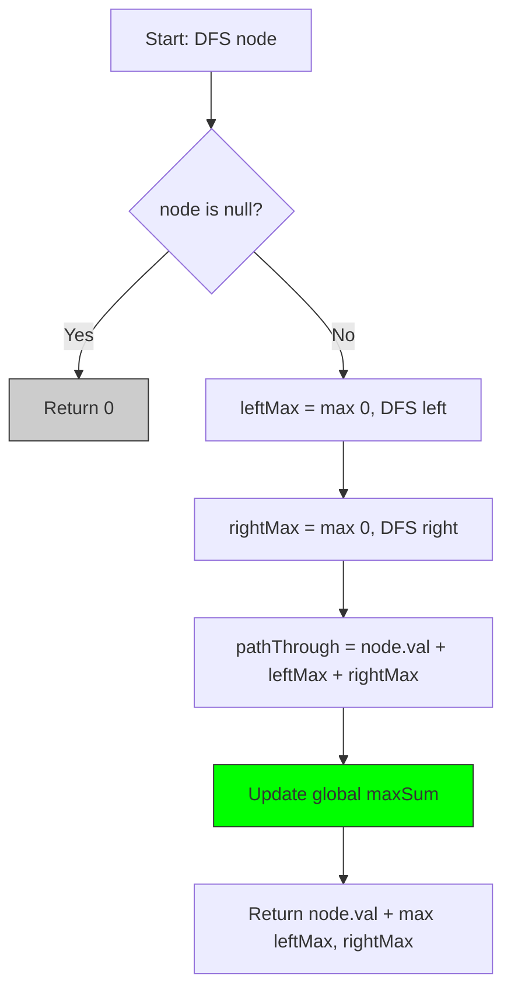
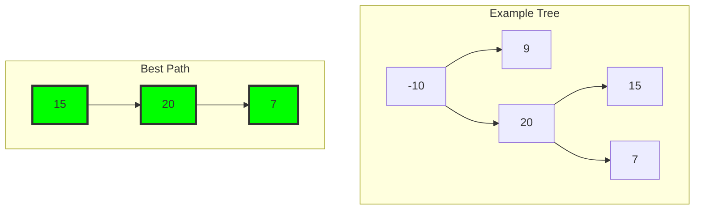
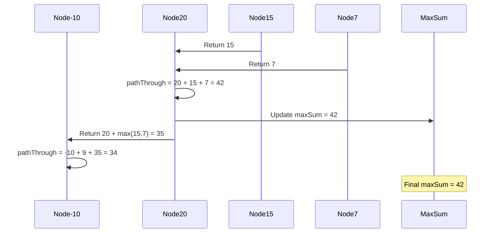
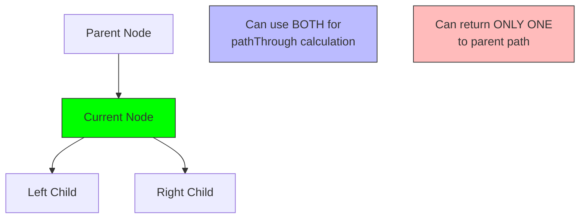

# 6. Binary Tree Maximum Path Sum

::: info Problem Info
**Difficulty**: Hard | **Frequency**: High | **LeetCode**: [#124](https://leetcode.com/problems/binary-tree-maximum-path-sum/)
:::

## Video Tutorials

- 🎥 [NeetCode](https://www.youtube.com/watch?v=WszrfSwMz58)
- 🎥 [Take U Forward](https://www.youtube.com/watch?v=UwnH2F4GpnM)
- 🎥 [Kevin Naughton Jr](https://www.youtube.com/watch?v=q5M_GrXW91w)

## Problem Statement

A **path** in a binary tree is a sequence of nodes where each pair of adjacent nodes has an edge. A node can only appear once in the sequence. The **path sum** is the sum of node values.

Given the root of a binary tree, return the **maximum path sum** of any non-empty path.

**Example 1:**
```
    1
   / \
  2   3

Output: 6
Explanation: Path is 2 → 1 → 3
```

**Example 2:**
```
      -10
      / \
     9  20
       /  \
      15   7

Output: 42
Explanation: Path is 15 → 20 → 7
```

## Algorithm Visualization

### DFS Approach



### Tree Path Visualization



### Calculation Steps



### Why Return Only One Branch?



## JavaScript Solution

### DFS with Backtracking (Optimal) ⭐

**Time Complexity**: O(n) | **Space Complexity**: O(h) where h is height

```javascript
/**
 * DFS with backtracking - O(n) time, O(h) space
 * h could be n in worst case (skewed tree)
 */
function maxPathSum(root) {
  let maxSum = -Infinity;

  function dfs(node) {
    if (!node) return 0;

    // Recursively get max sum from left and right
    // Math.max(0, ...) because we can skip negative paths
    const leftMax = Math.max(0, dfs(node.left));
    const rightMax = Math.max(0, dfs(node.right));

    // Calculate max path through this node
    const pathThroughNode = node.val + leftMax + rightMax;

    // Update global max
    maxSum = Math.max(maxSum, pathThroughNode);

    // Return max path that can be extended to parent
    // (only left or right, not both - can't have two branches in path)
    return node.val + Math.max(leftMax, rightMax);
  }

  dfs(root);
  return maxSum;
}

// Test
class TreeNode {
  constructor(val, left = null, right = null) {
    this.val = val;
    this.left = left;
    this.right = right;
  }
}

const root1 = new TreeNode(1,
  new TreeNode(2),
  new TreeNode(3)
);
console.log(maxPathSum(root1)); // 6 (1+2+3)

const root2 = new TreeNode(-10,
  new TreeNode(9),
  new TreeNode(20,
    new TreeNode(15),
    new TreeNode(7)
  )
);
console.log(maxPathSum(root2)); // 42 (15+20+7)
```

## Complexity Analysis

| Approach | Time | Space | Note |
|----------|------|-------|------|
| DFS | O(n) | O(h) | Visit each node once |

## Key Insights

::: tip Understanding the Algorithm
1. **Max path at node** = `node.val + leftMax + rightMax`
2. **Only return one branch** to parent (can't fork in path)
3. **Skip negative branches** with `Math.max(0, ...)`
4. **Global max** tracks best path found so far
:::

## Algorithm Visualization

```
Tree:
      -10
      / \
     9  20
       /  \
      15   7

At node 15: maxSum = 15, return 15
At node 7: maxSum = 7, return 7
At node 20:
  - leftMax = 15, rightMax = 7
  - pathThroughNode = 20 + 15 + 7 = 42
  - maxSum = 42
  - return 20 + max(15, 7) = 35
At node 9: maxSum = 9, return 9
At node -10:
  - leftMax = 9, rightMax = 35
  - pathThroughNode = -10 + 9 + 35 = 34
  - maxSum stays 42

Answer: 42
```

## Interview Tips

::: tip Speaking Points
- **Draw the tree** and trace through it
- **Explain why return max(left, right)** - Can't use both branches for parent
- **Clarify "path" concept** - No jumping between disconnected nodes
- **Handle negative numbers** - Use Math.max(0, ...) to skip negative paths
:::

## Common Mistakes

::: danger Watch Out
- ❌ Returning both left and right (breaks path concept)
- ❌ Not handling negative numbers correctly
- ❌ Forgetting to update global max inside function
- ❌ Not considering single node as valid path
:::

## Follow-up Questions

**Q: What if we need the actual path, not just sum?**
A: Track path nodes during DFS and store when updating maxSum

**Q: Can we do this iteratively?**
A: Possible but complex - need to simulate recursion with stack

**Q: What about n-ary trees?**
A: Same approach, but consider all children and pick top 2

## Related Problems

- [112. Path Sum](https://leetcode.com/problems/path-sum/) - Easy
- [437. Path Sum III](https://leetcode.com/problems/path-sum-iii/) - Medium
- [687. Longest Univalue Path](https://leetcode.com/problems/longest-univalue-path/) - Medium

---

::: info Next Problem
👉 Continue to [Trie Implementation](/problems/trie)
:::
