# 12. Median of Two Sorted Arrays

::: info Problem Info
**Difficulty**: Hard | **Frequency**: Medium | **LeetCode**: [#4](https://leetcode.com/problems/median-of-two-sorted-arrays/)
:::

## Video Tutorials

- 🎥 [NeetCode](https://www.youtube.com/watch?v=q6IEA26yrFU)
- 🎥 [Take U Forward](https://www.youtube.com/watch?v=BpsxyPO7sWY)
- 🎥 [Kevin Naughton Jr](https://www.youtube.com/watch?v=LPUQXVx2bOw)

## Problem Statement

Given two sorted arrays `nums1` and `nums2`, return the **median** of the two sorted arrays.

The overall runtime complexity should be **O(log(min(m,n)))**.

**Example:**
```
Input: nums1 = [1,3], nums2 = [2]
Output: 2.00000
Explanation: Merged array = [1,2,3], median = 2

Input: nums1 = [1,2], nums2 = [3,4]
Output: 2.50000
Explanation: Merged array = [1,2,3,4], median = (2+3)/2 = 2.5
```

## Algorithm Visualization

### Binary Search Partition


### Partition Strategy

```mermaid
flowchart TD
    A[Binary search on smaller array] --> B[Find partition cut1]
    B --> C[Calculate cut2 from cut1]
    C --> D{left1 ≤ right2 AND<br/>left2 ≤ right1?}
    D -->|Yes| E[Found valid partition!]
    D -->|No| F[Adjust binary search]
    F --> B

    style E fill:#0f0,stroke:#333
```



## JavaScript Solutions

### Approach 1: Binary Search (Optimal) ⭐

**Time**: O(log(min(m,n))) | **Space**: O(1)

```javascript
function findMedianSortedArrays(nums1, nums2) {
  // Ensure nums1 is the smaller array
  if (nums1.length > nums2.length) {
    return findMedianSortedArrays(nums2, nums1);
  }

  const m = nums1.length;
  const n = nums2.length;
  let low = 0;
  let high = m;

  while (low <= high) {
    const cut1 = Math.floor((low + high) / 2);
    const cut2 = Math.floor((m + n + 1) / 2) - cut1;

    const left1 = cut1 === 0 ? -Infinity : nums1[cut1 - 1];
    const right1 = cut1 === m ? Infinity : nums1[cut1];
    const left2 = cut2 === 0 ? -Infinity : nums2[cut2 - 1];
    const right2 = cut2 === n ? Infinity : nums2[cut2];

    if (left1 <= right2 && left2 <= right1) {
      // Found correct partition
      if ((m + n) % 2 === 0) {
        return (Math.max(left1, left2) + Math.min(right1, right2)) / 2;
      } else {
        return Math.max(left1, left2);
      }
    } else if (left1 > right2) {
      high = cut1 - 1;
    } else {
      low = cut1 + 1;
    }
  }

  return -1;
}
```

### Approach 2: Merge Arrays (Simple)

**Time**: O(m+n) | **Space**: O(m+n)

```javascript
function findMedianSortedArrays_Merge(nums1, nums2) {
  const merged = [];
  let i = 0, j = 0;

  while (i < nums1.length && j < nums2.length) {
    if (nums1[i] < nums2[j]) {
      merged.push(nums1[i++]);
    } else {
      merged.push(nums2[j++]);
    }
  }

  merged.push(...nums1.slice(i), ...nums2.slice(j));

  const mid = Math.floor(merged.length / 2);
  return merged.length % 2 === 1
    ? merged[mid]
    : (merged[mid - 1] + merged[mid]) / 2;
}
```

## Comparison

| Approach | Time | Space | Interview |
|----------|------|-------|-----------|
| Binary Search | O(log min(m,n)) | O(1) | **Optimal** |
| Merge | O(m+n) | O(m+n) | Simpler |

## Interview Tips

- Start with merge approach if short on time
- Binary search is tricky - practice it
- Draw partition visualization

---

::: info Next Problem
👉 Continue to [Edit Distance](/problems/edit-distance)
:::
