# 8. Minimum Window Substring

::: info Problem Info
**Difficulty**: Hard | **Frequency**: High | **LeetCode**: [#76](https://leetcode.com/problems/minimum-window-substring/)
:::

## Video Tutorials

- 🎥 [NeetCode](https://www.youtube.com/watch?v=aclHkTaDMV0)
- 🎥 [Take U Forward](https://www.youtube.com/watch?v=_mVnWNe6B84)
- 🎥 [Striver](https://www.youtube.com/watch?v=F7F3qB5-y58)

## Problem Statement

Given two strings `s` and `t`, return the **minimum window substring** of `s` that contains all characters in `t`. If there is no such window, return the empty string `""`.

**Example:**
```
Input: s = "ADOBECODEBANC", t = "ABC"
Output: "BANC"
Explanation: Minimum window is "BANC" containing A, B, C
```

## Algorithm Visualization

### Sliding Window Flow


### Example: s="ADOBECODEBANC", t="ABC"

```mermaid
stateDiagram-v2
    [*] --> S1: Window: "ADOBEC" ✓ (has ABC)
    S1 --> S2: Shrink left
    S2 --> S3: Window: "CODEBA" ✓
    S3 --> S4: Shrink more
    S4 --> S5: Window: "BANC" ✓ MINIMUM!
    S5 --> [*]: Result = "BANC"
```



##  JavaScript Solution

### Sliding Window + Hash Map ⭐

**Time**: O(m+n) | **Space**: O(1) - charset is limited

```javascript
function minWindow(s, t) {
  if (!t || !s || s.length < t.length) return "";

  // Count characters needed
  const tCount = {};
  for (const char of t) {
    tCount[char] = (tCount[char] || 0) + 1;
  }

  let required = Object.keys(tCount).length;
  let formed = 0;

  const windowCounts = {};
  let left = 0;
  let minLen = Infinity;
  let minStart = 0;

  for (let right = 0; right < s.length; right++) {
    const char = s[right];
    windowCounts[char] = (windowCounts[char] || 0) + 1;

    if (char in tCount && windowCounts[char] === tCount[char]) {
      formed++;
    }

    // Try to shrink window from left
    while (left <= right && formed === required) {
      const leftChar = s[left];

      // Update minimum window
      if (right - left + 1 < minLen) {
        minLen = right - left + 1;
        minStart = left;
      }

      // Remove from window
      windowCounts[leftChar]--;
      if (leftChar in tCount && windowCounts[leftChar] < tCount[leftChar]) {
        formed--;
      }

      left++;
    }
  }

  return minLen === Infinity ? "" : s.substring(minStart, minStart + minLen);
}

// Test
console.log(minWindow("ADOBECODEBANC", "ABC")); // "BANC"
console.log(minWindow("a", "a")); // "a"
console.log(minWindow("a", "aa")); // ""
```

## Algorithm Steps

1. **Expand right** pointer to find valid window
2. **When valid**, shrink left pointer to minimize
3. **Track min** window seen
4. **Use "formed"** concept for efficiency

## Interview Tips

::: tip Speaking Points
- Explain the sliding window concept
- Why we use `formed` instead of checking all chars
- Handle edge cases: t longer than s, no valid window
:::

---

::: info Next Problem
👉 Continue to [Course Schedule](/problems/course-schedule)
:::
