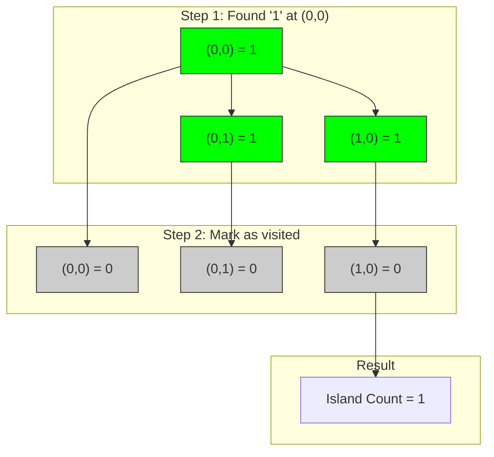
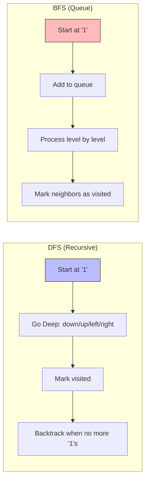
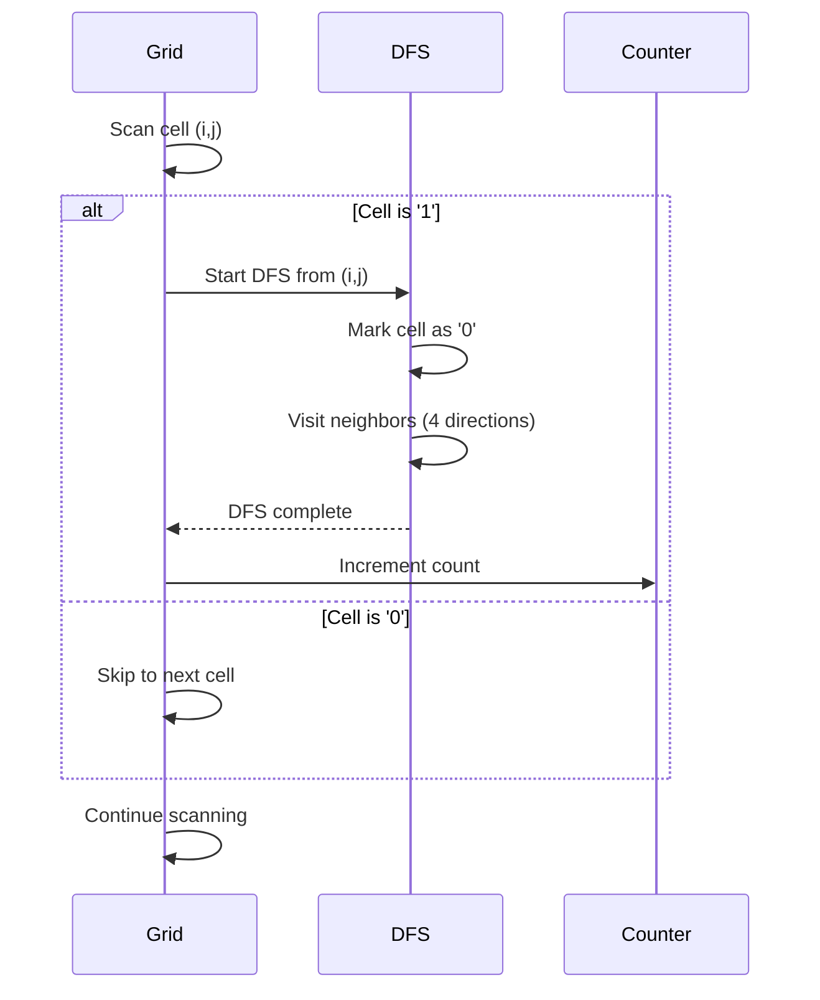

# 3. Number of Islands

::: info Problem Info
**Difficulty**: Medium | **Frequency**: High | **LeetCode**: [#200](https://leetcode.com/problems/number-of-islands/)
:::

## Video Tutorials

- 🎥 [NeetCode](https://www.youtube.com/watch?v=pNi8GH-qT8s)
- 🎥 [Take U Forward](https://www.youtube.com/watch?v=dVjc73L1c3M)
- 🎥 [Tech Dose](https://www.youtube.com/watch?v=bNqKmK2LI0w)

## Problem Statement

Given an m x n 2D binary grid where `'1'` represents land and `'0'` represents water, return the number of islands.

An **island** is surrounded by water and is formed by connecting adjacent lands horizontally or vertically.

**Example 1:**
```
Input: grid = [
  ["1","1","1","1","0"],
  ["1","1","0","1","0"],
  ["1","1","0","0","0"],
  ["0","0","0","0","0"]
]
Output: 1
```

**Example 2:**
```
Input: grid = [
  ["1","1","0","0","0"],
  ["1","1","0","0","0"],
  ["0","0","1","0","0"],
  ["0","0","0","1","1"]
]
Output: 3
```

## Algorithm Visualization

### DFS Traversal Example

Grid:
```
1 1 0
1 0 0
0 0 1
```



### DFS vs BFS Comparison



### Island Detection Process



## JavaScript Solutions

### Approach 1: DFS (Optimal) ⭐

**Time Complexity**: O(m×n) | **Space Complexity**: O(m×n)

```javascript
/**
 * DFS Approach - O(m*n) time, O(m*n) space (recursion stack)
 * BEST for interviews - intuitive and clean
 */
function numIslands_DFS(grid) {
  if (!grid || grid.length === 0) return 0;

  const rows = grid.length;
  const cols = grid[0].length;
  let count = 0;

  function dfs(i, j) {
    // Out of bounds or water
    if (i < 0 || i >= rows || j < 0 || j >= cols || grid[i][j] === '0') {
      return;
    }

    grid[i][j] = '0'; // Mark as visited

    // Explore all 4 directions
    dfs(i + 1, j); // down
    dfs(i - 1, j); // up
    dfs(i, j + 1); // right
    dfs(i, j - 1); // left
  }

  for (let i = 0; i < rows; i++) {
    for (let j = 0; j < cols; j++) {
      if (grid[i][j] === '1') {
        dfs(i, j);
        count++;
      }
    }
  }

  return count;
}
```

### Approach 2: BFS (Alternative)

**Time Complexity**: O(m×n) | **Space Complexity**: O(m×n)

```javascript
/**
 * BFS Approach - O(m*n) time, O(m*n) space
 * More iterative, avoids recursion depth issues
 */
function numIslands_BFS(grid) {
  if (!grid || grid.length === 0) return 0;

  const rows = grid.length;
  const cols = grid[0].length;
  let count = 0;

  function bfs(startI, startJ) {
    const queue = [[startI, startJ]];
    grid[startI][startJ] = '0';

    while (queue.length > 0) {
      const [i, j] = queue.shift();

      // Check all 4 directions
      const directions = [[0, 1], [0, -1], [1, 0], [-1, 0]];
      for (const [di, dj] of directions) {
        const ni = i + di;
        const nj = j + dj;

        if (ni >= 0 && ni < rows && nj >= 0 && nj < cols && grid[ni][nj] === '1') {
          grid[ni][nj] = '0';
          queue.push([ni, nj]);
        }
      }
    }
  }

  for (let i = 0; i < rows; i++) {
    for (let j = 0; j < cols; j++) {
      if (grid[i][j] === '1') {
        bfs(i, j);
        count++;
      }
    }
  }

  return count;
}

// Test
const grid1 = [
  ['1', '1', '1', '1', '0'],
  ['1', '1', '0', '1', '0'],
  ['1', '1', '0', '0', '0'],
  ['0', '0', '0', '0', '0']
];
console.log(numIslands_DFS(grid1)); // 1

const grid2 = [
  ['1', '1', '0', '0', '0'],
  ['1', '1', '0', '0', '0'],
  ['0', '0', '1', '0', '0'],
  ['0', '0', '0', '1', '1']
];
console.log(numIslands_DFS(grid2)); // 3
```

## Complexity Analysis

| Approach | Time | Space | Note |
|----------|------|-------|------|
| DFS | O(m×n) | O(m×n) | Recursion stack |
| BFS | O(m×n) | O(m×n) | Queue storage |

## Key Insights

::: tip Understanding the Problem
- Each island is a **connected component** in the grid
- We modify the grid in-place to mark visited cells
- DFS explores depth-first (recursive), BFS explores level by level
- Both approaches have same time/space complexity
:::

## Algorithm Visualization

```
Initial Grid:
1 1 0
1 0 0
0 0 1

Step 1: Found '1' at (0,0), start DFS
Mark (0,0) → 0
Mark (0,1) → 0
Mark (1,0) → 0
Island count = 1

Grid now:
0 0 0
0 0 0
0 0 1

Step 2: Found '1' at (2,2), start DFS
Mark (2,2) → 0
Island count = 2

Result: 2 islands
```

## Interview Tips

::: tip Speaking Points
- **Explain graph connectivity** - This is a graph traversal problem
- **Show both approaches** - Demonstrate knowledge of DFS and BFS
- **Discuss space trade-offs** - Both use O(m×n) but in different ways
- **Ask about modification** - Confirm it's okay to modify input grid
- **Alternative**: If can't modify, use separate `visited` set
:::

## Common Mistakes

::: danger Watch Out
- ❌ Not checking bounds before accessing grid
- ❌ Forgetting to mark cells as visited
- ❌ Using '1' instead of `'1'` (string vs number)
- ❌ Not handling empty grid edge case
- ❌ Counting water cells instead of land
:::

## Follow-up Questions

**Q: What if we can't modify the input?**
A: Use a separate `Set` to track visited coordinates

**Q: What about diagonal connections?**
A: Add 4 more directions: `[[-1,-1], [-1,1], [1,-1], [1,1]]`

**Q: How to find the largest island?**
A: Track size during DFS and keep max

**Q: How to handle very large grids?**
A: Use Union-Find (Disjoint Set Union) for better performance

## Related Problems

- [695. Max Area of Island](https://leetcode.com/problems/max-area-of-island/) - Medium
- [733. Flood Fill](https://leetcode.com/problems/flood-fill/) - Easy
- [1254. Number of Closed Islands](https://leetcode.com/problems/number-of-closed-islands/) - Medium

---

::: info Next Problem
👉 Continue to [Binary Tree Maximum Path Sum](/problems/max-path-sum)
:::
