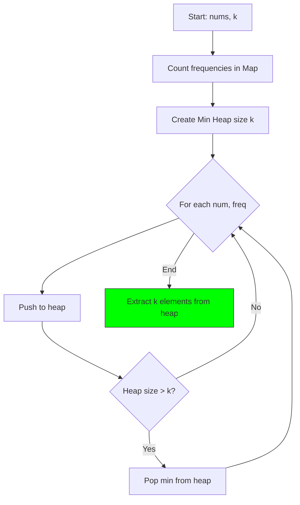
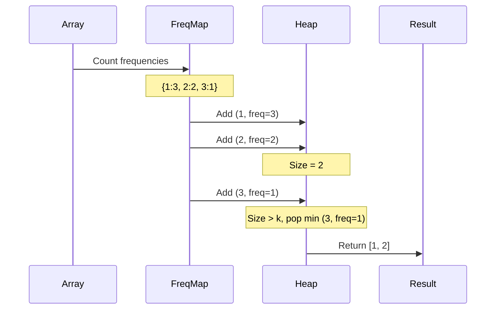

# 5. Top K Frequent Elements ⭐

::: warning SEARCH RANKING
**Difficulty**: Medium | **Frequency**: High | **LeetCode**: [#347](https://leetcode.com/problems/top-k-frequent-elements/)

Critical for search result ranking!
:::

## Problem Statement

Given an integer array `nums` and an integer `k`, return the `k` most frequent elements.

## JavaScript Solution

```javascript
function topKFrequent(nums, k) {
  const freqMap = new Map();
  for (const num of nums) {
    freqMap.set(num, (freqMap.get(num) || 0) + 1);
  }
  
  return Array.from(freqMap.entries())
    .sort((a, b) => b[1] - a[1])
    .slice(0, k)
    .map(([num]) => num);
}
```

**Time**: O(n log n) | **Space**: O(n)

## Algorithm Visualization

### Min Heap Approach



### Example: [1,1,1,2,2,3], k=2


