# 7. Implement Trie (Prefix Tree) ⭐

::: warning SEARCH-SPECIFIC
**Difficulty**: Medium | **Frequency**: High | **HIGHLY RELEVANT FOR TEAMS**

Essential for autocomplete and search functionality!
:::

## Video Tutorials

- 🎥 [NeetCode](https://www.youtube.com/watch?v=oobqoCJlHA0)
- 🎥 [Take U Forward](https://www.youtube.com/watch?v=HBa-HXHwrqc)
- 🎥 [Code with Harry](https://www.youtube.com/watch?v=Qd7Lqe92_j8)

## Problem Statement

Implement the **Trie** (also called Prefix Tree) data structure with three functions:
- `insert(word)` - Inserts a word into the trie
- `search(word)` - Returns true if word exists
- `startsWith(prefix)` - Returns true if any word starts with prefix

**Example:**
```javascript
const trie = new Trie();
trie.insert("apple");
trie.search("apple");   // true
trie.search("app");     // false
trie.startsWith("app"); // true
trie.insert("app");
trie.search("app");     // true
```

## Trie Structure Visualization

### Trie Architecture


### Trie Tree Structure Example

Insert: "app", "apple", "application"


### Insert Operation Flow


### Search Operation Example

Searching for "app" in trie containing ["app", "apple", "application"]:

```mermaid
flowchart LR
    A[root] -->|'a'| B[a node]
    B -->|'p'| C[p node]
    C -->|'p'| D[p node isEnd=true ✓]

    style D fill:#0f0,stroke:#333,stroke-width:3px
```



### Autocomplete Flow


## JavaScript Solution

### Trie Implementation (Optimal) ⭐

**Time Complexity**: O(m) for all operations (m = word length)
**Space Complexity**: O(26×m×n) where n = number of words

```javascript
/**
 * Trie Node - represents a character
 */
class TrieNode {
  constructor() {
    this.children = {}; // Map of char → TrieNode
    this.isEndOfWord = false;
  }
}

/**
 * Trie Data Structure
 * PERFECT for search autocomplete!
 */
class Trie {
  constructor() {
    this.root = new TrieNode();
  }

  /**
   * Insert word into trie
   * Time: O(m) where m is word length
   * Space: O(m) for new nodes
   */
  insert(word) {
    let node = this.root;

    for (const char of word) {
      if (!node.children[char]) {
        node.children[char] = new TrieNode();
      }
      node = node.children[char];
    }

    node.isEndOfWord = true;
  }

  /**
   * Search for exact word
   * Time: O(m)
   * Space: O(1)
   */
  search(word) {
    const node = this.findNode(word);
    return node !== null && node.isEndOfWord;
  }

  /**
   * Search for prefix
   * Time: O(m)
   * Space: O(1)
   */
  startsWith(prefix) {
    return this.findNode(prefix) !== null;
  }

  /**
   * Helper to find node for word/prefix
   */
  findNode(word) {
    let node = this.root;

    for (const char of word) {
      if (!node.children[char]) {
        return null;
      }
      node = node.children[char];
    }

    return node;
  }

  /**
   * BONUS: Get all words with given prefix
   * Essential for autocomplete!
   */
  getWordsWithPrefix(prefix) {
    const node = this.findNode(prefix);
    if (!node) return [];

    const words = [];

    function dfs(currNode, currWord) {
      if (currNode.isEndOfWord) {
        words.push(currWord);
      }

      for (const char in currNode.children) {
        dfs(currNode.children[char], currWord + char);
      }
    }

    dfs(node, prefix);
    return words;
  }

  /**
   * BONUS: Delete a word
   */
  delete(word) {
    const deleteHelper = (node, word, index) => {
      if (index === word.length) {
        if (!node.isEndOfWord) return false;
        node.isEndOfWord = false;
        return Object.keys(node.children).length === 0;
      }

      const char = word[index];
      if (!node.children[char]) return false;

      const shouldDeleteChild = deleteHelper(
        node.children[char],
        word,
        index + 1
      );

      if (shouldDeleteChild) {
        delete node.children[char];
        return Object.keys(node.children).length === 0 && !node.isEndOfWord;
      }

      return false;
    };

    deleteHelper(this.root, word, 0);
  }
}

// Test basic operations
const trie = new Trie();
trie.insert("apple");
console.log(trie.search("apple"));   // true
console.log(trie.search("app"));     // false
console.log(trie.startsWith("app")); // true
trie.insert("app");
console.log(trie.search("app"));     // true

// Test autocomplete
const searchTrie = new Trie();
["apple", "application", "apply", "app"].forEach(w => searchTrie.insert(w));
console.log(searchTrie.getWordsWithPrefix("app"));
// ["app", "apple", "application", "apply"]
```

## Complexity Analysis

| Operation | Time | Space | Note |
|-----------|------|-------|------|
| Insert | O(m) | O(m) | m = word length |
| Search | O(m) | O(1) | Traverse to end |
| StartsWith | O(m) | O(1) | Partial traversal |
| Autocomplete | O(p + n) | O(n) | p = prefix, n = results |

## Trie Structure Visualization

```
Insert: "apple", "app", "application"

         root
          |
          a
          |
          p
          |
          p [end: "app"]
          |
          l
         / \
        i   e [end: "apple"]
        |
        c
        |
        a
        |
        t
        |
        i
        |
        o
        |
        n [end: "application"]
```

## Key Insights

::: tip Why Trie is Perfect for Search
1. **Fast Prefix Matching** - O(m) vs O(n×m) for array search
2. **Space Efficient** - Shares common prefixes
3. **Autocomplete** - Natural fit for search suggestions
4. **Dictionary Operations** - Add/remove words dynamically
5. **No Hash Collisions** - Unlike hash maps
:::

## Real-World Applications

**In Microsoft Teams Search:**
- 🔍 **Autocomplete** - Suggest completions as user types
- 📝 **Spell Checker** - Find words with similar prefixes
- 🌐 **IP Routing** - Longest prefix matching
- 📚 **Dictionary** - Word validation

**Example Autocomplete:**
```javascript
const searchEngine = new Trie();

// Index documents
const documents = [
  "microsoft teams",
  "microsoft office",
  "teams meeting",
  "teams chat"
];
documents.forEach(doc => searchEngine.insert(doc));

// User types "teams"
const suggestions = searchEngine.getWordsWithPrefix("teams");
// Returns: ["teams meeting", "teams chat"]
```

## Interview Tips

::: tip Speaking Points
- **Explain the structure** - Tree where each node is a character
- **Draw it out** - Visual helps tremendously
- **Discuss space trade-offs** - Uses more space but faster than alternatives
- **Mention real applications**:
  - Google Search autocomplete
  - IDE code completion
  - Contact name search
  - URL routing
:::

## Alternative Approaches

### 1. Hash Set
```javascript
// Simple but no prefix matching
class SimpleDict {
  constructor() {
    this.words = new Set();
  }
  insert(word) { this.words.add(word); }
  search(word) { return this.words.has(word); }
  // ❌ Can't do efficient prefix search
}
```

### 2. Sorted Array + Binary Search
```javascript
// Can do prefix search but slower insertions
class SortedDict {
  constructor() {
    this.words = [];
  }
  insert(word) {
    // O(n) to maintain sorted order
  }
  search(word) {
    // O(log n) binary search
  }
  // ❌ Slow inserts, ❌ Complex prefix search
}
```

## Common Mistakes

::: danger Watch Out
- ❌ Forgetting to mark `isEndOfWord`
- ❌ Creating new node when already exists
- ❌ Not handling empty strings
- ❌ Confusing search vs startsWith
- ❌ Memory leaks (not cleaning up on delete)
:::

## Follow-up Questions

**Q: How to handle case-insensitive search?**
A: Convert to lowercase before insert/search

**Q: How to add word frequency?**
A: Add `frequency` counter to TrieNode

**Q: How to limit autocomplete results?**
A: Use DFS with max count parameter

**Q: Space optimization?**
A: Use compressed/radix trie to merge single-child chains

## Advanced: Compressed Trie (Radix Tree)

```javascript
// Instead of single characters, store strings
class RadixNode {
  constructor(label = "") {
    this.label = label; // String instead of char
    this.children = new Map();
    this.isEnd = false;
  }
}
// Saves space by merging chains
```

## Related Problems

- [211. Design Add and Search Words Data Structure](https://leetcode.com/problems/design-add-and-search-words-data-structure/) - Medium
- [212. Word Search II](https://leetcode.com/problems/word-search-ii/) - Hard
- [676. Implement Magic Dictionary](https://leetcode.com/problems/implement-magic-dictionary/) - Medium
- [1268. Search Suggestions System](https://leetcode.com/problems/search-suggestions-system/) - Medium

---

::: info Next Problem
👉 Continue to [Top K Frequent Elements](/problems/top-k-frequent) - Another search-critical problem!
:::
