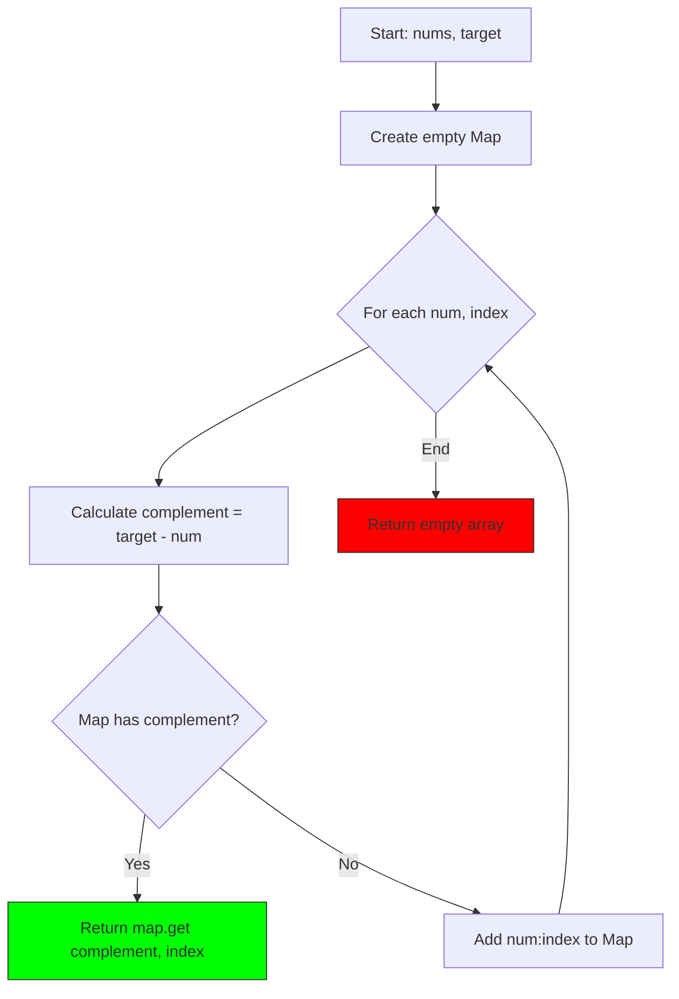
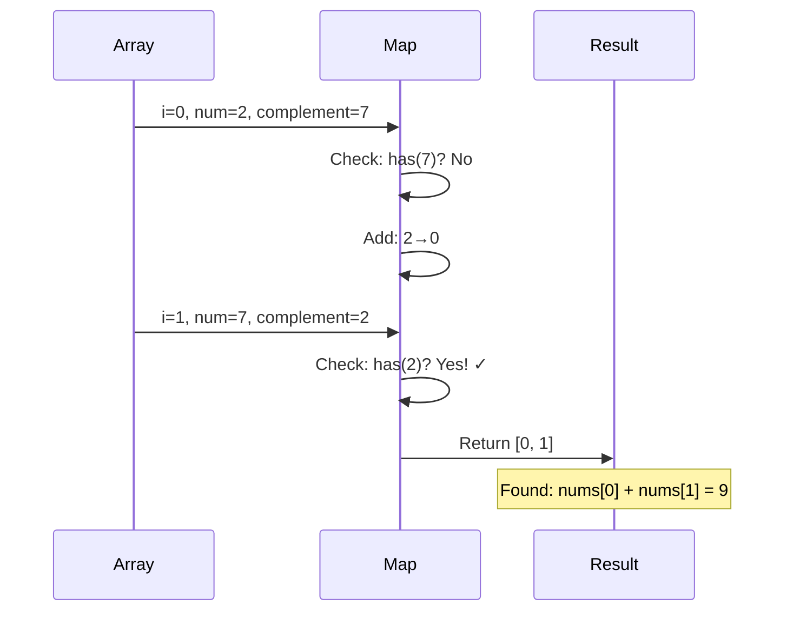
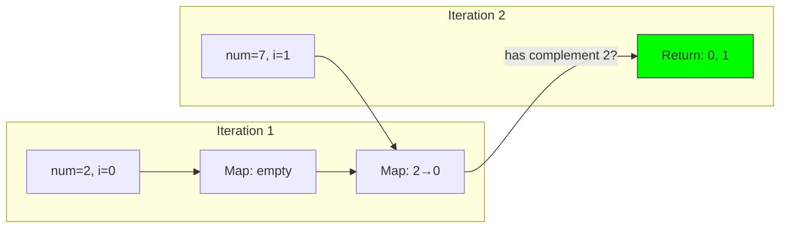

# 1. Two Sum

::: info Problem Info
**Difficulty**: Easy | **Frequency**: Very High | **LeetCode**: [#1](https://leetcode.com/problems/two-sum/)
:::

## Video Tutorials

- 🎥 [NeetCode](https://www.youtube.com/watch?v=KLlXCFG5mnU)
- 🎥 [Take U Forward](https://www.youtube.com/watch?v=ltiuXojD9u8)
- 🎥 [Code with Harry](https://www.youtube.com/watch?v=ld-kJDG2AUS)

## Problem Statement

Given an array of integers `nums` and an integer `target`, return the indices of the two numbers that add up to `target`. You may not use the same element twice.

**Example 1:**
```
Input: nums = [2,7,11,15], target = 9
Output: [0,1]
Explanation: nums[0] + nums[1] = 2 + 7 = 9
```

## Algorithm Visualization

### Hash Map Approach



### Example Walkthrough

Input: `nums = [2, 7, 11, 15]`, `target = 9`



### Data Structure Flow



**Example 2:**
```
Input: nums = [3,2,4], target = 6
Output: [1,2]
```

## JavaScript Solutions

### Approach 1: Brute Force

**Time Complexity**: O(n²) | **Space Complexity**: O(1)

```javascript
/**
 * Brute Force: Try all pairs
 * O(n²) time, O(1) space
 */
function twoSum_bruteforce(nums, target) {
  for (let i = 0; i < nums.length; i++) {
    for (let j = i + 1; j < nums.length; j++) {
      if (nums[i] + nums[j] === target) {
        return [i, j];
      }
    }
  }
  return [];
}
```

### Approach 2: Hash Map (Optimal) ⭐

**Time Complexity**: O(n) | **Space Complexity**: O(n)

```javascript
/**
 * Optimal: Hash Map - O(n) time, O(n) space
 * BEST APPROACH - Use this!
 */
function twoSum(nums, target) {
  const map = new Map();

  for (let i = 0; i < nums.length; i++) {
    const complement = target - nums[i];

    if (map.has(complement)) {
      return [map.get(complement), i];
    }

    map.set(nums[i], i);
  }

  return [];
}

// Test cases
console.log(twoSum([2, 7, 11, 15], 9)); // [0, 1]
console.log(twoSum([3, 2, 4], 6)); // [1, 2]
console.log(twoSum([3, 3], 6)); // [0, 1]
```

## Complexity Analysis

| Approach | Time | Space | Note |
|----------|------|-------|------|
| Brute Force | O(n²) | O(1) | Try all pairs |
| Hash Map | O(n) | O(n) | **Optimal** - single pass |

## Key Insights

1. **Use Map for O(1) lookups** - JavaScript Map provides constant-time access
2. **Single pass** - Check complement before adding current number
3. **Handles duplicates** - Works correctly when target requires same value twice
4. **Why check before adding?** - Ensures we don't use the same element twice

## Algorithm Walkthrough

For `nums = [2, 7, 11, 15]`, `target = 9`:

```
i=0: num=2, complement=7, map={}, map doesn't have 7 → add 2:0
i=1: num=7, complement=2, map={2:0}, map HAS 2! → return [0, 1]
```

## Interview Tips

::: tip Speaking Points
- **Start with brute force** - Shows you understand the problem
- **Explain optimization** - Why hash map improves from O(n²) to O(n)
- **Discuss trade-offs** - O(n) space for O(n) time improvement
- **Handle edge cases** - Mention duplicates, negative numbers, no solution
:::

## Common Mistakes

::: danger Watch Out
- ❌ Using the same element twice
- ❌ Not checking if solution exists
- ❌ Forgetting to return indices (not values)
- ❌ Off-by-one errors in brute force
:::

## Follow-up Questions

**Q: What if the array is sorted?**
A: Use two-pointer approach with O(n) time and O(1) space

**Q: What if there are multiple solutions?**
A: Return any valid pair, or modify to return all pairs

**Q: What about Three Sum?**
A: Similar approach but requires sorting + two pointers (see [3Sum](/problems/3sum))

## Related Problems

- [15. 3Sum](/problems/3sum) - Medium
- [167. Two Sum II - Input Array Is Sorted](https://leetcode.com/problems/two-sum-ii-input-array-is-sorted/) - Medium
- [170. Two Sum III - Data Structure Design](https://leetcode.com/problems/two-sum-iii-data-structure-design/) - Easy

---

::: info Next Problem
👉 Continue to [LRU Cache](/problems/lru-cache) - Critical for search systems!
:::
