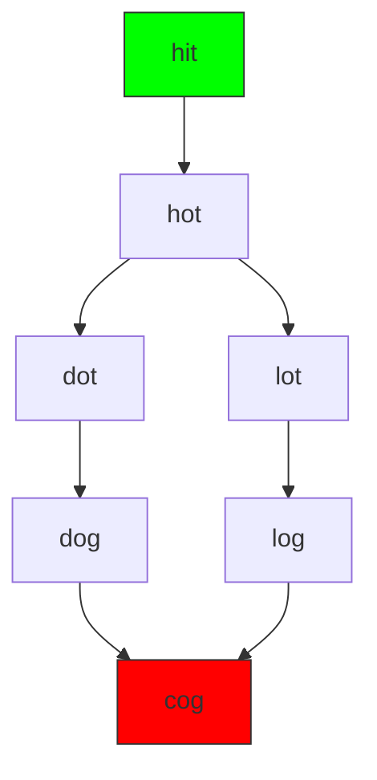
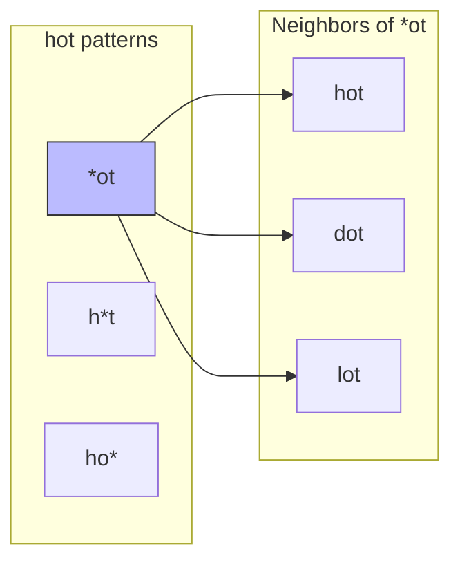
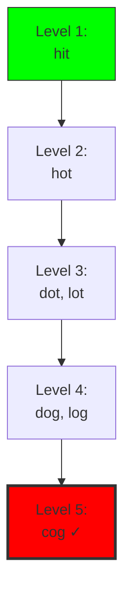

# 15. Word Ladder

::: info Problem Info
**Difficulty**: Hard | **Frequency**: Medium-High | **LeetCode**: [#127](https://leetcode.com/problems/word-ladder/)
:::

## Video Tutorials

- 🎥 [NeetCode](https://www.youtube.com/watch?v=Z2lxvjbVF0I)
- 🎥 [Take U Forward](https://www.youtube.com/watch?v=fQmJgx6C-j4)
- 🎥 [Striver](https://www.youtube.com/watch?v=pVKFW3f_6xQ)

## Problem Statement

Given two words, `beginWord` and `endWord`, and a dictionary `wordList`, return the **number of words** in the shortest transformation sequence from `beginWord` to `endWord`.

Rules:
- Only one letter can be changed at a time
- Each transformed word must exist in the word list
- All words have the same length

**Example:**
```
Input:
beginWord = "hit"
endWord = "cog"
wordList = ["hot","dot","dog","lot","log","cog"]

Output: 5
Explanation: "hit" → "hot" → "dot" → "dog" → "cog"
```

## Algorithm Visualization

### Word Transformation Graph



### Pattern Matching Example



### BFS Level-by-Level



## JavaScript Solution

### BFS with Pattern Matching ⭐

**Time**: O(N×L²) where N = words, L = word length | **Space**: O(N×L²)

```javascript
function ladderLength(beginWord, endWord, wordList) {
  const wordSet = new Set(wordList);

  if (!wordSet.has(endWord)) return 0;

  // Create pattern map: pattern → list of words
  const patterns = new Map();

  const getPatterns = (word) => {
    const patternList = [];
    for (let i = 0; i < word.length; i++) {
      const pattern = word.slice(0, i) + '*' + word.slice(i + 1);
      patternList.push(pattern);
    }
    return patternList;
  };

  // Build pattern map from wordList
  for (const word of wordList) {
    for (const pattern of getPatterns(word)) {
      if (!patterns.has(pattern)) {
        patterns.set(pattern, []);
      }
      patterns.get(pattern).push(word);
    }
  }

  // BFS
  const queue = [[beginWord, 1]];
  const visited = new Set([beginWord]);

  while (queue.length > 0) {
    const [word, length] = queue.shift();

    if (word === endWord) return length;

    // Check all patterns of current word
    for (const pattern of getPatterns(word)) {
      const neighbors = patterns.get(pattern) || [];

      for (const neighbor of neighbors) {
        if (!visited.has(neighbor)) {
          visited.add(neighbor);
          queue.push([neighbor, length + 1]);
        }
      }
    }
  }

  return 0;
}

// Test
console.log(ladderLength(
  "hit",
  "cog",
  ["hot", "dot", "dog", "lot", "log", "cog"]
)); // 5

console.log(ladderLength(
  "hit",
  "cog",
  ["hot", "dot", "dog", "lot", "log"]
)); // 0 (no path)
```

## Key Insights

::: tip Understanding the Approach
- Convert word transformation to **graph problem**
- Use **patterns (wildcards)** to find neighbors efficiently
  - "hot" → ["*ot", "h*t", "ho*"]
  - All words matching "*ot" are neighbors
- **BFS guarantees shortest path**
- **Visited set** prevents cycles
:::

## Algorithm Visualization

```
Dictionary: ["hot", "dot", "dog", "cog"]
Begin: "hit", End: "cog"

Patterns:
"hot" → *ot, h*t, ho*
"dot" → *ot, d*t, do*
"dog" → *og, d*g, do*
"cog" → *og, c*g, co*

BFS:
Level 1: hit (length=1)
Level 2: hot (length=2) [via h*t]
Level 3: dot (length=3) [via *ot]
Level 4: dog (length=4) [via do*]
Level 5: cog (length=5) [via *og] ✓

Answer: 5
```

## Interview Tips

::: tip Speaking Points
- Explain why BFS (shortest path)
- Justify pattern approach (efficiency)
- Discuss bidirectional BFS optimization
- Handle edge cases: no path, begin = end
:::

## Common Mistakes

::: danger Watch Out
- ❌ Using DFS instead of BFS (won't find shortest)
- ❌ Trying all 26×L combinations (inefficient)
- ❌ Not checking if endWord in list
- ❌ Forgetting to mark visited
:::

## Optimization: Bidirectional BFS

Search from both begin and end simultaneously - reduces search space significantly!

## Related Problems

- [126. Word Ladder II](https://leetcode.com/problems/word-ladder-ii/) - Hard
- [433. Minimum Genetic Mutation](https://leetcode.com/problems/minimum-genetic-mutation/) - Medium

---

::: tip Congratulations! 🎉
You've completed all 15 LeetCode problems! Review the [Quick Reference](/quick-reference) for last-minute prep.

**Good luck with your Microsoft Teams interview!** 🚀
:::
