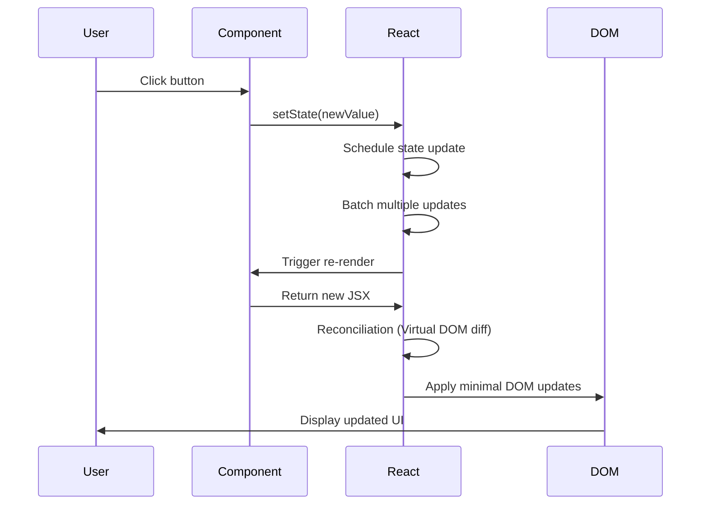
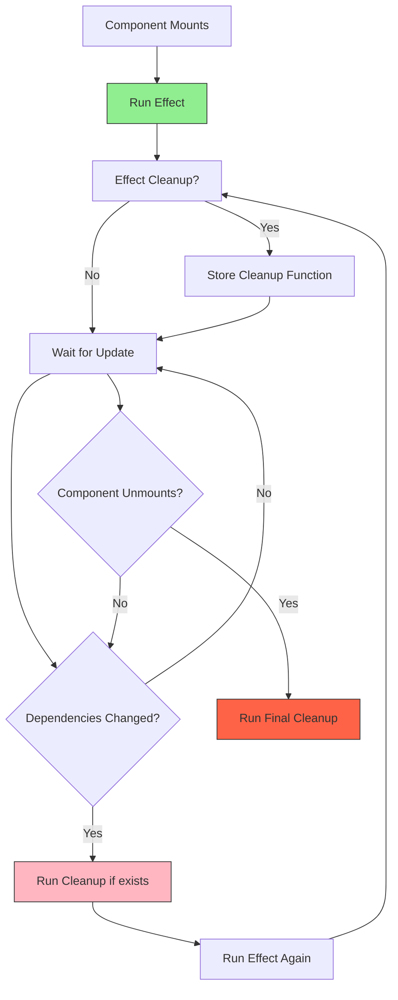
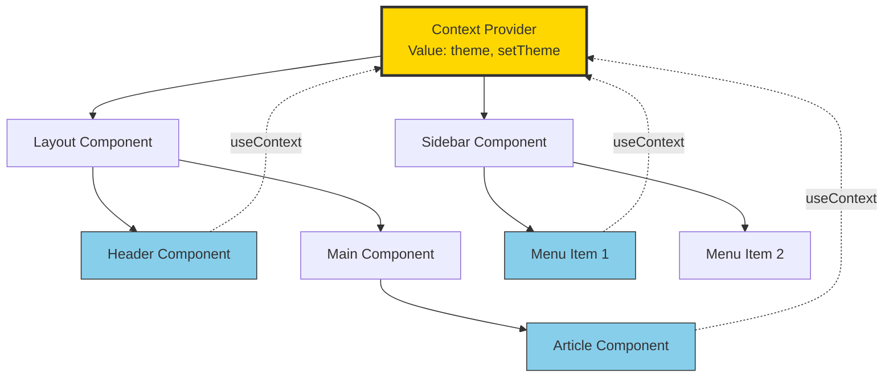
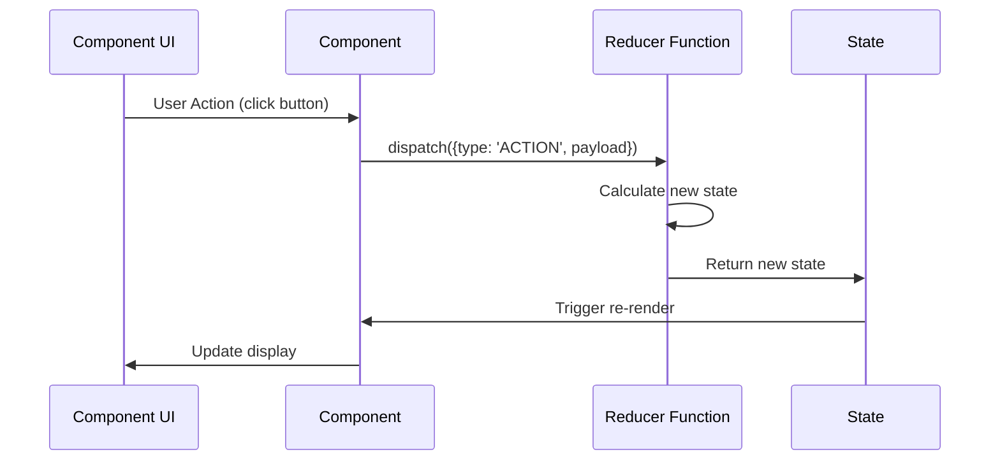
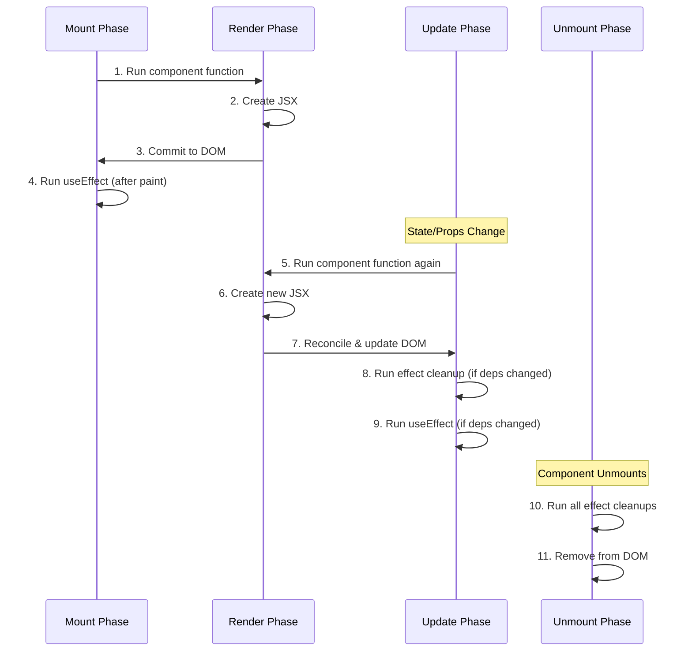
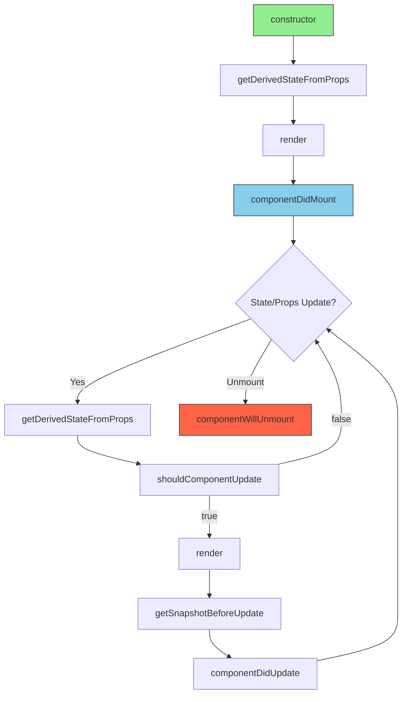
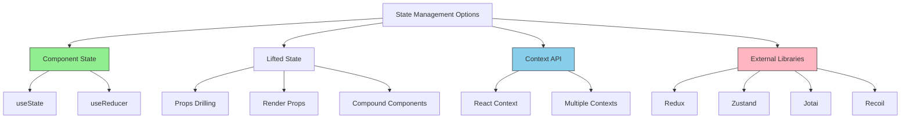
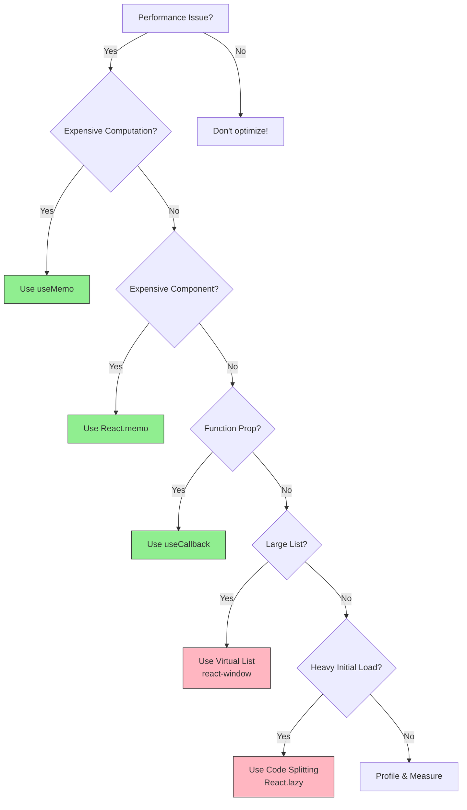

# React Concepts - Advanced Guide

Essential React concepts for frontend interviews at Microsoft Teams. Deep dive into core concepts, advanced patterns, and performance optimization.

---

## Table of Contents

1. [React Fundamentals](#1-react-fundamentals)
2. [React Hooks - Deep Dive](#2-react-hooks-deep-dive)
3. [Component Lifecycle](#3-component-lifecycle)
4. [State Management](#4-state-management)
5. [Performance Optimization](#5-performance-optimization)
6. [Advanced Patterns](#6-advanced-patterns)
7. [React 18+ Features](#7-react-18-features)
8. [Interview Questions](#8-interview-questions)

---

## 1. React Fundamentals

### What is React?

React is a **declarative, component-based JavaScript library** for building user interfaces. Key principles:

- **Declarative**: Describe what the UI should look like, React handles the "how"
- **Component-Based**: Build encapsulated components that manage their own state
- **Learn Once, Write Anywhere**: Use React for web, mobile (React Native), VR, etc.
- **Virtual DOM**: Efficient updates through reconciliation algorithm

### JSX - JavaScript XML

JSX is syntactic sugar for `React.createElement()`:

```javascript
// JSX
const element = <h1 className="greeting">Hello, {name}!</h1>;

// Compiles to:
const element = React.createElement(
  'h1',
  { className: 'greeting' },
  'Hello, ',
  name,
  '!'
);
```

**JSX Rules:**
- Must return a single parent element (or use Fragment `<>...</>`)
- JavaScript expressions go inside `{}`
- Use `className` instead of `class`
- Use `htmlFor` instead of `for`
- Self-closing tags must end with `/>`

### Functional vs Class Components

```javascript
/**
 * FUNCTIONAL COMPONENT (Modern, Preferred)
 */
function UserProfile({ user }) {
  const [isFollowing, setIsFollowing] = useState(false);

  useEffect(() => {
    // Side effects
    document.title = `${user.name}'s Profile`;
  }, [user.name]);

  return (
    <div className="profile">
      <h2>{user.name}</h2>
      <button onClick={() => setIsFollowing(!isFollowing)}>
        {isFollowing ? 'Unfollow' : 'Follow'}
      </button>
    </div>
  );
}

/**
 * CLASS COMPONENT (Legacy, but still used in older codebases)
 */
class UserProfile extends React.Component {
  constructor(props) {
    super(props);
    this.state = { isFollowing: false };
    this.handleClick = this.handleClick.bind(this); // Binding required!
  }

  componentDidMount() {
    document.title = `${this.props.user.name}'s Profile`;
  }

  componentDidUpdate(prevProps) {
    if (prevProps.user.name !== this.props.user.name) {
      document.title = `${this.props.user.name}'s Profile`;
    }
  }

  handleClick() {
    this.setState(prev => ({ isFollowing: !prev.isFollowing }));
  }

  render() {
    return (
      <div className="profile">
        <h2>{this.props.user.name}</h2>
        <button onClick={this.handleClick}>
          {this.state.isFollowing ? 'Unfollow' : 'Follow'}
        </button>
      </div>
    );
  }
}
```

### Component Hierarchy Visualization

```mermaid
graph TD
    APP[App Component<br/>State: user, theme] --> NAV[Navigation<br/>Props: user]
    APP --> MAIN[Main Layout<br/>Props: theme]
    APP --> FOOTER[Footer]

    NAV --> PROFILE[User Profile<br/>Props: user]
    NAV --> MENU[Menu Items]

    MAIN --> SIDEBAR[Sidebar<br/>State: collapsed]
    MAIN --> CONTENT[Content Area<br/>State: posts]

    CONTENT --> POST1[Post Component<br/>Props: post data]
    CONTENT --> POST2[Post Component<br/>Props: post data]

    POST1 --> COMMENTS[Comments<br/>State: comments[]]

    style APP fill:#90EE90,stroke:#333
    style CONTENT fill:#87CEEB,stroke:#333
    style POST1 fill:#FFB6C1,stroke:#333
```

### Props vs State

| Feature | Props | State |
|---------|-------|-------|
| **Mutability** | Immutable (read-only) | Mutable (via setState) |
| **Ownership** | Owned by parent | Owned by component |
| **Change trigger** | Parent re-renders | setState() called |
| **Use case** | Pass data down | Manage internal data |
| **Access in functional** | Function parameter | useState hook |
| **Access in class** | `this.props` | `this.state` |

```javascript
function Parent() {
  const [count, setCount] = useState(0); // State

  return <Child count={count} onIncrement={() => setCount(c => c + 1)} />;
  // Passing as props ↑
}

function Child({ count, onIncrement }) { // Props
  return (
    <div>
      <p>Count from parent: {count}</p>
      <button onClick={onIncrement}>Increment</button>
    </div>
  );
}
```

---

## 2. React Hooks - Deep Dive

Hooks are functions that let you "hook into" React state and lifecycle features from function components.

### Rules of Hooks 🚨

<div v-pre>
1. **Only call at the top level** - Don't call inside loops, conditions, or nested functions<br>
2. **Only call from React functions** - Call from functional components or custom hooks<br>
3. **Hooks must have consistent order** - React relies on call order to track state
</div>

```javascript
// ❌ WRONG - Conditional hook
function BadComponent({ condition }) {
  if (condition) {
    const [state, setState] = useState(0); // Hook order changes!
  }
  return <div>Bad</div>;
}

// ✅ CORRECT - Hook always called
function GoodComponent({ condition }) {
  const [state, setState] = useState(0);

  if (condition) {
    // Use the state conditionally
  }
  return <div>Good</div>;
}
```

### useState - State Management

**Basic Usage:**

```javascript
function Counter() {
  const [count, setCount] = useState(0);
  const [text, setText] = useState('');
  const [user, setUser] = useState({ name: '', age: 0 });

  return (
    <div>
      <p>Count: {count}</p>
      <button onClick={() => setCount(count + 1)}>Increment</button>
    </div>
  );
}
```

**Functional Updates (Critical!):**

```javascript
function Counter() {
  const [count, setCount] = useState(0);

  // ❌ WRONG - Stale closure problem
  const handleMultipleIncrements = () => {
    setCount(count + 1); // count = 0
    setCount(count + 1); // count = 0 (still!)
    setCount(count + 1); // count = 0 (still!)
    // Result: count becomes 1, not 3!
  };

  // ✅ CORRECT - Functional update
  const handleMultipleIncrementsCorrect = () => {
    setCount(prev => prev + 1); // prev = 0, returns 1
    setCount(prev => prev + 1); // prev = 1, returns 2
    setCount(prev => prev + 1); // prev = 2, returns 3
    // Result: count becomes 3 ✓
  };

  return (
    <div>
      <p>Count: {count}</p>
      <button onClick={handleMultipleIncrements}>Wrong</button>
      <button onClick={handleMultipleIncrementsCorrect}>Correct</button>
    </div>
  );
}
```

**Lazy Initialization:**

```javascript
function ExpensiveComponent() {
  // ❌ Runs on every render
  const [data, setData] = useState(expensiveComputation());

  // ✅ Runs only once on mount
  const [data, setData] = useState(() => expensiveComputation());

  return <div>{data}</div>;
}

function expensiveComputation() {
  console.log('Computing...');
  let result = 0;
  for (let i = 0; i < 1000000; i++) {
    result += i;
  }
  return result;
}
```

**Complex State Management:**

```javascript
function UserForm() {
  // Multiple useState (simple, clear)
  const [name, setName] = useState('');
  const [email, setEmail] = useState('');
  const [age, setAge] = useState(0);

  // OR single object state (more complex)
  const [user, setUser] = useState({
    name: '',
    email: '',
    age: 0
  });

  const handleNameChange = (e) => {
    // Must spread existing state!
    setUser({ ...user, name: e.target.value });
  };

  // Better: Use functional update for safety
  const handleEmailChange = (e) => {
    setUser(prev => ({ ...prev, email: e.target.value }));
  };

  return (
    <form>
      <input value={user.name} onChange={handleNameChange} />
      <input value={user.email} onChange={handleEmailChange} />
    </form>
  );
}
```

### useState Flow Diagram



### useEffect - Side Effects

**Dependency Array Behavior:**

```javascript
function EffectExample({ userId }) {
  const [data, setData] = useState(null);

  // 1️⃣ No dependency array - Runs after EVERY render
  useEffect(() => {
    console.log('Runs on every render');
  }); // ⚠️ Usually a mistake

  // 2️⃣ Empty array - Runs ONCE on mount
  useEffect(() => {
    console.log('Runs only on mount');
    return () => console.log('Cleanup on unmount');
  }, []);

  // 3️⃣ With dependencies - Runs when dependencies change
  useEffect(() => {
    console.log('Runs when userId changes');
    fetchUser(userId).then(setData);
  }, [userId]);

  // 4️⃣ Multiple dependencies
  useEffect(() => {
    console.log('Runs when userId OR data changes');
  }, [userId, data]);

  return <div>{data?.name}</div>;
}
```

**Data Fetching with useEffect:**

```javascript
function UserProfile({ userId }) {
  const [user, setUser] = useState(null);
  const [loading, setLoading] = useState(true);
  const [error, setError] = useState(null);

  useEffect(() => {
    let cancelled = false; // Cleanup flag

    const fetchUser = async () => {
      try {
        setLoading(true);
        setError(null);

        const response = await fetch(`/api/users/${userId}`);
        const data = await response.json();

        if (!cancelled) { // Prevent state update after unmount
          setUser(data);
        }
      } catch (err) {
        if (!cancelled) {
          setError(err.message);
        }
      } finally {
        if (!cancelled) {
          setLoading(false);
        }
      }
    };

    fetchUser();

    // Cleanup function
    return () => {
      cancelled = true; // Cancel pending updates
    };
  }, [userId]); // Re-run when userId changes

  if (loading) return <div>Loading...</div>;
  if (error) return <div>Error: {error}</div>;
  return <div>{user?.name}</div>;
}
```

**Event Listeners with Cleanup:**

```javascript
function WindowSize() {
  const [size, setSize] = useState({ width: 0, height: 0 });

  useEffect(() => {
    function handleResize() {
      setSize({
        width: window.innerWidth,
        height: window.innerHeight
      });
    }

    // Add event listener
    window.addEventListener('resize', handleResize);
    handleResize(); // Call once to set initial size

    // Cleanup: Remove event listener
    return () => {
      window.removeEventListener('resize', handleResize);
    };
  }, []); // Empty array - setup once, cleanup on unmount

  return <div>Window size: {size.width} x {size.height}</div>;
}
```

**Timers with Cleanup:**

```javascript
function Timer() {
  const [seconds, setSeconds] = useState(0);
  const [isRunning, setIsRunning] = useState(true);

  useEffect(() => {
    if (!isRunning) return;

    const intervalId = setInterval(() => {
      setSeconds(prev => prev + 1);
    }, 1000);

    // Cleanup: Clear interval
    return () => clearInterval(intervalId);
  }, [isRunning]); // Re-run when isRunning changes

  return (
    <div>
      <p>Seconds: {seconds}</p>
      <button onClick={() => setIsRunning(!isRunning)}>
        {isRunning ? 'Pause' : 'Resume'}
      </button>
    </div>
  );
}
```

### useEffect Lifecycle Diagram



### useContext - Global State

**Creating and Using Context:**

```javascript
import { createContext, useContext, useState } from 'react';

// 1. Create context
const ThemeContext = createContext();
const UserContext = createContext();

// 2. Provider component
function App() {
  const [theme, setTheme] = useState('light');
  const [user, setUser] = useState(null);

  return (
    <ThemeContext.Provider value={{ theme, setTheme }}>
      <UserContext.Provider value={{ user, setUser }}>
        <Layout />
      </UserContext.Provider>
    </ThemeContext.Provider>
  );
}

// 3. Consumer components
function Layout() {
  const { theme, setTheme } = useContext(ThemeContext);
  const { user } = useContext(UserContext);

  return (
    <div className={`layout theme-${theme}`}>
      <Header />
      <MainContent />
      <button onClick={() => setTheme(theme === 'light' ? 'dark' : 'light')}>
        Toggle Theme
      </button>
    </div>
  );
}

function Header() {
  const { user } = useContext(UserContext);
  return <h1>Welcome, {user?.name || 'Guest'}</h1>;
}
```

**Custom Context Hook Pattern:**

```javascript
// ✅ Best Practice: Create custom hook
function useTheme() {
  const context = useContext(ThemeContext);
  if (!context) {
    throw new Error('useTheme must be used within ThemeProvider');
  }
  return context;
}

function useUser() {
  const context = useContext(UserContext);
  if (!context) {
    throw new Error('useUser must be used within UserProvider');
  }
  return context;
}

// Now use custom hooks
function SomeComponent() {
  const { theme, setTheme } = useTheme();
  const { user, setUser } = useUser();

  return <div>Much cleaner!</div>;
}
```

**Advanced: Context with Reducer:**

```javascript
const StateContext = createContext();
const DispatchContext = createContext();

function TodoProvider({ children }) {
  const [todos, dispatch] = useReducer(todoReducer, []);

  return (
    <StateContext.Provider value={todos}>
      <DispatchContext.Provider value={dispatch}>
        {children}
      </DispatchContext.Provider>
    </StateContext.Provider>
  );
}

function useTodos() {
  const context = useContext(StateContext);
  if (!context) throw new Error('useTodos must be used within TodoProvider');
  return context;
}

function useTodoDispatch() {
  const context = useContext(DispatchContext);
  if (!context) throw new Error('useTodoDispatch must be used within TodoProvider');
  return context;
}
```

### Context Flow Diagram



### useReducer - Complex State Logic

**When to use useReducer vs useState:**
- Multiple related state values
- Complex state transitions
- Next state depends on previous
- Want to separate logic from UI

```javascript
// Reducer function (pure, outside component)
function counterReducer(state, action) {
  switch (action.type) {
    case 'INCREMENT':
      return { count: state.count + 1 };
    case 'DECREMENT':
      return { count: state.count - 1 };
    case 'RESET':
      return { count: 0 };
    case 'SET':
      return { count: action.payload };
    default:
      throw new Error(`Unknown action: ${action.type}`);
  }
}

function Counter() {
  const [state, dispatch] = useReducer(counterReducer, { count: 0 });

  return (
    <div>
      <p>Count: {state.count}</p>
      <button onClick={() => dispatch({ type: 'INCREMENT' })}>+</button>
      <button onClick={() => dispatch({ type: 'DECREMENT' })}>-</button>
      <button onClick={() => dispatch({ type: 'RESET' })}>Reset</button>
      <button onClick={() => dispatch({ type: 'SET', payload: 100 })}>
        Set to 100
      </button>
    </div>
  );
}
```

**Real-World Example: Todo App:**

```javascript
function todoReducer(state, action) {
  switch (action.type) {
    case 'ADD_TODO':
      return [
        ...state,
        {
          id: Date.now(),
          text: action.payload,
          completed: false
        }
      ];

    case 'TOGGLE_TODO':
      return state.map(todo =>
        todo.id === action.payload
          ? { ...todo, completed: !todo.completed }
          : todo
      );

    case 'DELETE_TODO':
      return state.filter(todo => todo.id !== action.payload);

    case 'EDIT_TODO':
      return state.map(todo =>
        todo.id === action.payload.id
          ? { ...todo, text: action.payload.text }
          : todo
      );

    default:
      return state;
  }
}

function TodoApp() {
  const [todos, dispatch] = useReducer(todoReducer, []);
  const [input, setInput] = useState('');

  const handleSubmit = (e) => {
    e.preventDefault();
    if (input.trim()) {
      dispatch({ type: 'ADD_TODO', payload: input });
      setInput('');
    }
  };

  return (
    <div>
      <form onSubmit={handleSubmit}>
        <input
          value={input}
          onChange={(e) => setInput(e.target.value)}
          placeholder="Add todo..."
        />
        <button type="submit">Add</button>
      </form>

      <ul>
        {todos.map(todo => (
          <li key={todo.id}>
            <input
              type="checkbox"
              checked={todo.completed}
              onChange={() => dispatch({ type: 'TOGGLE_TODO', payload: todo.id })}
            />
            <span style={{ textDecoration: todo.completed ? 'line-through' : 'none' }}>
              {todo.text}
            </span>
            <button onClick={() => dispatch({ type: 'DELETE_TODO', payload: todo.id })}>
              Delete
            </button>
          </li>
        ))}
      </ul>
    </div>
  );
}
```

### useReducer Flow



### useMemo - Expensive Computation Memoization

**Problem: Expensive computation runs on every render**

```javascript
function ExpensiveComponent({ items, filter }) {
  // ❌ WRONG - Filters array on EVERY render
  const filteredItems = items.filter(item => item.category === filter);

  // ✅ CORRECT - Only recalculates when items or filter change
  const filteredItems = useMemo(() => {
    console.log('Filtering items...');
    return items.filter(item => item.category === filter);
  }, [items, filter]);

  return (
    <ul>
      {filteredItems.map(item => (
        <li key={item.id}>{item.name}</li>
      ))}
    </ul>
  );
}
```

**Real-World Examples:**

```javascript
function ProductList({ products, searchTerm, sortBy }) {
  // Expensive filtering
  const filteredProducts = useMemo(() => {
    return products.filter(product =>
      product.name.toLowerCase().includes(searchTerm.toLowerCase())
    );
  }, [products, searchTerm]);

  // Expensive sorting
  const sortedProducts = useMemo(() => {
    return [...filteredProducts].sort((a, b) => {
      if (sortBy === 'price') return a.price - b.price;
      if (sortBy === 'name') return a.name.localeCompare(b.name);
      return 0;
    });
  }, [filteredProducts, sortBy]);

  // Expensive calculation
  const totalValue = useMemo(() => {
    return sortedProducts.reduce((sum, product) => sum + product.price, 0);
  }, [sortedProducts]);

  return (
    <div>
      <h3>Total Value: ${totalValue}</h3>
      <ul>
        {sortedProducts.map(product => (
          <li key={product.id}>{product.name} - ${product.price}</li>
        ))}
      </ul>
    </div>
  );
}
```

**useMemo for Reference Equality:**

```javascript
function Parent() {
  const [count, setCount] = useState(0);
  const [text, setText] = useState('');

  // ❌ New object on every render - Child re-renders unnecessarily
  const config = { theme: 'dark', fontSize: 14 };

  // ✅ Same object reference unless dependencies change
  const config = useMemo(() => ({
    theme: 'dark',
    fontSize: 14
  }), []);

  return <Child config={config} />;
}

const Child = React.memo(({ config }) => {
  console.log('Child rendered');
  return <div style={{ fontSize: config.fontSize }}>Child</div>;
});
```

### useCallback - Function Memoization

**Problem: New function on every render breaks memoization**

```javascript
function Parent() {
  const [count, setCount] = useState(0);
  const [text, setText] = useState('');

  // ❌ WRONG - New function on every render
  const handleClick = () => {
    console.log('Clicked!');
  };

  // ✅ CORRECT - Same function reference
  const handleClick = useCallback(() => {
    console.log('Clicked!');
  }, []); // Empty deps - never changes

  // With dependencies
  const handleIncrement = useCallback(() => {
    setCount(c => c + 1);
  }, []); // setCount is stable, no deps needed

  const handleLog = useCallback(() => {
    console.log(count); // Uses count from closure
  }, [count]); // Recreate when count changes

  return (
    <div>
      <button onClick={() => setCount(c => c + 1)}>Count: {count}</button>
      <input value={text} onChange={(e) => setText(e.target.value)} />
      <ExpensiveChild onClick={handleClick} />
    </div>
  );
}

const ExpensiveChild = React.memo(({ onClick }) => {
  console.log('ExpensiveChild rendered');
  return <button onClick={onClick}>Click me</button>;
});
```

**useCallback vs useMemo:**

```javascript
// These are equivalent:
const memoizedCallback = useCallback(() => {
  doSomething(a, b);
}, [a, b]);

const memoizedCallback = useMemo(() => {
  return () => doSomething(a, b);
}, [a, b]);

// useCallback is just syntactic sugar for useMemo with a function
```

### useRef - Mutable References

**Use Cases:**

<div v-pre>
1. Access DOM elements<br>
2. Store mutable values without re-render<br>
3. Keep previous values<br>
4. Store timeout/interval IDs
</div>

```javascript
function TextInput() {
  const inputRef = useRef(null);

  const focusInput = () => {
    inputRef.current.focus();
  };

  return (
    <div>
      <input ref={inputRef} type="text" />
      <button onClick={focusInput}>Focus Input</button>
    </div>
  );
}
```

**Storing Mutable Values:**

```javascript
function Timer() {
  const [count, setCount] = useState(0);
  const intervalRef = useRef(null);

  const start = () => {
    if (intervalRef.current !== null) return; // Already running

    intervalRef.current = setInterval(() => {
      setCount(c => c + 1);
    }, 1000);
  };

  const stop = () => {
    if (intervalRef.current) {
      clearInterval(intervalRef.current);
      intervalRef.current = null;
    }
  };

  useEffect(() => {
    return () => stop(); // Cleanup on unmount
  }, []);

  return (
    <div>
      <p>Count: {count}</p>
      <button onClick={start}>Start</button>
      <button onClick={stop}>Stop</button>
    </div>
  );
}
```

**Previous Value Pattern:**

```javascript
function Counter() {
  const [count, setCount] = useState(0);
  const prevCountRef = useRef();

  useEffect(() => {
    prevCountRef.current = count;
  }, [count]);

  const prevCount = prevCountRef.current;

  return (
    <div>
      <p>Current: {count}</p>
      <p>Previous: {prevCount}</p>
      <button onClick={() => setCount(count + 1)}>Increment</button>
    </div>
  );
}
```

**useRef vs useState:**

| Feature | useRef | useState |
|---------|--------|----------|
| **Re-render on change** | ❌ No | ✅ Yes |
| **Persists between renders** | ✅ Yes | ✅ Yes |
| **Mutable** | ✅ Yes (`.current`) | ❌ No (immutable) |
| **Access in render** | ✅ Synchronous | ⚠️ May be stale |
| **Use case** | DOM refs, timers, tracking | UI state |

### Custom Hooks

**Extract reusable logic:**

```javascript
/**
 * useFetch - Reusable data fetching hook
 */
function useFetch(url) {
  const [data, setData] = useState(null);
  const [loading, setLoading] = useState(true);
  const [error, setError] = useState(null);

  useEffect(() => {
    let cancelled = false;

    const fetchData = async () => {
      try {
        setLoading(true);
        const response = await fetch(url);
        const json = await response.json();

        if (!cancelled) {
          setData(json);
          setError(null);
        }
      } catch (err) {
        if (!cancelled) {
          setError(err.message);
        }
      } finally {
        if (!cancelled) {
          setLoading(false);
        }
      }
    };

    fetchData();

    return () => {
      cancelled = true;
    };
  }, [url]);

  return { data, loading, error };
}

// Usage
function UserProfile({ userId }) {
  const { data: user, loading, error } = useFetch(`/api/users/${userId}`);

  if (loading) return <div>Loading...</div>;
  if (error) return <div>Error: {error}</div>;
  return <div>{user.name}</div>;
}
```

**More Custom Hooks:**

```javascript
/**
 * useLocalStorage - Sync state with localStorage
 */
function useLocalStorage(key, initialValue) {
  const [storedValue, setStoredValue] = useState(() => {
    try {
      const item = window.localStorage.getItem(key);
      return item ? JSON.parse(item) : initialValue;
    } catch (error) {
      console.error(error);
      return initialValue;
    }
  });

  const setValue = (value) => {
    try {
      const valueToStore = value instanceof Function ? value(storedValue) : value;
      setStoredValue(valueToStore);
      window.localStorage.setItem(key, JSON.stringify(valueToStore));
    } catch (error) {
      console.error(error);
    }
  };

  return [storedValue, setValue];
}

// Usage
function App() {
  const [theme, setTheme] = useLocalStorage('theme', 'light');
  return <div className={theme}>App</div>;
}

/**
 * useDebounce - Debounce a value
 */
function useDebounce(value, delay) {
  const [debouncedValue, setDebouncedValue] = useState(value);

  useEffect(() => {
    const handler = setTimeout(() => {
      setDebouncedValue(value);
    }, delay);

    return () => clearTimeout(handler);
  }, [value, delay]);

  return debouncedValue;
}

// Usage
function SearchInput() {
  const [searchTerm, setSearchTerm] = useState('');
  const debouncedSearchTerm = useDebounce(searchTerm, 500);

  useEffect(() => {
    if (debouncedSearchTerm) {
      // API call here
      console.log('Searching for:', debouncedSearchTerm);
    }
  }, [debouncedSearchTerm]);

  return (
    <input
      value={searchTerm}
      onChange={(e) => setSearchTerm(e.target.value)}
      placeholder="Search..."
    />
  );
}

/**
 * useWindowSize - Track window dimensions
 */
function useWindowSize() {
  const [windowSize, setWindowSize] = useState({
    width: undefined,
    height: undefined,
  });

  useEffect(() => {
    function handleResize() {
      setWindowSize({
        width: window.innerWidth,
        height: window.innerHeight,
      });
    }

    window.addEventListener('resize', handleResize);
    handleResize();

    return () => window.removeEventListener('resize', handleResize);
  }, []);

  return windowSize;
}

/**
 * usePrevious - Get previous value
 */
function usePrevious(value) {
  const ref = useRef();

  useEffect(() => {
    ref.current = value;
  }, [value]);

  return ref.current;
}

/**
 * useToggle - Boolean toggle with actions
 */
function useToggle(initialValue = false) {
  const [value, setValue] = useState(initialValue);

  const toggle = useCallback(() => setValue(v => !v), []);
  const setTrue = useCallback(() => setValue(true), []);
  const setFalse = useCallback(() => setValue(false), []);

  return [value, { toggle, setTrue, setFalse }];
}

// Usage
function Modal() {
  const [isOpen, { toggle, setTrue, setFalse }] = useToggle(false);

  return (
    <div>
      <button onClick={setTrue}>Open</button>
      {isOpen && (
        <div className="modal">
          <button onClick={setFalse}>Close</button>
        </div>
      )}
    </div>
  );
}
```

---

## 3. Component Lifecycle

### Functional Component Lifecycle



### Class Component Lifecycle (Legacy)



### Lifecycle Comparison

| Phase | Class Component | Functional Component |
|-------|----------------|----------------------|
| **Mount** | `constructor` | `useState` initialization |
| | `componentDidMount` | `useEffect(() => {}, [])` |
| **Update** | `componentDidUpdate` | `useEffect(() => {}, [deps])` |
| | `shouldComponentUpdate` | `React.memo()` |
| **Unmount** | `componentWillUnmount` | `useEffect cleanup` |
| **Error** | `componentDidCatch` | Error Boundary |

### Complete Lifecycle Example

```javascript
function CompleteLifecycleDemo({ userId }) {
  const [user, setUser] = useState(null);
  const [count, setCount] = useState(0);

  // 1️⃣ MOUNT - Runs once when component mounts
  useEffect(() => {
    console.log('Component mounted');

    // Cleanup runs on unmount
    return () => {
      console.log('Component will unmount');
    };
  }, []);

  // 2️⃣ UPDATE - Runs when userId changes
  useEffect(() => {
    console.log('userId changed:', userId);

    let cancelled = false;

    fetch(`/api/users/${userId}`)
      .then(res => res.json())
      .then(data => {
        if (!cancelled) setUser(data);
      });

    // Cleanup runs before next effect
    return () => {
      console.log('Cleaning up previous userId effect');
      cancelled = true;
    };
  }, [userId]);

  // 3️⃣ EVERY RENDER - Runs after every render
  useEffect(() => {
    console.log('Component rendered');
  });

  // 4️⃣ Multiple dependencies
  useEffect(() => {
    console.log('User or count changed:', user, count);
  }, [user, count]);

  return (
    <div>
      <h1>{user?.name}</h1>
      <button onClick={() => setCount(c => c + 1)}>Count: {count}</button>
    </div>
  );
}
```

---

## 4. State Management

### Lifting State Up

```javascript
function TemperatureConverter() {
  const [celsius, setCelsius] = useState(0);

  const fahrenheit = (celsius * 9/5) + 32;

  return (
    <div>
      <TemperatureInput
        scale="Celsius"
        temperature={celsius}
        onTemperatureChange={setCelsius}
      />
      <TemperatureInput
        scale="Fahrenheit"
        temperature={fahrenheit}
        onTemperatureChange={(f) => setCelsius((f - 32) * 5/9)}
      />
      <p>Water boils: {celsius >= 100 ? 'Yes' : 'No'}</p>
    </div>
  );
}

function TemperatureInput({ scale, temperature, onTemperatureChange }) {
  return (
    <div>
      <label>{scale}:</label>
      <input
        type="number"
        value={temperature}
        onChange={(e) => onTemperatureChange(Number(e.target.value))}
      />
    </div>
  );
}
```

### State Management Hierarchy



### Context API for Global State

```javascript
// Complete auth example
import { createContext, useContext, useState, useEffect } from 'react';

const AuthContext = createContext();

export function AuthProvider({ children }) {
  const [user, setUser] = useState(null);
  const [loading, setLoading] = useState(true);

  useEffect(() => {
    // Check if user is logged in
    const token = localStorage.getItem('token');
    if (token) {
      fetchUser(token).then(setUser).finally(() => setLoading(false));
    } else {
      setLoading(false);
    }
  }, []);

  const login = async (email, password) => {
    const response = await fetch('/api/login', {
      method: 'POST',
      body: JSON.stringify({ email, password }),
      headers: { 'Content-Type': 'application/json' }
    });
    const data = await response.json();
    localStorage.setItem('token', data.token);
    setUser(data.user);
  };

  const logout = () => {
    localStorage.removeItem('token');
    setUser(null);
  };

  const value = {
    user,
    login,
    logout,
    isAuthenticated: !!user,
    loading
  };

  return (
    <AuthContext.Provider value={value}>
      {children}
    </AuthContext.Provider>
  );
}

export function useAuth() {
  const context = useContext(AuthContext);
  if (!context) {
    throw new Error('useAuth must be used within AuthProvider');
  }
  return context;
}

// Usage
function App() {
  return (
    <AuthProvider>
      <Router>
        <Navigation />
        <Routes />
      </Router>
    </AuthProvider>
  );
}

function Navigation() {
  const { user, logout, isAuthenticated } = useAuth();

  if (!isAuthenticated) return <LoginButton />;

  return (
    <nav>
      <span>Welcome, {user.name}</span>
      <button onClick={logout}>Logout</button>
    </nav>
  );
}
```

---

## 5. Performance Optimization

### React.memo - Component Memoization

```javascript
/**
 * React.memo prevents re-renders if props haven't changed
 */

// ❌ Without memo - re-renders on every parent update
function ExpensiveComponent({ data }) {
  console.log('Rendering ExpensiveComponent');
  return <div>/* Complex rendering */</div>;
}

// ✅ With memo - only re-renders if data changes
const ExpensiveComponent = React.memo(function ExpensiveComponent({ data }) {
  console.log('Rendering ExpensiveComponent');
  return <div>/* Complex rendering */</div>;
});

// Custom comparison function
const ExpensiveComponent = React.memo(
  function ExpensiveComponent({ user }) {
    return <div>{user.name}</div>;
  },
  (prevProps, nextProps) => {
    // Return true if props are equal (skip re-render)
    return prevProps.user.id === nextProps.user.id;
  }
);
```

### Optimization Decision Tree



### Code Splitting with React.lazy

```javascript
import { lazy, Suspense } from 'react';

// ❌ Regular import - Bundles everything together
import HeavyComponent from './HeavyComponent';

// ✅ Lazy import - Separate bundle, loads on demand
const HeavyComponent = lazy(() => import('./HeavyComponent'));

function App() {
  return (
    <div>
      <Suspense fallback={<div>Loading...</div>}>
        <HeavyComponent />
      </Suspense>
    </div>
  );
}

// Route-based code splitting
const Home = lazy(() => import('./routes/Home'));
const About = lazy(() => import('./routes/About'));
const Contact = lazy(() => import('./routes/Contact'));

function App() {
  return (
    <Router>
      <Suspense fallback={<LoadingSpinner />}>
        <Routes>
          <Route path="/" element={<Home />} />
          <Route path="/about" element={<About />} />
          <Route path="/contact" element={<Contact />} />
        </Routes>
      </Suspense>
    </Router>
  );
}
```

### Virtual Lists for Large Data

```javascript
import { FixedSizeList } from 'react-window';

function LargeList({ items }) {
  // ❌ Rendering 10,000 items - Very slow!
  return (
    <div>
      {items.map(item => (
        <div key={item.id}>{item.name}</div>
      ))}
    </div>
  );

  // ✅ Virtual list - Only renders visible items
  const Row = ({ index, style }) => (
    <div style={style}>
      {items[index].name}
    </div>
  );

  return (
    <FixedSizeList
      height={600}
      itemCount={items.length}
      itemSize={35}
      width="100%"
    >
      {Row}
    </FixedSizeList>
  );
}
```

### Performance Best Practices

```javascript
/**
 * 1. Avoid inline object creation in JSX
 */
// ❌ Creates new object on every render
<Child style={{ color: 'red' }} />

// ✅ Define outside or use useMemo
const style = { color: 'red' };
<Child style={style} />

/**
 * 2. Avoid inline function creation in JSX
 */
// ❌ Creates new function on every render
<button onClick={() => handleClick(id)}>Click</button>

// ✅ Use useCallback
const handleClick = useCallback(() => doSomething(id), [id]);
<button onClick={handleClick}>Click</button>

/**
 * 3. Use key properly for lists
 */
// ❌ Index as key - Problems with reordering
{items.map((item, index) => <Item key={index} {...item} />)}

// ✅ Stable unique ID
{items.map(item => <Item key={item.id} {...item} />)}

/**
 * 4. Debounce expensive operations
 */
function SearchInput() {
  const [searchTerm, setSearchTerm] = useState('');
  const debouncedSearch = useDebounce(searchTerm, 300);

  useEffect(() => {
    // API call with debounced value
    searchAPI(debouncedSearch);
  }, [debouncedSearch]);

  return (
    <input
      value={searchTerm}
      onChange={(e) => setSearchTerm(e.target.value)}
    />
  );
}

/**
 * 5. Virtualize long lists
 */
// Use react-window or react-virtualized

/**
 * 6. Optimize images
 */
// Use lazy loading


// Use modern formats (WebP, AVIF)
<picture>
  <source srcSet="image.avif" type="image/avif" />
  <source srcSet="image.webp" type="image/webp" />
  
</picture>
```

---

## 6. Advanced Patterns

### Render Props Pattern

```javascript
/**
 * Render Props: Share code between components using a prop whose value is a function
 */

function MouseTracker({ render }) {
  const [position, setPosition] = useState({ x: 0, y: 0 });

  const handleMouseMove = (event) => {
    setPosition({ x: event.clientX, y: event.clientY });
  };

  useEffect(() => {
    window.addEventListener('mousemove', handleMouseMove);
    return () => window.removeEventListener('mousemove', handleMouseMove);
  }, []);

  return render(position);
}

// Usage
function App() {
  return (
    <div>
      <MouseTracker
        render={({ x, y }) => (
          <h1>Mouse position: ({x}, {y})</h1>
        )}
      />

      <MouseTracker
        render={({ x, y }) => (
          <div style={{ position: 'absolute', left: x, top: y }}>
            🎯
          </div>
        )}
      />
    </div>
  );
}

// Alternative: Children as function
function DataFetcher({ url, children }) {
  const { data, loading, error } = useFetch(url);
  return children({ data, loading, error });
}

// Usage
<DataFetcher url="/api/users">
  {({ data, loading, error }) => {
    if (loading) return <div>Loading...</div>;
    if (error) return <div>Error: {error}</div>;
    return <div>{data.name}</div>;
  }}
</DataFetcher>
```

### Higher-Order Components (HOC)

```javascript
/**
 * HOC: Function that takes a component and returns a new component
 */

// HOC for authentication
function withAuth(Component) {
  return function AuthenticatedComponent(props) {
    const { user, loading } = useAuth();

    if (loading) return <div>Loading...</div>;
    if (!user) return <Navigate to="/login" />;

    return <Component {...props} user={user} />;
  };
}

// Usage
function Dashboard({ user }) {
  return <h1>Welcome, {user.name}!</h1>;
}

export default withAuth(Dashboard);

// HOC for data fetching
function withData(Component, url) {
  return function DataComponent(props) {
    const { data, loading, error } = useFetch(url);

    if (loading) return <div>Loading...</div>;
    if (error) return <div>Error: {error}</div>;

    return <Component {...props} data={data} />;
  };
}

// Usage
function UserList({ data }) {
  return (
    <ul>
      {data.map(user => <li key={user.id}>{user.name}</li>)}
    </ul>
  );
}

export default withData(UserList, '/api/users');
```

### Compound Components Pattern

```javascript
/**
 * Compound Components: Components that work together to form a complete UI
 */

const TabsContext = createContext();

function Tabs({ children, defaultValue }) {
  const [activeTab, setActiveTab] = useState(defaultValue);

  return (
    <TabsContext.Provider value={{ activeTab, setActiveTab }}>
      <div className="tabs">{children}</div>
    </TabsContext.Provider>
  );
}

function TabList({ children }) {
  return <div className="tab-list">{children}</div>;
}

function Tab({ value, children }) {
  const { activeTab, setActiveTab } = useContext(TabsContext);
  const isActive = activeTab === value;

  return (
    <button
      className={isActive ? 'tab active' : 'tab'}
      onClick={() => setActiveTab(value)}
    >
      {children}
    </button>
  );
}

function TabPanel({ value, children }) {
  const { activeTab } = useContext(TabsContext);

  if (activeTab !== value) return null;

  return <div className="tab-panel">{children}</div>;
}

// Attach components to parent
Tabs.List = TabList;
Tabs.Tab = Tab;
Tabs.Panel = TabPanel;

// Usage
function App() {
  return (
    <Tabs defaultValue="tab1">
      <Tabs.List>
        <Tabs.Tab value="tab1">Tab 1</Tabs.Tab>
        <Tabs.Tab value="tab2">Tab 2</Tabs.Tab>
        <Tabs.Tab value="tab3">Tab 3</Tabs.Tab>
      </Tabs.List>

      <Tabs.Panel value="tab1">Content 1</Tabs.Panel>
      <Tabs.Panel value="tab2">Content 2</Tabs.Panel>
      <Tabs.Panel value="tab3">Content 3</Tabs.Panel>
    </Tabs>
  );
}
```

### Controlled vs Uncontrolled Components

```javascript
/**
 * CONTROLLED: React controls the value
 */
function ControlledInput() {
  const [value, setValue] = useState('');

  const handleSubmit = (e) => {
    e.preventDefault();
    console.log('Submitted:', value);
  };

  return (
    <form onSubmit={handleSubmit}>
      <input
        type="text"
        value={value} // React controls this
        onChange={(e) => setValue(e.target.value)}
      />
      <button type="submit">Submit</button>
    </form>
  );
}

/**
 * UNCONTROLLED: DOM controls the value
 */
function UncontrolledInput() {
  const inputRef = useRef();

  const handleSubmit = (e) => {
    e.preventDefault();
    console.log('Submitted:', inputRef.current.value);
  };

  return (
    <form onSubmit={handleSubmit}>
      <input
        type="text"
        ref={inputRef} // Access DOM directly
        defaultValue=""
      />
      <button type="submit">Submit</button>
    </form>
  );
}

/**
 * When to use each:
 * - Controlled: Form validation, conditional rendering, multiple inputs
 * - Uncontrolled: Simple forms, file inputs, integration with non-React code
 */
```

### Error Boundaries

```javascript
/**
 * Error Boundary: Catch JavaScript errors in child components
 * NOTE: Must be a class component (no hook equivalent yet)
 */

class ErrorBoundary extends React.Component {
  constructor(props) {
    super(props);
    this.state = { hasError: false, error: null, errorInfo: null };
  }

  static getDerivedStateFromError(error) {
    // Update state so next render shows fallback UI
    return { hasError: true };
  }

  componentDidCatch(error, errorInfo) {
    // Log error to error reporting service
    console.error('Error caught by boundary:', error, errorInfo);
    this.setState({ error, errorInfo });
  }

  render() {
    if (this.state.hasError) {
      return (
        <div className="error-boundary">
          <h1>Something went wrong.</h1>
          <details>
            <summary>Error details</summary>
            <pre>{this.state.error?.toString()}</pre>
            <pre>{this.state.errorInfo?.componentStack}</pre>
          </details>
          <button onClick={() => this.setState({ hasError: false })}>
            Try again
          </button>
        </div>
      );
    }

    return this.props.children;
  }
}

// Usage
function App() {
  return (
    <ErrorBoundary>
      <Navigation />
      <ErrorBoundary>
        <Sidebar />
      </ErrorBoundary>
      <ErrorBoundary>
        <MainContent />
      </ErrorBoundary>
    </ErrorBoundary>
  );
}

// Trigger errors for testing
function BuggyComponent() {
  const [shouldThrow, setShouldThrow] = useState(false);

  if (shouldThrow) {
    throw new Error('I crashed!');
  }

  return <button onClick={() => setShouldThrow(true)}>Crash</button>;
}
```

### Portals

```javascript
/**
 * Portals: Render children into a DOM node outside the parent hierarchy
 * Use cases: Modals, tooltips, dropdowns
 */
import { createPortal } from 'react-dom';

function Modal({ isOpen, onClose, children }) {
  if (!isOpen) return null;

  return createPortal(
    <div className="modal-overlay" onClick={onClose}>
      <div className="modal-content" onClick={(e) => e.stopPropagation()}>
        {children}
        <button onClick={onClose}>Close</button>
      </div>
    </div>,
    document.getElementById('modal-root') // Renders here instead of parent
  );
}

// Usage
function App() {
  const [isOpen, setIsOpen] = useState(false);

  return (
    <div className="app">
      <button onClick={() => setIsOpen(true)}>Open Modal</button>

      <Modal isOpen={isOpen} onClose={() => setIsOpen(false)}>
        <h2>Modal Title</h2>
        <p>Modal content goes here</p>
      </Modal>
    </div>
  );
}

// In index.html:
// <div id="root"></div>
// <div id="modal-root"></div>
```

---

## 7. React 18+ Features

### Concurrent Features

React 18 introduces concurrent rendering, allowing React to prepare multiple versions of the UI at the same time.

### useTransition - Mark Updates as Non-Urgent

```javascript
import { useState, useTransition } from 'react';

function SearchResults() {
  const [query, setQuery] = useState('');
  const [results, setResults] = useState([]);
  const [isPending, startTransition] = useTransition();

  const handleChange = (e) => {
    const value = e.target.value;
    setQuery(value); // Urgent: Update input immediately

    // Non-urgent: Update results
    startTransition(() => {
      // Expensive filtering operation
      const filtered = bigDataSet.filter(item =>
        item.name.toLowerCase().includes(value.toLowerCase())
      );
      setResults(filtered);
    });
  };

  return (
    <div>
      <input value={query} onChange={handleChange} />
      {isPending && <div>Updating results...</div>}
      <ul>
        {results.map(item => <li key={item.id}>{item.name}</li>)}
      </ul>
    </div>
  );
}
```

### useDeferredValue - Defer Expensive Computations

```javascript
import { useState, useDeferredValue, useMemo } from 'react';

function ProductList({ query }) {
  const deferredQuery = useDeferredValue(query);

  // Expensive computation uses deferred value
  const filteredProducts = useMemo(() => {
    return products.filter(product =>
      product.name.toLowerCase().includes(deferredQuery.toLowerCase())
    );
  }, [deferredQuery]);

  return (
    <div>
      {filteredProducts.map(product => (
        <ProductCard key={product.id} product={product} />
      ))}
    </div>
  );
}

function SearchPage() {
  const [query, setQuery] = useState('');

  return (
    <div>
      <input value={query} onChange={(e) => setQuery(e.target.value)} />
      <ProductList query={query} />
    </div>
  );
}
```

### Suspense for Data Fetching

```javascript
import { Suspense } from 'react';

// Resource-based data fetching (works with libraries like Relay, SWR)
function ProfilePage({ userId }) {
  return (
    <Suspense fallback={<ProfileSkeleton />}>
      <ProfileDetails userId={userId} />
      <Suspense fallback={<PostsSkeleton />}>
        <ProfilePosts userId={userId} />
      </Suspense>
    </Suspense>
  );
}

function ProfileDetails({ userId }) {
  const user = useUser(userId); // Suspends if data not ready
  return <h1>{user.name}</h1>;
}

function ProfilePosts({ userId }) {
  const posts = usePosts(userId); // Suspends if data not ready
  return posts.map(post => <Post key={post.id} post={post} />);
}
```

---

## 8. Interview Questions

### Question 1: What is the Virtual DOM? ⭐⭐

**Answer:**

The Virtual DOM is a lightweight JavaScript representation of the actual DOM. React maintains a virtual copy of the UI in memory.

**How it works:**

<div v-pre>
1. When state changes, React creates a new Virtual DOM tree<br>
2. React compares it with the previous Virtual DOM (Reconciliation)<br>
3. React calculates the minimal set of DOM operations needed<br>
4. React applies only those changes to the real DOM (Commit phase)
</div>

**Benefits:**
- Batches multiple updates together
- Minimizes expensive DOM operations
- Enables declarative programming

```javascript
// Example: Only text node updates, not entire element
function Counter() {
  const [count, setCount] = useState(0);

  return (
    <div>
      <h1>Count: {count}</h1> // Only text content updates
      <button onClick={() => setCount(c => c + 1)}>Increment</button>
    </div>
  );
}
```

### Question 2: Explain Reconciliation ⭐⭐⭐

**Answer:**

Reconciliation is React's algorithm for diffing two Virtual DOM trees to determine what changed.

**Key Concepts:**

<div v-pre>
1. **Element Type Comparison**: If type changes, React destroys old tree and builds new one<br>
2. **Keys**: Help React identify which items changed, added, or removed<br>
3. **Component State**: Preserved during re-renders if component type stays same
</div>

```javascript
// ❌ Without keys - All items re-render
{items.map((item, index) => <Item key={index} {...item} />)}

// ✅ With stable keys - Only changed items re-render
{items.map(item => <Item key={item.id} {...item} />)}

// Example: Type change destroys state
function Parent() {
  const [showA, setShowA] = useState(true);

  return (
    <div>
      {showA ? <ComponentA /> : <ComponentB />}
      
    </div>
  );
}

// Example: Same type preserves state
function Parent() {
  const [theme, setTheme] = useState('light');

  return (
    <div>
      <Counter theme={theme} />
      
    </div>
  );
}
```

### Question 3: What are React Keys and why are they important? ⭐⭐

**Answer:**

Keys help React identify which items in a list have changed, added, or removed. They should be stable, unique, and consistent across re-renders.

```javascript
// ❌ WRONG: Index as key
{todos.map((todo, index) => (
  <TodoItem key={index} todo={todo} />
))}
// Problem: If you delete first item, all items shift indices
// React thinks items changed, re-renders everything

// ✅ CORRECT: Unique ID as key
{todos.map(todo => (
  <TodoItem key={todo.id} todo={todo} />
))}
// React knows exactly which item was removed

// ❌ WRONG: Random key
{todos.map(todo => (
  <TodoItem key={Math.random()} todo={todo} />
))}
// Key changes every render - React always re-creates element

// ✅ CORRECT: Composite key for nested lists
{posts.map(post => (
  <Post key={post.id}>
    {post.comments.map(comment => (
      <Comment key={`${post.id}-${comment.id}`} comment={comment} />
    ))}
  </Post>
))}
```

### Question 4: When would you use useCallback vs useMemo? ⭐⭐⭐

**Answer:**

| Feature | useCallback | useMemo |
|---------|-------------|---------|
| **Returns** | Memoized function | Memoized value |
| **Use case** | Prevent function re-creation | Prevent expensive computation |
| **Syntax** | `useCallback(fn, deps)` | `useMemo(() => value, deps)` |

```javascript
function Parent() {
  const [count, setCount] = useState(0);
  const [items, setItems] = useState([]);

  // ❌ New function every render - Child re-renders
  const handleClick = () => {
    console.log('clicked');
  };

  // ✅ useCallback - Same function reference
  const handleClick = useCallback(() => {
    console.log('clicked');
  }, []);

  // ❌ Filters array every render
  const filteredItems = items.filter(item => item.active);

  // ✅ useMemo - Only recalculates when items change
  const filteredItems = useMemo(() => {
    return items.filter(item => item.active);
  }, [items]);

  return (
    <div>
      <Child onClick={handleClick} items={filteredItems} />
    </div>
  );
}

const Child = React.memo(({ onClick, items }) => {
  console.log('Child rendered');
  return <div>// ...</div>;
});
```

### Question 5: What's the difference between controlled and uncontrolled components? ⭐⭐

**Answer:**

| Feature | Controlled | Uncontrolled |
|---------|-----------|--------------|
| **Value source** | React state | DOM |
| **Value access** | Always in sync | Need ref to access |
| **Validation** | Easy (on every change) | Harder (on submit) |
| **Re-renders** | On every keystroke | Minimal |
| **Default value** | `value` prop | `defaultValue` prop |

```javascript
// CONTROLLED: React state is source of truth
function ControlledForm() {
  const [name, setName] = useState('');
  const [email, setEmail] = useState('');

  const handleSubmit = (e) => {
    e.preventDefault();
    console.log({ name, email }); // Always available
  };

  return (
    <form onSubmit={handleSubmit}>
      <input
        value={name} // React controls value
        onChange={(e) => setName(e.target.value)}
      />
      <input
        value={email}
        onChange={(e) => setEmail(e.target.value)}
      />
      
      {name.length < 3 && <span>Name too short</span>}
    </form>
  );
}

// UNCONTROLLED: DOM is source of truth
function UncontrolledForm() {
  const nameRef = useRef();
  const emailRef = useRef();

  const handleSubmit = (e) => {
    e.preventDefault();
    console.log({
      name: nameRef.current.value, // Access from DOM
      email: emailRef.current.value
    });
  };

  return (
    <form onSubmit={handleSubmit}>
      <input ref={nameRef} defaultValue="" />
      <input ref={emailRef} defaultValue="" />
    </form>
  );
}
```

### Question 6: Explain useEffect cleanup function ⭐⭐⭐

**Answer:**

The cleanup function runs before the next effect execution or when component unmounts. It prevents memory leaks and stale state updates.

```javascript
function ChatRoom({ roomId }) {
  useEffect(() => {
    // Setup
    const socket = connectToRoom(roomId);

    socket.on('message', (msg) => {
      displayMessage(msg);
    });

    // Cleanup runs:
    // 1. Before next effect (if roomId changes)
    // 2. On component unmount
    return () => {
      socket.disconnect();
      console.log('Cleaning up connection to', roomId);
    };
  }, [roomId]);

  return <div>Chat Room {roomId}</div>;
}

// Timeline:
// 1. Component mounts with roomId=1
// 2. Effect runs, connects to room 1
// 3. User changes room to roomId=2
// 4. Cleanup runs (disconnects from room 1)
// 5. Effect runs again, connects to room 2
// 6. Component unmounts
// 7. Cleanup runs (disconnects from room 2)
```

**Common Use Cases:**

```javascript
// 1. Event listeners
useEffect(() => {
  const handler = () => console.log('resized');
  window.addEventListener('resize', handler);
  return () => window.removeEventListener('resize', handler);
}, []);

// 2. Timers
useEffect(() => {
  const timer = setInterval(() => tick(), 1000);
  return () => clearInterval(timer);
}, []);

// 3. Subscriptions
useEffect(() => {
  const subscription = dataSource.subscribe();
  return () => subscription.unsubscribe();
}, []);

// 4. Async cancellation
useEffect(() => {
  let cancelled = false;

  fetchData().then(data => {
    if (!cancelled) setState(data);
  });

  return () => {
    cancelled = true;
  };
}, []);
```

### Question 7: What causes a component to re-render? ⭐⭐

**Answer:**

A component re-renders when:

<div v-pre>
1. State changes via setState<br>
2. Props change from parent<br>
3. Parent component re-renders<br>
4. Context data updates<br>
5. forceUpdate gets invoked
</div>

Use React.memo to prevent unnecessary child re-renders.

```javascript
// Child re-renders on every parent render
function Child() {
  console.log('Child rendered');
  return React.createElement('div', null, 'Child');
}

// MemoizedChild only re-renders when props change
const MemoizedChild = React.memo(function Child() {
  console.log('Memoized Child rendered');
  return React.createElement('div', null, 'Memoized Child');
});
```

### Question 8: What are React Fragments and why use them? ⭐

**Answer:**

Fragments let you group multiple elements without adding extra nodes to the DOM.

```javascript
// ❌ Extra <div> in DOM
function List() {
  return (
    <div> 
      <li>Item 1</li>
      <li>Item 2</li>
    </div>
  );
}

// ✅ No extra DOM node
function List() {
  return (
    <> 
      <li>Item 1</li>
      <li>Item 2</li>
    </>
  );
}

// ✅ With key (required in lists)
function List({ items }) {
  return (
    <ul>
      {items.map(item => (
        <React.Fragment key={item.id}>
          <li>{item.name}</li>
          <li>{item.description}</li>
        </React.Fragment>
      ))}
    </ul>
  );
}
```

### Question 9: Explain React Context gotchas ⭐⭐⭐

**Answer:**

**Problem: All consumers re-render when any context value changes**

```javascript
// ❌ BAD: Single context with multiple values
function App() {
  const [user, setUser] = useState(null);
  const [theme, setTheme] = useState('light');

  // PROBLEM: Changing theme re-renders all user consumers!
  const value = { user, setUser, theme, setTheme };

  return (
    <AppContext.Provider value={value}>
      <Components />
    </AppContext.Provider>
  );
}

// ✅ GOOD: Split into multiple contexts
function App() {
  const [user, setUser] = useState(null);
  const [theme, setTheme] = useState('light');

  return (
    <UserContext.Provider value={{ user, setUser }}>
      <ThemeContext.Provider value={{ theme, setTheme }}>
        <Components />
      </ThemeContext.Provider>
    </UserContext.Provider>
  );
}

// ✅ BETTER: Memoize context value
function App() {
  const [user, setUser] = useState(null);

  const value = useMemo(() => ({ user, setUser }), [user]);

  return (
    <UserContext.Provider value={value}>
      <Components />
    </UserContext.Provider>
  );
}

// ✅ BEST: Split state and dispatch contexts
function App() {
  const [state, dispatch] = useReducer(reducer, initialState);

  return (
    <StateContext.Provider value={state}>
      <DispatchContext.Provider value={dispatch}>
        <Components />
      </DispatchContext.Provider>
    </StateContext.Provider>
  );
}
```

### Question 10: Custom Hook vs Regular Function? ⭐⭐

**Answer:**

| Feature | Custom Hook | Regular Function |
|---------|-------------|------------------|
| **Can use hooks** | ✅ Yes | ❌ No |
| **Naming** | Must start with `use` | Any name |
| **Re-renders** | Causes re-render if state changes | No effect on renders |
| **Lifecycle** | Tied to component | Independent |

```javascript
// ❌ Regular function - Can't use hooks
function formatDate(date) {
  return date.toLocaleDateString();
}

// ✅ Custom hook - Can use hooks
function useCurrentTime() {
  const [time, setTime] = useState(new Date());

  useEffect(() => {
    const timer = setInterval(() => setTime(new Date()), 1000);
    return () => clearInterval(timer);
  }, []);

  return time;
}

// ❌ WRONG - Using hook in regular function
function formatTime() {
  const time = useCurrentTime(); // Error! Can't use hooks here
  return time.toLocaleTimeString();
}

// ✅ CORRECT - Using hook in component
function Clock() {
  const time = useCurrentTime();
  return <div>{time.toLocaleTimeString()}</div>;
}
```

---

## Quick Reference

### Common Patterns

```javascript
// 1. Conditional Rendering
{condition && <Component />}
{condition ? <ComponentA /> : <ComponentB />}

// 2. List Rendering
{items.map(item => <Item key={item.id} {...item} />)}

// 3. Event Handling
<button onClick={(e) => handleClick(e, id)}>Click</button>

// 4. Form Handling
const handleSubmit = (e) => {
  e.preventDefault();
  // Handle form
};

// 5. Lazy Loading
const Component = lazy(() => import('./Component'));

// 6. Error Boundaries
<ErrorBoundary fallback={<Error />}>
  <Component />
</ErrorBoundary>

// 7. Portals
{createPortal(<Modal />, document.getElementById('modal-root'))}

// 8. Refs forwarding
const Input = forwardRef((props, ref) => <input ref={ref} {...props} />);
```

---

::: tip Pro Tips
1. **Always provide keys** for list items
2. **Memoize expensive computations** with useMemo
3. **Memoize callbacks** passed to memoized children
4. **Use React DevTools** Profiler to find performance issues
5. **Split large components** into smaller ones
6. **Lift state up** only when necessary
7. **Use Context** for truly global state
8. **Clean up effects** to prevent memory leaks
:::

::: warning Common Mistakes
- Mutating state directly ❌ `state.push(item)`
- Using index as key ❌ `key={index}`
- Forgetting dependencies ❌ `useEffect(() => {}, [])`
- Not cleaning up effects ❌ Missing return in useEffect
- Inline objects in JSX ❌ `style={{ color: 'red' }}`
- Not memoizing context values ❌ `value={{ user, theme }}`
:::
