# Web Vitals & Performance Optimization 🚀

Essential metrics and optimization techniques for delivering excellent user experiences.

---

## What Are Web Vitals?

Web Vitals are standardized metrics defined by Google to measure real-world user experience. They focus on three critical aspects of user experience: **loading, interactivity, and visual stability**.

**Business Impact:**
- Only 47% of websites meet Google's Core Web Vitals requirements (2025)
- Poor Web Vitals can cost 8-35% in revenue and conversions
- Sites meeting thresholds are 24% less likely to have high bounce rates
- Core Web Vitals are SEO ranking factors

---

## Core Web Vitals (2025)

As of March 2024, the three Core Web Vitals are:

```mermaid
graph LR
    A[Core Web Vitals] --> B[LCP<br/>Loading Performance]
    A --> C[INP<br/>Interactivity]
    A --> D[CLS<br/>Visual Stability]

    B --> B1[≤ 2.5s = Good]
    C --> C1[≤ 200ms = Good]
    D --> D1[≤ 0.1 = Good]

    style B fill:#90EE90
    style C fill:#90EE90
    style D fill:#90EE90
```



**Important:** Google uses the **75th percentile** of real user data. This means 75% of page views must meet "good" thresholds.

---

## 1. Largest Contentful Paint (LCP)

### What It Measures

LCP measures **perceived load speed** by marking when the largest content element becomes visible in the viewport.

**Elements Measured:**
- `` elements
- `<image>` inside `<svg>`
- `<video>` elements
- Elements with background images loaded via CSS
- Block-level text elements

### Thresholds

| Rating | Time |
|--------|------|
| ✅ Good | ≤ 2.5 seconds |
| ⚠️ Needs Improvement | 2.5 - 4.0 seconds |
| ❌ Poor | > 4.0 seconds |

### Common Causes

1. Slow server response (high TTFB)
2. Render-blocking JavaScript and CSS
3. Slow resource load times (large images)
4. Client-side rendering delays
5. Missing resource hints

### Optimization Techniques

#### 1. Prioritize LCP Image

```html
<!-- ✅ CORRECT: Prioritize hero image -->


<!-- ❌ WRONG: Don't lazy load LCP image -->

```

**Impact:** Etsy saw 4% LCP improvement; some sites report 20-30% improvements.

#### 2. Use Modern Image Formats

```html
<picture>
  <!-- AVIF: ~50% smaller than WebP -->
  <source
    srcset="hero-800.avif 800w, hero-1200.avif 1200w"
    type="image/avif"
    sizes="(max-width: 768px) 100vw, 1200px"
  />

  <!-- WebP: ~50% smaller than JPEG -->
  <source
    srcset="hero-800.webp 800w, hero-1200.webp 1200w"
    type="image/webp"
    sizes="(max-width: 768px) 100vw, 1200px"
  />

  <!-- JPEG fallback -->
  
</picture>
```

#### 3. Inline Critical CSS

```html
<!DOCTYPE html>
<html>
<head>
  <!-- Inline critical above-the-fold CSS -->
  <style>
    .hero {
      display: flex;
      min-height: 100vh;
      background: linear-gradient(to right, #667eea, #764ba2);
    }
  </style>

  <!-- Defer non-critical CSS -->
  <link
    rel="preload"
    href="styles.css"
    as="style"
    onload="this.onload=null;this.rel='stylesheet'"
  >
  <noscript><link rel="stylesheet" href="styles.css"></noscript>
</head>
</html>
```

#### 4. Preconnect to Required Origins

```html
<head>
  <!-- Establish early connections -->
  <link rel="preconnect" href="https://fonts.googleapis.com">
  <link rel="preconnect" href="https://fonts.gstatic.com" crossorigin>
  <link rel="preconnect" href="https://cdn.example.com">
  <link rel="dns-prefetch" href="https://analytics.example.com">
</head>
```

**Impact:** Can reduce LCP by 200-800ms by eliminating DNS, TCP, and TLS roundtrips.

---

## 2. Interaction to Next Paint (INP)

### What It Measures

INP measures overall **page responsiveness** by observing the latency of ALL user interactions throughout the page lifecycle. It replaced FID in March 2024.

**INP captures the complete interaction lifecycle:**


### Thresholds

| Rating | Time |
|--------|------|
| ✅ Good | ≤ 200 milliseconds |
| ⚠️ Needs Improvement | 200 - 500 milliseconds |
| ❌ Poor | > 500 milliseconds |

### Common Causes

1. Long JavaScript tasks (>50ms) blocking main thread
2. Heavy event handlers
3. Excessive third-party scripts
4. Large DOM updates triggering reflows
5. Layout thrashing

### Optimization Techniques

#### 1. Break Up Long Tasks

```javascript
// ❌ WRONG: Long task blocks main thread
function processLargeDataset(data) {
  const results = [];
  for (let i = 0; i < data.length; i++) {
    results.push(expensiveOperation(data[i]));
  }
  return results;
}

// ✅ CORRECT: Break into smaller chunks
async function processLargeDataset(data) {
  const results = [];

  for (let i = 0; i < data.length; i++) {
    results.push(expensiveOperation(data[i]));

    // Yield to main thread every 50 items
    if (i % 50 === 0) {
      await scheduler.yield(); // Modern API
      // Fallback: await new Promise(resolve => setTimeout(resolve, 0));
    }
  }

  return results;
}
```

#### 2. Optimize Event Handlers

```javascript
// ❌ WRONG: Heavy computation in event handler
button.addEventListener('click', () => {
  const result = performExpensiveCalculation();
  updateUI(result);
});

// ✅ CORRECT: Defer heavy work
button.addEventListener('click', async () => {
  button.classList.add('loading');

  await scheduler.yield();

  const result = performExpensiveCalculation();
  updateUI(result);

  button.classList.remove('loading');
});

// ✅ EVEN BETTER: Use Web Workers
button.addEventListener('click', () => {
  button.classList.add('loading');

  const worker = new Worker('calculator.worker.js');
  worker.postMessage({ data: inputData });

  worker.onmessage = (e) => {
    updateUI(e.data.result);
    button.classList.remove('loading');
    worker.terminate();
  };
});
```

#### 3. Debounce Input Handlers

```javascript
function debounce(func, delay) {
  let timeoutId;
  return (...args) => {
    clearTimeout(timeoutId);
    timeoutId = setTimeout(() => func(...args), delay);
  };
}

// Usage: Wait 300ms after typing stops
searchInput.addEventListener('input', debounce(async (e) => {
  const results = await fetchSearchResults(e.target.value);
  displayResults(results);
}, 300));
```

#### 4. Avoid Layout Thrashing

```javascript
// ❌ WRONG: Interleaved reads and writes cause forced reflows
function updateElements(elements) {
  elements.forEach(element => {
    const height = element.offsetHeight; // Read (forces layout)
    element.style.height = height + 10 + 'px'; // Write
  });
}

// ✅ CORRECT: Batch reads, then batch writes
function updateElements(elements) {
  // Batch all reads first
  const heights = elements.map(el => el.offsetHeight);

  // Then batch all writes
  elements.forEach((el, i) => {
    el.style.height = heights[i] + 10 + 'px';
  });
}
```

#### 5. Optimize CSS Animations

```css
/* ❌ WRONG: Triggers layout/paint on main thread */
.element {
  transition: width 0.3s, height 0.3s, top 0.3s;
}

/* ✅ CORRECT: Only animates compositor properties */
.element {
  transition: transform 0.3s, opacity 0.3s;
  will-change: transform, opacity;
}

.element:hover {
  transform: scale(1.1) translateY(-10px);
  opacity: 0.9;
}
```

---

## 3. Cumulative Layout Shift (CLS)

### What It Measures

CLS measures **visual stability** by quantifying unexpected layout shifts of visible content during the page lifecycle.

**Layout Shift Visualization:**


### Thresholds

| Rating | Score |
|--------|-------|
| ✅ Good | ≤ 0.1 |
| ⚠️ Needs Improvement | 0.1 - 0.25 |
| ❌ Poor | > 0.25 |

### Common Causes

1. Images/videos without dimensions
2. Web fonts causing FOIT/FOUT
3. Dynamically injected content (ads, embeds)
4. Elements added above existing content

### Optimization Techniques

#### 1. Always Specify Dimensions

```html
<!-- ❌ WRONG: No dimensions -->


<!-- ✅ CORRECT: Explicit dimensions -->


<!-- ✅ CORRECT: Modern responsive with aspect-ratio -->

```

#### 2. Reserve Space with CSS

```css
/* For images */
.product-image {
  width: 100%;
  height: auto;
  aspect-ratio: 16 / 9;
  background-color: #f0f0f0; /* Placeholder */
}

/* For video embeds */
.video-container {
  position: relative;
  width: 100%;
  aspect-ratio: 16 / 9;
}

.video-container iframe {
  position: absolute;
  top: 0;
  left: 0;
  width: 100%;
  height: 100%;
}

/* For ad slots */
.ad-slot {
  min-height: 250px;
  aspect-ratio: 300 / 250;
  background: #f5f5f5;
}
```

#### 3. Optimize Font Loading

```html
<head>
  <!-- Preload critical fonts -->
  <link
    rel="preload"
    href="/fonts/inter-var.woff2"
    as="font"
    type="font/woff2"
    crossorigin
  >

  <style>
    @font-face {
      font-family: 'Inter';
      src: url('/fonts/inter-var.woff2') format('woff2');
      font-weight: 100 900;
      font-display: optional; /* Prevent FOUT */
    }

    body {
      font-family: 'Inter', system-ui, sans-serif;
    }
  </style>
</head>
```

**Impact:** Can reduce CLS by up to 70%.

#### 4. Handle Dynamic Content

```javascript
// ❌ WRONG: Insert content above existing content
function addNotification(message) {
  const notification = createNotification(message);
  document.body.insertBefore(notification, document.body.firstChild);
}

// ✅ CORRECT: Use fixed positioning
function addNotification(message) {
  const notification = createNotification(message);
  notification.style.position = 'fixed';
  notification.style.top = '20px';
  notification.style.right = '20px';
  notification.style.zIndex = '9999';
  document.body.appendChild(notification);
}
```

---

## 4. Measuring Web Vitals

### Using web-vitals Library

#### Installation

```bash
npm install web-vitals
```

#### Basic Usage

```javascript
import { onCLS, onINP, onLCP, onFCP, onTTFB } from 'web-vitals';

function logMetric({ name, value, rating }) {
  console.log(`${name}:`, {
    value: value.toFixed(2),
    rating
  });
}

// Measure Core Web Vitals
onCLS(logMetric);
onINP(logMetric);
onLCP(logMetric);

// Measure other vitals
onFCP(logMetric);
onTTFB(logMetric);
```

#### Send to Analytics

```javascript
import { onCLS, onINP, onLCP } from 'web-vitals';

function sendToAnalytics({ name, value, id, rating }) {
  // Google Analytics 4
  gtag('event', name, {
    event_category: 'Web Vitals',
    event_label: id,
    value: Math.round(name === 'CLS' ? value * 1000 : value),
    metric_rating: rating,
  });

  // Or send to custom endpoint
  fetch('/api/vitals', {
    method: 'POST',
    headers: { 'Content-Type': 'application/json' },
    body: JSON.stringify({ name, value, id, rating }),
    keepalive: true
  });
}

onCLS(sendToAnalytics);
onINP(sendToAnalytics);
onLCP(sendToAnalytics);
```

#### Complete Implementation

```javascript
class WebVitalsReporter {
  constructor(options = {}) {
    this.endpoint = options.endpoint || '/api/vitals';
    this.debug = options.debug || false;
    this.queue = [];
  }

  init() {
    onCLS(this.handleMetric.bind(this));
    onINP(this.handleMetric.bind(this));
    onLCP(this.handleMetric.bind(this));

    // Flush before page unload
    addEventListener('visibilitychange', () => {
      if (document.visibilityState === 'hidden') {
        this.flush();
      }
    });
  }

  handleMetric(metric) {
    const { name, value, rating, id } = metric;

    if (this.debug) {
      console.log(`[Web Vitals] ${name}:`, {
        value: value.toFixed(2),
        rating
      });
    }

    this.queue.push({
      name,
      value: Math.round(name === 'CLS' ? value * 1000 : value),
      rating,
      id,
      timestamp: Date.now(),
      url: window.location.href
    });

    setTimeout(() => this.flush(), 3000);
  }

  flush() {
    if (this.queue.length === 0) return;

    const data = [...this.queue];
    this.queue = [];

    navigator.sendBeacon(
      this.endpoint,
      JSON.stringify({ metrics: data })
    );
  }
}

// Initialize
const reporter = new WebVitalsReporter({
  endpoint: '/api/vitals',
  debug: true
});

reporter.init();
```

---

## 5. Other Important Metrics

### First Contentful Paint (FCP)

**What it measures:** Time until first text or image is painted.

**Thresholds:**
- ✅ Good: ≤ 1.8s
- ⚠️ Needs Improvement: 1.8 - 3.0s
- ❌ Poor: > 3.0s

### Time to First Byte (TTFB)

**What it measures:** Time between requesting a page and receiving the first byte.

**Thresholds:**
- ✅ Good: ≤ 0.8s
- ⚠️ Needs Improvement: 0.8 - 1.8s
- ❌ Poor: > 1.8s

**Optimization:**
```javascript
// Implement server-side caching
app.get('/api/data', async (req, res) => {
  const cacheKey = `data:${req.params.id}`;

  // Try cache first
  const cached = await redis.get(cacheKey);
  if (cached) {
    return res.json(JSON.parse(cached));
  }

  const data = await database.query(req.params.id);

  // Cache for 5 minutes
  await redis.setEx(cacheKey, 300, JSON.stringify(data));

  res.json(data);
});
```

---

## 6. Real-World Optimization Examples

### Complete Image Optimization

```html
<picture>
  <!-- AVIF for modern browsers -->
  <source
    type="image/avif"
    srcset="hero-400.avif 400w, hero-800.avif 800w, hero-1200.avif 1200w"
    sizes="(max-width: 768px) 100vw, 1200px"
  />

  <!-- WebP for broader support -->
  <source
    type="image/webp"
    srcset="hero-400.webp 400w, hero-800.webp 800w, hero-1200.webp 1200w"
    sizes="(max-width: 768px) 100vw, 1200px"
  />

  <!-- JPEG fallback -->
  
</picture>

<!-- Lazy load below-fold images -->

```

### Code Splitting (React)

```javascript
import React, { Suspense, lazy } from 'react';

// Lazy load route components
const Dashboard = lazy(() => import('./pages/Dashboard'));
const Profile = lazy(() => import('./pages/Profile'));

function App() {
  return (
    <Suspense fallback={<LoadingSpinner />}>
      <Routes>
        <Route path="/dashboard" element={<Dashboard />} />
        <Route path="/profile" element={<Profile />} />
      </Routes>
    </Suspense>
  );
}
```

### Resource Hints Strategy

```html
<head>
  <!-- 1. DNS Prefetch: Earliest possible hint -->
  <link rel="dns-prefetch" href="https://analytics.google.com">

  <!-- 2. Preconnect: Full connection for critical origins -->
  <link rel="preconnect" href="https://fonts.googleapis.com">
  <link rel="preconnect" href="https://fonts.gstatic.com" crossorigin>

  <!-- 3. Preload: Critical resources for initial render -->
  <link rel="preload" href="/fonts/inter.woff2" as="font" type="font/woff2" crossorigin>
  <link rel="preload" href="/images/hero.jpg" as="image" fetchpriority="high">

  <!-- 4. Prefetch: Resources for next navigation -->
  <link rel="prefetch" href="/dashboard" as="document">
</head>
```

---

## 7. Performance Monitoring Flow

```mermaid
graph TD
    A[Page Load] --> B[web-vitals Library<br/>Measures Metrics]
    B --> C{Metric Type}

    C --> D[LCP<br/>Loading]
    C --> E[INP<br/>Interactivity]
    C --> F[CLS<br/>Visual Stability]

    D --> G[Send to Analytics]
    E --> G
    F --> G

    G --> H[Real User Monitoring<br/>RUM Dashboard]

    H --> I{Meets Threshold?}
    I -->|Yes| J[✅ Good Performance]
    I -->|No| K[⚠️ Investigate & Optimize]

    K --> L[Use Attribution Build<br/>for Debugging]
    L --> M[Identify Root Cause]
    M --> N[Apply Optimizations]
    N --> A

    style J fill:#90EE90
    style K fill:#FFB6C1
```



---

## 8. Optimization Checklist

### LCP Optimizations
- ✅ Set `fetchpriority="high"` on LCP image
- ✅ Preload LCP image
- ✅ Use modern image formats (AVIF, WebP)
- ✅ Implement responsive images with srcset
- ✅ Specify width/height on images
- ✅ Inline critical CSS
- ✅ Preconnect to required origins
- ✅ Optimize TTFB with caching
- ✅ Use CDN for assets

### INP Optimizations
- ✅ Break up long tasks (>50ms)
- ✅ Use `scheduler.yield()` to yield
- ✅ Optimize event handlers
- ✅ Debounce/throttle input handlers
- ✅ Move heavy work to Web Workers
- ✅ Optimize animations (transform/opacity only)
- ✅ Avoid layout thrashing
- ✅ Code split to reduce JS size

### CLS Optimizations
- ✅ Specify width/height on all media
- ✅ Use aspect-ratio CSS
- ✅ Preload fonts
- ✅ Use `font-display: optional`
- ✅ Reserve space for ads/embeds
- ✅ Avoid inserting content above existing
- ✅ Use transform for animations

---

## 9. Key Takeaways

### Performance Rules (2025)

1. **75th Percentile Rule**: 75% of page views must meet "good" thresholds
2. **INP Replaced FID**: As of March 2024, INP is official for interactivity
3. **Real User Data Matters**: Google uses RUM data for rankings
4. **Mobile-First**: Optimize for mobile devices first

### Core Web Vitals Weight

- **LCP**: 40% weight
- **INP**: 40% weight
- **CLS**: 20% weight

### Quick Wins

**LCP**: Add `fetchpriority="high"`, preload resources, use CDN
**INP**: Break tasks >50ms, debounce handlers, use Web Workers
**CLS**: Add dimensions, reserve space, use `font-display: optional`

### Monitoring Strategy

1. **Development**: Lighthouse + Chrome DevTools
2. **CI/CD**: Lighthouse CI for automated testing
3. **Production**: RUM with web-vitals library
4. **Analytics**: Send metrics to GA4 or custom endpoint
5. **Debugging**: Use attribution build for root causes

---

## Resources

- [web.dev/vitals](https://web.dev/vitals) - Official documentation
- [web-vitals GitHub](https://github.com/GoogleChrome/web-vitals) - Official library
- [Chrome DevTools Performance](https://developer.chrome.com/docs/devtools/performance/)
- [Lighthouse CI](https://github.com/GoogleChrome/lighthouse-ci)

---

**Remember**: Measure before and after optimization, focus on real user data, and continuously monitor in production. Web Vitals directly impact user satisfaction, SEO rankings, and business metrics! 📈
